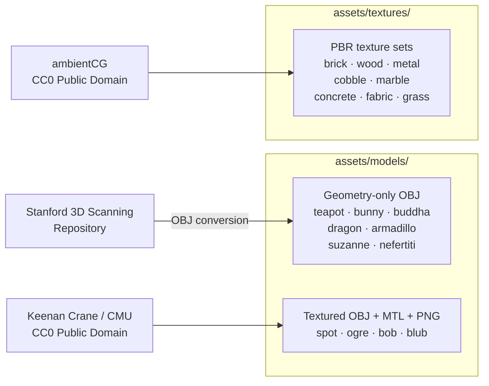
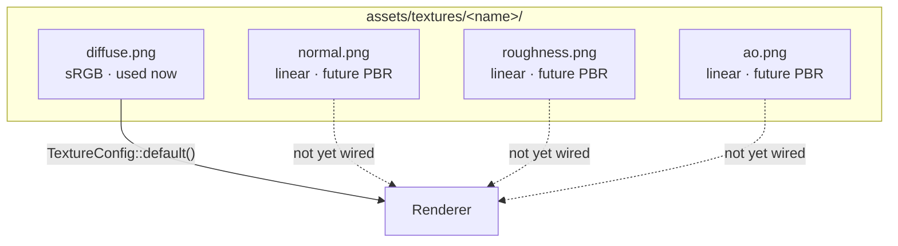
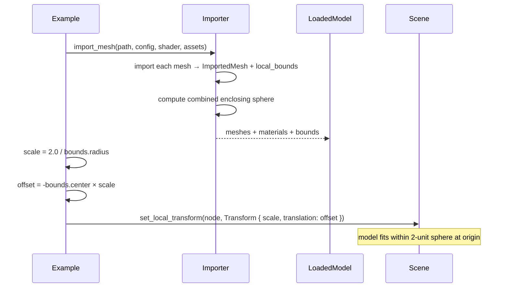
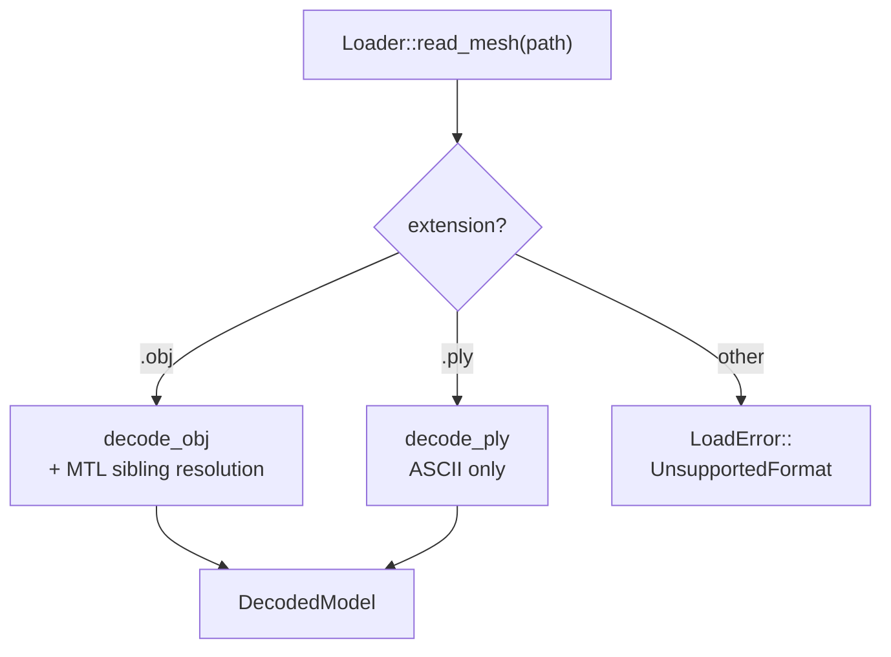
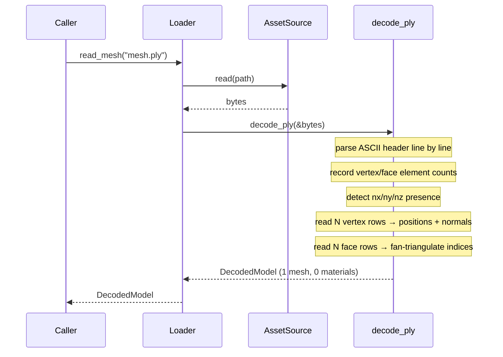
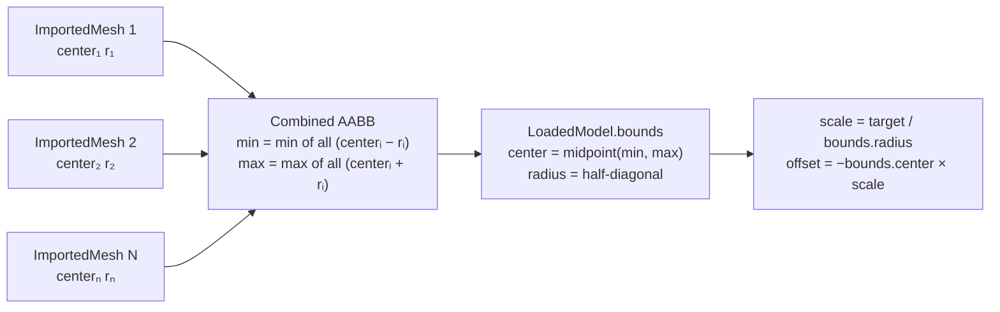

# Brief: Asset Library, Git LFS, PLY Loader, Model Viewer

## Feature

Asset library with Git LFS, hand-rolled PLY loader, combined model bounds, and a
CLI-driven model viewer example.

---

## Key Decisions

- Commit current `feature/asset-loading-pipeline` branch, merge to main, then start
  fresh branch `feature/asset-library-ply`.
- Git LFS enabled via `.gitattributes` scoped to `assets/**`; `git-lfs` added to Nix
  dev shell in `flake.nix`.
- Download all assets in one pass:
  - 7 geometry-only OBJs (Stanford / common-3d-test-models)
  - 4 textured OBJ + MTL + PNG models (Keenan Crane, CC0)
  - 8 PBR texture packs (ambientCG, CC0, 2K PNG)
- PLY decoder is **hand-rolled, no external crate** — ASCII format only, zero new
  dependencies added to `rig-loader`. Binary PLY deferred.
- `LoadedModel` gains a `bounds: BoundingSphere` field — combined enclosing sphere of
  all mesh bounding spheres, computed at import time in `rig-import`.
- Model gallery (`model_gallery` example) is a simple single-model viewer:
  - Default model: teapot
  - CLI argument overrides: `cargo run -p model_gallery -- bunny`
  - Auto-scale from `loaded.bounds.radius` — no hardcoded per-model constants
  - No runtime model switching (one model per process invocation)
- Only diffuse color textures wired for now — normal / roughness / AO maps present on
  disk but not consumed by the renderer yet.
- ambientCG texture files renamed on disk to a consistent convention:
  `diffuse.png`, `normal.png`, `roughness.png`, `ao.png`.

---

## Plan

### Phase 1 — Commit and merge current branch

Commit message: `feat: asset loading pipeline — rig-loader, rig-import, seven examples`

1. Stage all modified and untracked files on `feature/asset-loading-pipeline`.
2. Commit as one milestone-7 commit.
3. Merge `--no-ff` into `main`.
4. Create new branch `feature/asset-library-ply`.

---

### Phase 2 — Git LFS setup

Commit message: `chore: enable Git LFS for binary assets`

1. Create `.gitattributes` at repo root tracking:
   - `assets/**/*.obj`, `*.mtl`, `*.ply`, `*.gltf`, `*.glb`, `*.fbx`
   - `assets/**/*.png`, `*.jpg`, `*.jpeg`, `*.tga`, `*.hdr`, `*.exr`
   - `assets/**/*.zip`, `*.tar.gz`
2. Add `pkgs.git-lfs` to `nativeBuildInputs` in `flake.nix`.
3. Run `git lfs install`, commit `.gitattributes` + `flake.nix`.

Note: existing small test assets (`cube.obj`, `checker.png`, etc.) were committed
before LFS was enabled and stay as regular git objects — they are tiny and not worth
a history rewrite.

---

### Phase 3 — Download and organize asset library

Commit message: `feat: add curated 3D model and PBR texture library`

#### Responsibility split — agent vs. human

This phase is a collaboration:

- **Agent creates**: `scripts/download_assets.sh`, the `assets/` directory structure,
  and `assets/LICENSES.md`. These are committed to the repo.
- **Human executes**: the actual downloads by running `scripts/download_assets.sh`
  (or manually). The agent must not attempt to `wget` or `curl` external URLs —
  network access to third-party hosts is a human step.
- **Agent resumes**: after the human confirms the files are in place, the agent
  inspects the extracted contents, finalises the Keenan Crane path table, and
  proceeds to Phase 4.

The agent should pause after creating the script and directory structure, and
explicitly ask the human to run the script and report back before continuing.

#### Geometry-only models (from common-3d-test-models, OBJ)

Clone `https://github.com/alecjacobson/common-3d-test-models` (depth 1) and copy:

| Source | Destination |
|--------|-------------|
| `data/teapot.obj` | `assets/models/teapot.obj` |
| `data/stanford-bunny.obj` | `assets/models/bunny.obj` |
| `data/happy.obj` | `assets/models/buddha.obj` |
| `data/xyzrgb_dragon.obj` | `assets/models/dragon.obj` |
| `data/armadillo.obj` | `assets/models/armadillo.obj` |
| `data/suzanne.obj` | `assets/models/suzanne.obj` |
| `data/nefertiti.obj` | `assets/models/nefertiti.obj` |

#### Textured models (Keenan Crane, CC0)

Download and extract into subdirectories. Flatten so OBJ + MTL + PNG are directly
inside the directory (no nested subdirs). Use the triangulated OBJ variant.

| URL | Destination |
|-----|-------------|
| `https://www.cs.cmu.edu/~kmcrane/Projects/ModelRepository/spot.zip` | `assets/models/spot/` |
| `https://www.cs.cmu.edu/~kmcrane/Projects/ModelRepository/ogre.zip` | `assets/models/ogre/` |
| `https://www.cs.cmu.edu/~kmcrane/Projects/ModelRepository/bob.zip` | `assets/models/bob/` |
| `https://www.cs.cmu.edu/~kmcrane/Projects/ModelRepository/blub.zip` | `assets/models/blub/` |

#### PBR texture packs (ambientCG, CC0, 2K PNG)

Download ZIPs and extract. Rename files to the standard convention:
`*_Color.png` → `diffuse.png`, `*_NormalGL.png` → `normal.png`,
`*_Roughness.png` → `roughness.png`, `*_AmbientOcclusion.png` → `ao.png`.
Delete `*_Displacement.png`.

| ambientCG ID | Destination |
|-------------|-------------|
| Bricks076 | `assets/textures/brick_red/` |
| WoodFloor051 | `assets/textures/wood_oak/` |
| Metal032 | `assets/textures/metal_rust/` |
| PavingStones131 | `assets/textures/stone_cobble/` |
| Marble012 | `assets/textures/marble_white/` |
| Concrete034 | `assets/textures/concrete_worn/` |
| Fabric045 | `assets/textures/fabric_denim/` |
| Ground037 | `assets/textures/terrain_grass/` |

Download URL pattern: `https://ambientcg.com/get?file=<ID>_2K-PNG.zip`

#### Provide a download script

Create `scripts/download_assets.sh` — a reproducible shell script that performs all
the above downloads, extractions, and renames. This is the canonical way to
(re-)populate `assets/` from scratch.

The script must be idempotent: skip downloads if the target file already exists.
After extracting each Keenan Crane zip, print the full directory listing of the
extracted contents before doing any renames. This gives the operator visibility into
the actual filenames so they can confirm or correct the rename logic.

#### Verify Keenan Crane model structure before locking in paths

**The model paths in the Phase 6 CLI table are tentative.** The Keenan Crane zips
have never been inspected. Each archive likely contains multiple OBJ variants
(control mesh, quadrangulation, triangulation) plus textures, and the MTL/texture
reference chain is unknown until extraction.

Phase 3 must include an explicit verification step:

1. Extract all four zips.
2. Inspect the contents — identify the triangulated OBJ, its `mtllib` reference,
   the MTL's `map_Kd` texture path, and whether those files are all present.
3. Decide on final filenames and directory layout based on what is actually there.
4. Update the Phase 6 CLI model table to match the verified paths before any
   implementation of the gallery example begins.

Do not rename an OBJ file without also verifying that the `mtllib` line inside it
still resolves to an MTL that exists on disk, and that the MTL's `map_Kd` resolves
to a texture that exists as a sibling. The importer resolves all paths as siblings
of the OBJ — the entire chain must be consistent after any renames.

#### Create assets/LICENSES.md

Document provenance and license of every asset. Stanford models are non-commercial
research use. Keenan Crane models are CC0. ambientCG textures are CC0.

---

### Phase 4 — Combined model bounds on LoadedModel

Commit message: `feat(import): add combined BoundingSphere to LoadedModel`

1. Add field `bounds: BoundingSphere` to `LoadedModel` in
   `crates/import/src/output.rs`.
2. In `Importer::import_mesh` (`crates/import/src/importer.rs`), after collecting
   all `ImportedMesh` values, compute the combined enclosing sphere:
   - Collect all per-mesh `local_bounds` (already computed by `import_decoded_mesh`).
   - Find the AABB across all mesh bounding sphere centers ± radii.
   - Derive the combined `BoundingSphere` from that AABB (center = midpoint,
     radius = half-diagonal or max distance from center to any mesh sphere surface).
3. Populate `LoadedModel { meshes, materials, bounds }`.
4. Add a unit test: import a two-mesh model and verify the combined bounds encloses
   both individual mesh bounds.

---

### Phase 5 — Hand-rolled ASCII PLY decoder

Commit message: `feat(loader): add hand-rolled ASCII PLY mesh decoder`

No new crate dependencies. Implemented entirely in `std`.

#### Decoder spec (`crates/loader/src/decode/ply.rs`)

Parse the PLY header line by line:
- Detect `format ascii 1.0` — reject binary formats with `LoadError::Decode`.
- Parse `element vertex N` and `element face N`.
- Parse `property float x/y/z` and optional `property float nx/ny/nz`.
- Stop at `end_header`.

Parse the data section:
- Read N vertex lines, split on whitespace, parse floats by column index.
- Read N face lines: first token is vertex count, remaining tokens are indices.
- Fan-triangulate n-gon faces (vertex 0 as pivot).

Return `DecodedModel` with one `DecodedMesh`:
- `name`: `"ply_mesh"`
- `positions`, `normals` (empty if absent), `uvs` (always empty)
- `indices` (triangulated)
- `material_index`: `None`
- `materials`: empty `Vec`

Return `LoadError::Decode` for: non-ASCII format, missing vertex element, missing
`x`/`y`/`z` properties, malformed float/int tokens.

#### Unit tests (in the same file)

1. `decode_minimal_triangle` — 3-vertex 1-face ASCII PLY → 9 position floats,
   indices `[0, 1, 2]`, empty normals.
2. `decode_quad_is_triangulated` — 4-vertex quad → 6 indices `[0, 1, 2, 0, 2, 3]`.
3. `decode_with_normals` — PLY with `nx`/`ny`/`nz` → normals vec populated.
4. `decode_missing_vertex_element_errors` — no vertex element → `LoadError::Decode`.
5. `decode_binary_format_rejected` — `format binary_little_endian 1.0` →
   `LoadError::Decode`.

#### Wire into Loader

Modify `crates/loader/src/decode/mod.rs` to add `mod ply; pub use ply::decode_ply;`.

Modify `Loader::read_mesh` in `crates/loader/src/loader.rs` to accept `["obj", "ply"]`
and dispatch by extension:

```rust
pub fn read_mesh(&self, path: &AssetPath) -> Result<DecodedModel, LoadError> {
    ensure_extension(path, &["obj", "ply"])?;
    let bytes = self.source.read(path)?;
    match path.extension().unwrap_or_default().to_ascii_lowercase().as_str() {
        "ply" => decode_ply(&bytes),
        _ => decode_obj(&bytes, |mtl_path| self.read_mtl(path, mtl_path)),
    }
}
```

Add a `read_mesh_dispatches_ply` test in `loader.rs`.

No changes needed in `rig-import` — `import_decoded_mesh` already handles empty
materials and generates normals when absent.

---

### Phase 6 — model_gallery example

Commit message: `feat: add model_gallery — CLI-driven single-model viewer`

#### Cargo.toml

Create `examples/model_gallery/Cargo.toml` with `rig-app`, `anyhow`, `env_logger`,
`log` dependencies. Add `"examples/model_gallery"` to workspace members in root
`Cargo.toml`.

#### CLI argument parsing

Parse `std::env::args().nth(1)` at startup. Match against a static table of known
model names (case-insensitive). Unknown name → print usage and exit. No name → default
to teapot.

Model table:

| CLI name | Path | Textured |
|----------|------|----------|
| `teapot` | `assets/models/teapot.obj` | no |
| `bunny` | `assets/models/bunny.obj` | no |
| `buddha` | `assets/models/buddha.obj` | no |
| `dragon` | `assets/models/dragon.obj` | no |
| `armadillo` | `assets/models/armadillo.obj` | no |
| `suzanne` | `assets/models/suzanne.obj` | no |
| `nefertiti` | `assets/models/nefertiti.obj` | no |
| `spot` | `assets/models/spot/spot.obj` | yes |
| `ogre` | `assets/models/ogre/ogre.obj` | yes |
| `bob` | `assets/models/bob/bob.obj` | yes |
| `blub` | `assets/models/blub/blub.obj` | yes |

#### Auto-scale

After import, compute:
```rust
let target_radius = 2.0;
let scale = target_radius / loaded.bounds.radius;
let offset = -loaded.bounds.center * scale;
```
Apply as `Transform { translation: offset, scale: Vec3::splat(scale), .. }`.

This normalizes every model to fit within a sphere of radius 2.0 centered at the
origin, regardless of source coordinate range.

#### Material assignment — do NOT use the shared helper

The gallery must **not** reuse `add_imported_model` from `shared_loading_example.rs`.
That helper calls `.context("imported model did not provide any material")?` on the
first material handle, which panics for geometry-only models (teapot, bunny, etc.)
and PLY files because `loaded.materials` is empty.

The gallery must instead:
1. Create a fallback material *before* calling `import_mesh` (Phong shader + neutral
   diffuse color for geometry-only, or textured shader for textured models).
2. After import, iterate `loaded.meshes` and assign:
   - The MTL-derived material if `mesh.material_index` is `Some` and the model
     provided materials (textured models).
   - The pre-created fallback material otherwise.

This is the correct pattern for any caller that handles mixed geometry-only /
textured models.

#### Shader selection

- Textured models: `TEXTURED_SHADER` — MTL auto-resolves diffuse texture via importer.
- Geometry-only models: `PHONG_SHADER` with a neutral diffuse color `[0.8, 0.8, 0.75, 1.0]`.

#### Scene setup

- One directional light (key light from upper-left).
- Camera at `(0, 0, 6)` looking at origin.
- Fly camera: W/A/S/D/Q/E + arrow keys.
- Slow Y-axis rotation animation on the model node.
- F3 overlay showing: model name, triangle count, vertex count, bounds radius, load time.
- Escape to quit.

#### Doc comment

```
//! CLI-driven 3D model viewer.
//!
//! Loads a single model from the asset library, auto-scales it to fit a 2-unit
//! bounding sphere, and renders it with either Phong shading or its diffuse texture.
//!
//! # Usage
//!
//!     cargo run -p model_gallery              # default: teapot
//!     cargo run -p model_gallery -- bunny
//!     cargo run -p model_gallery -- spot      # textured
//!
//! # Controls
//!
//! | Key(s)     | Action                  |
//! |------------|-------------------------|
//! | W / S      | Move forward / backward |
//! | A / D      | Strafe left / right     |
//! | Q / E      | Move up / down          |
//! | Arrow keys | Rotate camera           |
//! | F3         | Toggle overlay          |
//! | Escape     | Close window            |
```

---

### Phase 7 — Documentation

Commit message: `docs: add MODELS.md, update LOADING.md and AGENTS.md`

#### Create docs/MODELS.md

Full reference for the model library. Must match the Mermaid-heavy style of the
existing docs (ARCHITECTURE.md, LOADING.md, SCENEGRAPH.md). Required sections and
diagrams:

**Section 1 — Asset provenance**

Explain where each asset category originates. Include this flowchart:



**Section 2 — Geometry-only models table**

Table with columns: Model, File, Triangles, Source, License, Notes (scale quirks).

**Section 3 — Textured models table**

Table with columns: Model, Directory, Triangles, Texture file, License.

**Section 4 — PBR texture map convention**

Explain the four-file convention per texture set. Include this diagram:



**Section 5 — Auto-scale via combined bounds**

Explain `LoadedModel.bounds` and the auto-scale formula. Include this sequence:



**Section 6 — Usage code snippets**

Two `no_run` Rust code blocks:
1. Geometry-only model: create fallback Phong material first, then import, then
   assign fallback to all meshes.
2. Textured model: import with textured shader, let MTL resolve the texture, assign
   MTL-derived materials.

---

#### Update docs/LOADING.md

Add two new numbered sections after the existing content. Match the existing
sequenceDiagram + flowchart style throughout.

**New section — PLY format support**

Prose: ASCII-only, geometry-only (no UVs, no materials), fan triangulation for
n-gons, normals extracted if present otherwise generated by importer.

Include the format dispatch decision tree:



Include the PLY decode sequence (matching the style of the existing OBJ sequence):



**New section — Combined model bounds**

Prose: `LoadedModel.bounds` is the combined enclosing `BoundingSphere` across all
meshes in the model. Computed at import time. Used by callers for auto-scaling and
frustum culling.

Include the bounds computation diagram:



**Update asset library overview paragraph**

Add a short paragraph pointing to `docs/MODELS.md` for the full model reference and
`assets/LICENSES.md` for provenance. No new diagram needed here.

---

#### Update AGENTS.md

- Add milestone 8 to the milestones list:
  ```
  8. **Asset library + PLY loader** — Git LFS, curated OBJ model library (Stanford,
     Keenan Crane CC0), ambientCG PBR textures, hand-rolled ASCII PLY decoder in
     rig-loader, combined BoundingSphere on LoadedModel, model_gallery CLI viewer ✓
  ```
- Update `rig-loader` line in crate dependency order — PLY is hand-rolled so no new
  external dep; note it in the comment:
  ```
  rig-loader    (leaf — depends on image, tobj, thiserror; PLY decoded without external crate)
  ```
- Update `rig-import` line to mention `LoadedModel.bounds`:
  ```
  rig-import    (depends on rig-loader, rig-assets, rig-math; LoadedModel carries combined BoundingSphere)
  ```

---

## Rejected Alternatives

| Alternative | Reason rejected |
|-------------|----------------|
| `ply-rs` crate | Last published 2020, unknown Rust 2024 compat; PLY ASCII trivial to hand-parse |
| N/P key cycling gallery | Leaks GPU resources (AssetStore has no removal); adds complexity for no benefit now |
| One example per model | Too much Cargo.toml boilerplate |
| Hardcoded per-model scale factors | Brittle; breaks with new models; bounding sphere auto-scale is robust |
| Combined bounds as free function | Field on `LoadedModel` is architecturally sounder and benefits all future callers |
| Binary PLY support | Not needed now; OBJ conversions cover all current models |

---

## Risks

| # | Risk | Mitigation |
|---|------|------------|
| 1 | High-poly models (dragon 7.2M, nefertiti 2M) may freeze on load | Acceptable for a viewer; overlay shows load time |
| 2 | Stanford license is non-commercial | Fine for personal research; documented in `assets/LICENSES.md` |
| 3 | `git lfs migrate import` rewrites history | Skip migration; only LFS-track new files going forward |
| 4 | ambientCG download URLs may change | `scripts/download_assets.sh` provides reproducible downloads |
| 5 | Binary PLY files not supported | Not needed now; extend later if required |
| 6 | Keenan Crane zip internal structure may be nested | Verify after extraction; flatten manually if needed |

---

## Open Questions

- Auto-scale target radius: 2.0 units assumed — tune after first render if needed.
- `AssetStore` asset removal: not needed now, but flag for future gallery cycling work.
