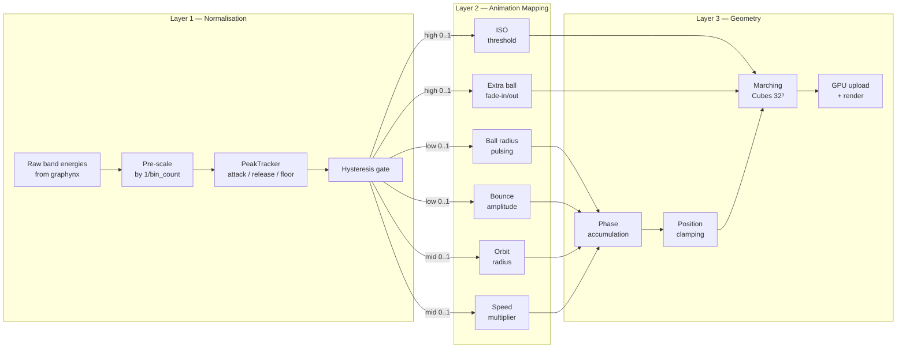
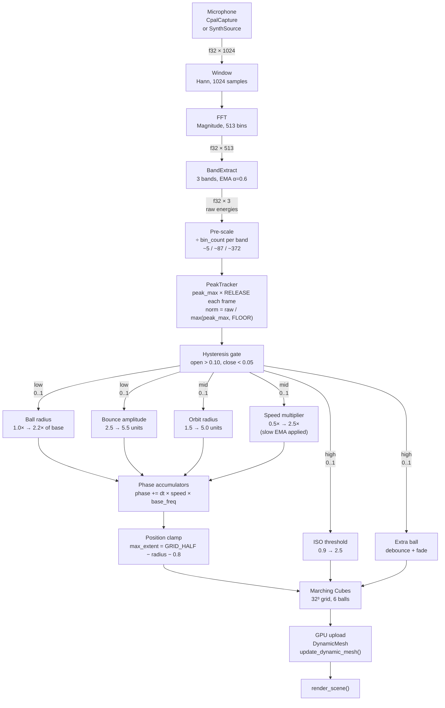
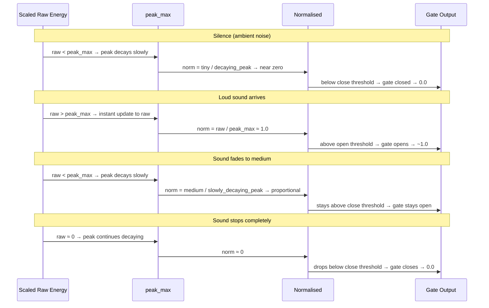
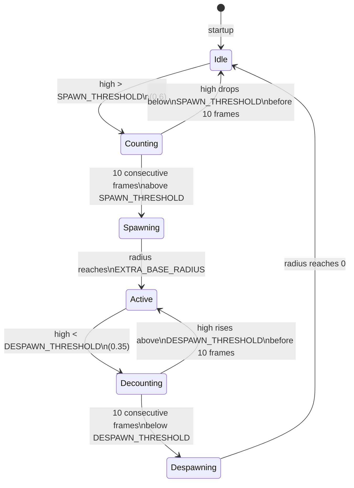
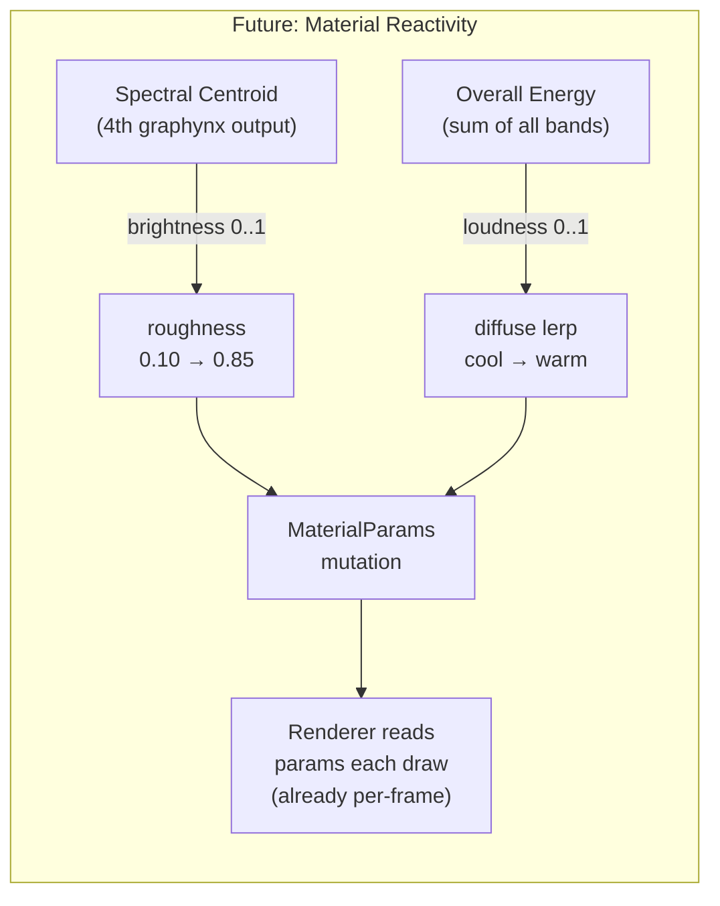

# Plan: Adaptive Multi-Axis Voice-Reactive Metaballs

**Status**: Planned — not yet implemented  
**Scope**: `examples/voice_metaballs` only — no changes to framework crates  
**Session**: Follows the initial `voice_metaballs` implementation and the brainstorm
that identified two improvement directions: auto-gain normalisation (Direction 3) and
multi-axis animation mapping (Direction 2).

---

## Table of Contents

1. [Background and Motivation](#1-background-and-motivation)
2. [Design Decisions](#2-design-decisions)
3. [Architecture Overview](#3-architecture-overview)
4. [Signal Flow](#4-signal-flow)
5. [Normalisation Layer — PeakTracker](#5-normalisation-layer--peaktracker)
6. [Animation Layer — Multi-Axis Mapping](#6-animation-layer--multi-axis-mapping)
7. [Phase Accumulation](#7-phase-accumulation)
8. [Extra Ball State Machine](#8-extra-ball-state-machine)
9. [Grid Boundary Clamping](#9-grid-boundary-clamping)
10. [Future: Material Reactivity](#10-future-material-reactivity)
11. [Implementation Steps](#11-implementation-steps)
12. [Tuning Constants Reference](#12-tuning-constants-reference)
13. [Test Plan](#13-test-plan)
14. [Risks and Mitigations](#14-risks-and-mitigations)

---

## 1. Background and Motivation

`examples/voice_metaballs` captures live microphone audio (or falls back to synthetic
voice), analyses it through a graphynx `Window → FFT → BandExtract` pipeline, and maps
three band energies to metaball animation parameters.

The audio pipeline works correctly — the HUD numbers change when sound is present. The
problem is that the **animation response is barely visible**. Three compounding causes
were identified during review:

### 1.1 Root causes

| Cause | Effect |
|-------|--------|
| `norm = e / (e + 1.0)` soft ceiling | Compresses ambient mic energy toward zero; even loud speech maps to ~0.5 |
| Double EMA smoothing (BandExtract α=0.6 + render-side RESPONSIVENESS=8.0) | Transients are eaten before they reach the animation |
| Only orbit radius changes (±1.5 units on a 6-unit grid) | The subtlest possible animation axis; invisible at normal camera distance |
| ISO range only 0.6 | Barely perceptible surface tightening |

### 1.2 What this plan fixes

- **Normalisation**: replace the fixed soft ceiling with a per-band adaptive peak
  tracker that always maps the current dynamic range to [0, 1], regardless of absolute
  volume.
- **Animation axes**: drive ball size, orbit radius, orbit speed, ISO threshold, and
  extra ball count from distinct frequency bands — so each band has a legible, dramatic
  visual channel.
- **Continuity**: replace time-based position computation with phase accumulators so
  that speed changes never cause position discontinuities.

---

## 2. Design Decisions

The following decisions were made during the planning session and are locked for this
implementation.

| Question | Decision | Rationale |
|----------|----------|-----------|
| Normalisation strategy | Per-band adaptive peak tracker | Each band independently fills [0, 1]; relative balance between bands is less important than each band being visually active |
| Phase accumulation vs. time scaling | Phase accumulation | No position discontinuities when speed changes; cleaner math |
| Ball count | Always allocate 6; 4 visible at idle | Simplest approach for a demo; no dynamic Vec allocation |
| Grid resolution | Keep 32³ | Sufficient for visual quality; performance headroom for 6 balls |
| Grid boundary strategy | Clamp ball positions with margin | Prevents flat-edge artefacts without changing grid size |
| Material reactivity | Document only; do not implement | Needs investigation of `UpdateContext` / `AssetStore` mutability; separate session |

---

## 3. Architecture Overview

The update loop is restructured into three sequential layers:



### State struct changes

```
VoiceMetaballsApp
├── (unchanged) camera_node, camera_rig, metaball_node, dyn_id, pending_mesh
├── (unchanged) preset, audio_mode, audio_source, executor
├── (unchanged) debug_hud, hud_* element ids
├── triangle_count
│
├── REMOVED: elapsed: f64          ← replaced by phase accumulators
├── REMOVED: smooth_energies       ← replaced by PeakTracker
│
├── NEW: peak_tracker: PeakTracker
├── NEW: ball_phases: [BallPhase; 6]
├── NEW: smooth_speed: f32         ← separate slow EMA for speed multiplier
└── NEW: extra_balls: ExtraBallState
```

---

## 4. Signal Flow

The complete data path from microphone to rendered frame:



### Why pre-scale by bin count?

`BandExtract` outputs the **sum** of magnitude bins in each band. With FFT size 1024 at
44100 Hz (bin width ≈ 43 Hz):

| Band | Hz range | Approx. bin count |
|------|----------|-------------------|
| Low | 20–250 | ~5 |
| Mid | 250–4000 | ~87 |
| High | 4000–20000 | ~372 |

Without pre-scaling, the high band outputs ~74× more than the low band for identical
signal content. The peak tracker handles this eventually, but during startup (when
`peak_max` is initialised to a small default) the low band appears near-zero while the
high band is already full-scale. Pre-scaling by `1/bin_count` gives all three bands
comparable magnitude from the first frame.

---

## 5. Normalisation Layer — PeakTracker

### 5.1 Algorithm

```
Per frame, for each band i:

  1. peak_max[i] = max(peak_max[i] × RELEASE, scaled_raw[i])
     — fast attack (instant), slow release (~2s half-life at 60fps)

  2. norm[i] = scaled_raw[i] / max(peak_max[i], FLOOR)
     — FLOOR prevents division by near-zero during silence

  3. gate hysteresis:
       if !gate_open[i] && norm[i] > GATE_OPEN_THRESHOLD  → gate_open[i] = true
       if  gate_open[i] && norm[i] < GATE_CLOSE_THRESHOLD → gate_open[i] = false

  4. output[i] = if gate_open[i] { norm[i] } else { 0.0 }
```

### 5.2 Struct

```rust
struct PeakTracker {
    peak_max:   [f32; 3],
    normalised: [f32; 3],
    gate_open:  [bool; 3],
}
```

### 5.3 Why hysteresis on the gate?

Without hysteresis, when a loud sound stops, `peak_max` decays slowly (RELEASE=0.997)
while actual energy drops immediately to ambient. For several seconds, the normalised
value hovers near the threshold, causing the animation to flicker between gated (0) and
small values. Hysteresis creates a dead-band: the gate opens at 0.10 but only closes
when the signal drops below 0.05 — a 2× margin that eliminates the flicker zone.

### 5.4 Peak tracker timing behaviour



### 5.5 Initialisation

Initialise `peak_max` to `[1.0, 1.0, 1.0]` rather than `[0.0, 0.0, 0.0]`. This means
the first few frames produce small normalised values (which is correct — no sound has
been heard yet) rather than a divide-by-zero spike when the first audio frame arrives.

---

## 6. Animation Layer — Multi-Axis Mapping

Each frequency band drives a **distinct, legible visual channel** so a viewer can
identify which band is active by watching the animation.

### 6.1 Band-to-axis mapping

| Band | Primary axis | Secondary axis | Visual read at full energy |
|------|-------------|---------------|---------------------------|
| **Low** (20–250 Hz) | Ball **radius** pulsing | Vertical **bounce amplitude** | Balls swell and bounce higher — feels heavy, physical |
| **Mid** (250–4000 Hz) | Orbit **radius** (spread/contract) | Orbit **speed** multiplier | Balls spread outward and orbit faster — feels energetic |
| **High** (4000–20000 Hz) | **ISO threshold** (surface detail) | Extra **ball count** (2 extra balls fade in) | Surface tightens and fractures; small satellite blobs appear |

### 6.2 Parameter ranges

```rust
// Low band → size + bounce
let ball_radius_scale = 1.0 + low * 1.2;   // 1.0× → 2.2× of base radius
let bounce_amp        = 2.5 + low * 3.0;   // 2.5 → 5.5 units vertical swing

// Mid band → orbit spread + speed
let orbit_radius  = 1.5 + mid * 3.5;       // 1.5 → 5.0 units (clamped for grid)
let target_speed  = 0.5 + mid * 2.0;       // 0.5× → 2.5× time multiplier

// High band → ISO threshold + extra balls
let iso           = 0.9 + high * 1.6;      // 0.9 → 2.5
// extra ball logic: see §8
```

### 6.3 Idle state (all bands gated to 0)

When silent, the animation settles to:
- 4 small balls (base radius, scale = 1.0)
- Tight orbit (1.5 units)
- Slow drift (0.5× speed)
- Blobby merged surface (ISO = 0.9, low threshold = large blob)
- Balls 4 & 5 invisible (radius = 0)

This gives a calm "breathing blob" at rest that **expands and fractures** when sound
arrives. The contrast between idle and active is what makes the reactivity legible.

### 6.4 Base ball radii

```rust
// Balls 0–3: base radii (multiplied by ball_radius_scale)
const BASE_RADIUS: [f32; 4] = [1.4, 1.3, 1.2, 1.1];

// Balls 4–5: extra balls — smaller, feel like "sparks" or "splinters"
const EXTRA_BASE_RADIUS: f32 = 0.9;
```

---

## 7. Phase Accumulation

### 7.1 Why phase accumulators?

The current code computes ball positions as `sin(t * freq)` where `t` is wall-clock
time. When the speed multiplier changes, the effective frequency changes, but `t`
continues to grow at the same rate — so the position is continuous. However, if we want
to scale `t` by `speed_mult`, we need to scale it consistently across all frequency
components of each ball's path. The cleanest approach is to accumulate phase explicitly:

```
phase += dt × speed_mult × base_freq
position = orbit_radius × sin(phase)
```

This way, `speed_mult` changes only affect the *rate* of phase accumulation, never
causing a position jump.

### 7.2 Struct

```rust
struct BallPhase {
    x: f32,   // accumulated phase for X axis
    y: f32,   // accumulated phase for Y axis
    z: f32,   // accumulated phase for Z axis
}
```

### 7.3 Base frequencies

Each ball has distinct base frequencies to maintain the Lissajous variety of the
current animation. Balls 4 & 5 (extra) are faster and tighter.

```rust
/// Base frequencies (x, y, z) per ball, in radians/second.
/// Balls 0–3 preserve the current Lissajous character.
/// Balls 4–5 are faster — they feel like satellite sparks.
const BASE_FREQ: [(f32, f32, f32); 6] = [
    (0.7, 0.5, 0.9),   // ball 0
    (0.6, 0.8, 0.4),   // ball 1
    (1.1, 0.7, 0.6),   // ball 2
    (0.9, 0.5, 1.0),   // ball 3
    (1.3, 0.9, 1.5),   // ball 4 — extra, fast
    (1.1, 1.2, 0.8),   // ball 5 — extra, offset from 4
];
```

### 7.4 Speed multiplier smoothing

The speed multiplier is derived from the mid band, which can change rapidly. Without
smoothing, a sudden jump from 0.5× to 2.5× would cause the balls to visibly lurch.
A dedicated slow EMA is applied to `target_speed` before it feeds into phase
accumulation:

```rust
// Separate slow EMA — much heavier than the band normalisation
// ~33 frames to reach 63% of target at 60fps → smooth velocity changes
const SPEED_SMOOTH_ALPHA: f32 = 0.03;

self.smooth_speed += SPEED_SMOOTH_ALPHA * (target_speed - self.smooth_speed);
// smooth_speed is what feeds into phase accumulation
```

This is intentionally separate from the peak tracker — it is about perceptual smoothness
of the *velocity axis*, not about normalising signal amplitude.

### 7.5 Position computation

```rust
// For balls 0–3 (orbit_radius driven by mid band):
let pos = Vec3::new(
    orbit_radius * phase.x.sin(),
    bounce_amp   * phase.y.cos(),
    orbit_radius * phase.z.sin(),
);

// For balls 4–5 (tighter orbit, fixed at 60% of orbit_radius):
let extra_orbit = orbit_radius * 0.6;
let pos = Vec3::new(
    extra_orbit * phase.x.sin(),
    bounce_amp  * 0.7 * phase.y.cos(),
    extra_orbit * phase.z.sin(),
);
```

---

## 8. Extra Ball State Machine

### 8.1 Rationale

Extra balls (4 & 5) appear when high-frequency energy is sustained above a threshold.
They should not flicker on/off with every transient — a debounce prevents this. They
fade in/out smoothly so their appearance is organic rather than a sudden pop.

### 8.2 State machine



### 8.3 Struct

```rust
struct ExtraBallState {
    /// Current rendered radius for each extra ball (0 = invisible).
    radius: [f32; 2],
    /// Target radius (EXTRA_BASE_RADIUS × ball_radius_scale, or 0 when despawning).
    target: [f32; 2],
    /// Consecutive frames above SPAWN_THRESHOLD.
    frames_above: u32,
    /// Consecutive frames below DESPAWN_THRESHOLD.
    frames_below: u32,
    /// Whether balls are currently in the Active or Spawning state.
    active: bool,
}
```

### 8.4 Update logic (per frame)

```rust
// Debounce counting
if high > SPAWN_THRESHOLD {
    self.extra_balls.frames_above += 1;
    self.extra_balls.frames_below = 0;
} else if high < DESPAWN_THRESHOLD {
    self.extra_balls.frames_below += 1;
    self.extra_balls.frames_above = 0;
} else {
    // In the dead-band: reset both counters to prevent false triggers
    self.extra_balls.frames_above = 0;
    self.extra_balls.frames_below = 0;
}

// State transitions
if !self.extra_balls.active && self.extra_balls.frames_above >= DEBOUNCE_FRAMES {
    self.extra_balls.active = true;
    self.extra_balls.target = [extra_radius, extra_radius];
}
if self.extra_balls.active && self.extra_balls.frames_below >= DEBOUNCE_FRAMES {
    self.extra_balls.active = false;
    self.extra_balls.target = [0.0, 0.0];
}

// Smooth fade (lerp toward target each frame)
for i in 0..2 {
    let delta = self.extra_balls.target[i] - self.extra_balls.radius[i];
    self.extra_balls.radius[i] += delta * (1.0 - (-dt * EXTRA_FADE_RATE).exp());
}
```

---

## 9. Grid Boundary Clamping

### 9.1 The problem

With orbit radius up to 5.0 and ball radius up to `1.4 × 2.2 = 3.08`, a ball at
position 5.0 has field influence extending to approximately 5.0 + 3.08 = 8.08 — well
outside `GRID_HALF = 6.0`. The marching cubes grid simply truncates the field at the
boundary, producing unnatural flat faces where the isosurface intersects the grid edge.

### 9.2 Solution

After computing each ball's position from its phase, clamp it so the ball's field
influence stays within the grid:

```rust
// Leave 0.8 units of margin beyond the ball radius for field falloff.
// The field at distance r from a ball of radius R is R²/r².
// At r = R + 0.8, the contribution is R²/(R+0.8)² — small enough to not
// produce a surface near the grid edge.
let max_extent = GRID_HALF - ball_radius - 0.8;
let max_extent = max_extent.max(0.5); // safety: never clamp to zero
pos = pos.clamp(Vec3::splat(-max_extent), Vec3::splat(max_extent));
```

This is applied per-ball, using that ball's current (audio-scaled) radius, so the
clamping automatically tightens when balls are large and relaxes when they are small.

---

## 10. Future: Material Reactivity

> **NOT IMPLEMENTED** — planned for a separate session.

### 10.1 Concept

Map audio analysis to PBR material properties, giving the metaball surface a visual
"mood" that reflects the sound character:

| Audio feature | Material axis | Idle | Full energy |
|--------------|--------------|------|-------------|
| Spectral centroid (brightness) | `roughness` | 0.10 (mirror-shiny) | 0.85 (matte) |
| Overall energy (loudness) | `diffuse` colour | Cool blue-grey `[0.55, 0.60, 0.70]` | Warm orange `[0.90, 0.55, 0.20]` |



### 10.2 Why this is feasible without pipeline changes

Looking at `crates/render/src/renderer.rs` lines 638–664, the renderer creates a fresh
`MaterialUniforms` buffer **every draw call**, reading from `material.parameters` at
that moment:

```rust
let material_bind_group = {
    let params = &material.parameters;
    let mat_uniforms = MaterialUniforms {
        base_color: params.diffuse,   // ← read fresh each frame
        metallic:   params.metallic,
        roughness:  params.roughness,
        ...
    };
    // new wgpu::Buffer created here every frame
    ...
};
```

This means mutating `material.parameters` between frames is automatically picked up by
the renderer — no pipeline rebuild, no new bind group layout, no shader changes needed.

### 10.3 Implementation path (when ready)

1. **Add spectral centroid** as a 4th graphynx output. This requires adding a new
   `SpectralCentroid` op to the graphynx pipeline (or computing it in the example from
   the raw spectrum output).

2. **Obtain mutable `AssetStore` access in `update()`**. Currently `UpdateContext` does
   not expose `&mut AssetStore`. Investigate whether to:
   - Add `assets: &mut AssetStore` to `UpdateContext` (preferred — clean boundary)
   - Or store a copy of `MaterialParams` in app state and pass it to `render()` for
     injection before `render_scene()`

3. **Mutate `MaterialParams`** each frame based on normalised audio values:
   ```rust
   let mat = ctx.assets.material_mut(self.material_handle)?;
   mat.parameters.roughness = lerp(0.10, 0.85, spectral_centroid);
   mat.parameters.diffuse   = lerp_color(COOL_BLUE, WARM_ORANGE, energy);
   ```

4. **Smooth the material params** with a slow EMA (roughness and colour should not
   jump abruptly — use a separate `smooth_material` EMA with α ≈ 0.05).

### 10.4 Open question

Does `UpdateContext` need `&mut AssetStore`? Check whether adding it breaks the
ownership model (the renderer also borrows assets during `render()`). If so, the
alternative is to stage material changes in app state and apply them in `render()`
before calling `render_scene()`.

---

## 11. Implementation Steps

Work in order — each step is independently testable before proceeding.

### Step 1 — Update `docs/METABALLS.md` §8

Expand the voice-reactive section with:
- Updated signal flow diagram (Mermaid, matching §4 of this document)
- Updated band-to-axis mapping table (matching §6.1)
- Description of `PeakTracker` algorithm
- Phase accumulation rationale
- Extra ball state machine diagram
- Tuning constants table
- New sub-section: **Future: Material Reactivity** (§10 of this document)

Write documentation first — it forces design clarity before code is written.

---

### Step 2 — Add `PeakTracker` struct and `update()` method

In `examples/voice_metaballs/src/main.rs`:

- Define `struct PeakTracker` with fields from §5.2
- Implement `PeakTracker::new()` — initialise `peak_max` to `[1.0, 1.0, 1.0]`
- Implement `PeakTracker::update(raw: &[f32; 3], dt: f32)` — full algorithm from §5.1
- Add `fn bin_counts_for_fft(fft_size: usize, sample_rate: f32) -> [f32; 3]` helper
  that computes approximate bin counts for the three bands (used for pre-scaling)

**Replaces**: `smooth_energies: [f32; 3]`, `RESPONSIVENESS` constant, `norm()` closure.

---

### Step 3 — Add `BallPhase` struct and phase accumulation

- Define `struct BallPhase { x: f32, y: f32, z: f32 }`
- Add `ball_phases: [BallPhase; 6]` to `VoiceMetaballsApp`
- Add `smooth_speed: f32` to `VoiceMetaballsApp`
- Add `BASE_FREQ` constant array (§7.3)
- In `update()`: accumulate phases using `smooth_speed` (§7.4)
- Compute positions from phases (§7.5)

**Replaces**: `elapsed: f64`, direct `sin(t * freq)` position computation.

---

### Step 4 — Implement multi-axis animation mapping

Replace the current mapping section in `update()` (lines 588–636 of `main.rs`):

- Map `low` → `ball_radius_scale`, `bounce_amp`
- Map `mid` → `orbit_radius`, `target_speed` (then smooth into `smooth_speed`)
- Map `high` → `iso`, feed into `ExtraBallState`
- Build 6-element `balls` array using scaled radii for 0–3 and `extra_balls.radius`
  for 4–5

---

### Step 5 — Add `ExtraBallState` struct and debounce logic

- Define `struct ExtraBallState` (§8.3)
- Implement `ExtraBallState::new()` — all zeros, inactive
- Implement `ExtraBallState::update(high: f32, extra_radius: f32, dt: f32)` — debounce
  + fade logic from §8.4

---

### Step 6 — Add position clamping

After computing each ball's position from its phase accumulator, apply the clamp from
§9.2. Use the ball's current (audio-scaled) radius for the margin calculation.

---

### Step 7 — Update `VoiceMetaballsApp` state struct

- Add new fields: `peak_tracker`, `ball_phases`, `smooth_speed`, `extra_balls`
- Remove: `smooth_energies`, `elapsed`
- Update `init()` to initialise new fields
- Update `update()` to use new fields throughout

---

### Step 8 — Update HUD display

Change the energies HUD line to show both normalised values and peak_max, aiding
tuning:

```
Bands: L=0.82 M=0.45 H=0.23  peaks: 1.24/0.89/0.67
```

This makes the peak tracker's adaptation visible at runtime.

---

### Step 9 — Update constants block

Remove:
- `RESPONSIVENESS: f32`
- `ISO_BASE: f32`, `ISO_RANGE: f32`

Add (with doc comments — see §12):
- `RELEASE`, `FLOOR`, `GATE_OPEN_THRESHOLD`, `GATE_CLOSE_THRESHOLD`
- `SPEED_SMOOTH_ALPHA`
- `SPAWN_THRESHOLD`, `DESPAWN_THRESHOLD`, `DEBOUNCE_FRAMES`
- `EXTRA_FADE_RATE`
- `BASE_FREQ` array
- `BASE_RADIUS` array
- Updated orbit/bounce/ISO range constants

---

### Step 10 — Add unit tests

See §13 for the full test plan.

---

### Step 11 — Final verification

```bash
nix develop --impure --command cargo fmt --all
nix develop --impure --command cargo clippy --workspace -- -D warnings
nix develop --impure --command cargo test --workspace
```

Manual test checklist:
- [ ] HUD shows normalised bands filling [0, 1] when speaking
- [ ] Ball pulsing visible when low-frequency sound present (bass, vowels)
- [ ] Orbit expansion + speed increase visible with voice (mid band)
- [ ] Surface tightening visible with sibilants / high-frequency content
- [ ] Extra balls appear after sustained high-frequency content (≥10 frames)
- [ ] Extra balls fade out smoothly after high-frequency content stops
- [ ] Idle state: calm merged blob, slow drift, no extra balls
- [ ] No flat-edge artefacts at grid boundary
- [ ] No position discontinuities when speed changes
- [ ] Synth mode (M key): all three presets produce visible animation
- [ ] Live mode (M key): TV / ambient audio produces some animation

---

## 12. Tuning Constants Reference

All constants are defined at the top of `main.rs` with doc comments. This table
provides the rationale for each starting value.

### Signal pipeline

| Constant | Value | Rationale |
|----------|-------|-----------|
| `FFT_SIZE` | 1024 | Unchanged. Power-of-two; ~23ms frame at 44100 Hz |
| `SAMPLE_RATE` | 44100 | Unchanged. Standard CD quality |
| `BAND_SMOOTHING` | 0.6 | Unchanged. Fast EMA inside BandExtract; smooths per-frame FFT jitter |

### PeakTracker

| Constant | Value | Rationale |
|----------|-------|-----------|
| `RELEASE` | 0.997 | `0.997^60 ≈ 0.835` — peak halves in ~3s at 60fps. Slow enough to stay calibrated through brief silences |
| `FLOOR` | 0.02 | Minimum peak_max. Prevents divide-by-near-zero in a completely silent room |
| `GATE_OPEN_THRESHOLD` | 0.10 | Gate opens when normalised energy exceeds 10% of recent peak |
| `GATE_CLOSE_THRESHOLD` | 0.05 | Gate closes when normalised energy drops below 5% — 2× hysteresis margin |

### Speed multiplier

| Constant | Value | Rationale |
|----------|-------|-----------|
| `SPEED_SMOOTH_ALPHA` | 0.03 | `1/0.03 ≈ 33 frames` to reach 63% of target — prevents jarring velocity jumps |

### Extra balls

| Constant | Value | Rationale |
|----------|-------|-----------|
| `SPAWN_THRESHOLD` | 0.6 | High band must reach 60% of recent peak before spawning |
| `DESPAWN_THRESHOLD` | 0.35 | Hysteresis: balls stay visible until high band drops below 35% |
| `DEBOUNCE_FRAMES` | 10 | ~167ms at 60fps — prevents flicker from transients |
| `EXTRA_FADE_RATE` | 6.0 | `1/6 ≈ 167ms` fade time constant — smooth but responsive |

### Animation ranges

| Constant | Idle | Full | Notes |
|----------|------|------|-------|
| `ball_radius_scale` | 1.0× | 2.2× | Applied to `BASE_RADIUS` per ball |
| `bounce_amp` | 2.5 | 5.5 | Vertical swing in world units |
| `orbit_radius` | 1.5 | 5.0 | Horizontal orbit radius; clamped for grid |
| `target_speed` | 0.5× | 2.5× | Phase accumulation rate multiplier |
| `iso` | 0.9 | 2.5 | Lower = larger blob; higher = tighter/fractured surface |

---

## 13. Test Plan

All tests go in the `#[cfg(test)]` module at the bottom of `main.rs`, following the
existing test style.

| Test name | What it verifies |
|-----------|-----------------|
| `peak_tracker_output_never_exceeds_one` | For any input, `normalised[i] ≤ 1.0` |
| `peak_tracker_adapts_to_loud_input` | After feeding high values for several frames, `normalised ≈ 1.0` |
| `peak_tracker_decays_in_silence` | After loud → silent, `peak_max` decreases each frame |
| `peak_tracker_floor_prevents_divide_by_zero` | With all-zero input, no NaN or panic |
| `peak_tracker_gate_hysteresis_no_oscillation` | Feeding a value between thresholds does not toggle gate on/off |
| `peak_tracker_gate_opens_above_threshold` | Normalised value above `GATE_OPEN_THRESHOLD` opens gate |
| `peak_tracker_gate_closes_below_threshold` | Normalised value below `GATE_CLOSE_THRESHOLD` closes gate |
| `ball_phase_accumulates_monotonically` | Phase always increases; no wrapping or sign flip |
| `ball_phase_speed_zero_no_change` | With `speed_mult = 0`, phases do not change |
| `extra_ball_debounce_no_spawn_before_threshold` | Fewer than `DEBOUNCE_FRAMES` above threshold does not spawn |
| `extra_ball_spawns_after_debounce` | Exactly `DEBOUNCE_FRAMES` above threshold triggers spawn |
| `extra_ball_despawns_after_debounce` | Exactly `DEBOUNCE_FRAMES` below despawn threshold triggers despawn |
| `extra_ball_radius_fades_toward_target` | Each frame, radius moves closer to target |
| `extra_ball_radius_zero_at_idle` | Freshly constructed `ExtraBallState` has radius = 0 |
| `position_clamp_respects_grid_half` | No ball position component exceeds `GRID_HALF` |
| `position_clamp_accounts_for_ball_radius` | Larger ball radius → tighter clamp |
| `six_balls_zero_extra_radius_field_ok` | `metaball_field` with two zero-radius balls returns same value as four-ball version |
| `speed_smooth_converges_to_target` | After many frames, `smooth_speed` is within 1% of `target_speed` |
| `speed_smooth_large_jump_bounded` | Single-frame change in `smooth_speed` is less than `SPEED_SMOOTH_ALPHA × range` |

---

## 14. Risks and Mitigations

| Risk | Likelihood | Impact | Mitigation |
|------|-----------|--------|------------|
| Peak tracker adapts too slowly → first seconds unresponsive | Medium | Low | Initialise `peak_max` to `[1.0, 1.0, 1.0]`; first frames produce proportional output |
| Low band (5 bins) has high variance → jittery size pulsing | Medium | Medium | `BAND_SMOOTHING = 0.6` inside BandExtract already smooths this; if still jittery, reduce to 0.3 |
| Speed smoothing too heavy → mid band feels unresponsive | Medium | Medium | `SPEED_SMOOTH_ALPHA = 0.03` is a starting point; increase to 0.06 if sluggish |
| Extra ball debounce too long → high band never visibly responds | Low | Medium | Log spawn/despawn events; reduce `DEBOUNCE_FRAMES` from 10 to 5 if needed |
| Grid clamping makes orbits feel "walled" | Medium | Low | Use `smoothstep` soft clamp at boundary instead of hard clamp if artefact is visible |
| 6 balls on 32³ grid → marching cubes too slow at 60fps | Low | Medium | Profile; extra balls have small radius — their field contribution is narrow and fast to evaluate |
| BandExtract EMA + PeakTracker = too much lag on transients | Low | Medium | If sluggish, reduce `BAND_SMOOTHING` from 0.6 to 0.2 and rely on PeakTracker for temporal behaviour |
| TV / ambient audio saturates peak tracker → no headroom for voice | Medium | Medium | Noise gate handles this: ambient sits below `GATE_OPEN_THRESHOLD`; voice transients open the gate |
| `UpdateContext` lacks `&mut AssetStore` (blocks material reactivity) | High | Low (deferred) | Documented as open question in §10.4; investigate in separate session |
