# Animation System

**Crates**: `rig-anim` (new), `rig-assets`, `rig-scene`, `rig-math`  
**Purpose**: Keyframe animation of scene node transforms, skeletal skinning data model, and the graphynx CUDA skinning path.

---

## Table of Contents

1. [Scope](#1-scope)
2. [Three-Phase Roadmap](#2-three-phase-roadmap)
3. [Crate Dependency Graph](#3-crate-dependency-graph)
4. [Phase 1 — Rigid Skeleton Animation](#4-phase-1--rigid-skeleton-animation)
   - [4.1 AnimationClip asset](#41-animationclip-asset)
   - [4.2 Keyframe channels](#42-keyframe-channels)
   - [4.3 Interpolation modes](#43-interpolation-modes)
   - [4.4 AnimationPlayer and binding](#44-animationplayer-and-binding)
   - [4.5 Per-frame playback pipeline](#45-per-frame-playback-pipeline)
   - [4.6 Bones as scene nodes](#46-bones-as-scene-nodes)
5. [Phase 2 — Skinning Data Model + graphynx CUDA Path](#5-phase-2--skinning-data-model--graphynx-cuda-path)
   - [5.1 SkeletonAsset](#51-skeletonasset)
   - [5.2 SkinAsset](#52-skinasset)
   - [5.3 SkinComponent](#53-skincomponent)
   - [5.4 Bone matrix packing](#54-bone-matrix-packing)
   - [5.5 graphynx skinning node](#55-graphynx-skinning-node)
   - [5.6 Data handoff to the renderer](#56-data-handoff-to-the-renderer)
6. [Phase 3 — glTF Loader (Future)](#6-phase-3--gltf-loader-future)
   - [6.1 glTF concept mapping](#61-gltf-concept-mapping)
   - [6.2 Decoder crate](#62-decoder-crate)
7. [Example Assets](#7-example-assets)
   - [7.1 Phase 1 — procedural geometry](#71-phase-1--procedural-geometry)
   - [7.2 Phase 3 — Khronos glTF sample assets](#72-phase-3--khronos-gltf-sample-assets)
8. [Example Demos](#8-example-demos)
9. [Extension Rules](#9-extension-rules)

---

## 1. Scope

`rig-anim` is responsible for:

- immutable animation clip assets (`AnimationClip`, `AnimationClipHandle`)
- per-instance playback state (`AnimationPlayer`)
- binding clip channels to scene node handles
- sampling clips at a given time and writing `Transform` values into `SceneGraph`
- (Phase 2) packing bone world matrices for the graphynx skinning compute graph

`rig-anim` is **not** responsible for:

- GPU buffer management (that is `rig-render`)
- mesh deformation (that is graphynx / CUDA)
- file format decoding (that is `rig-loader` / `rig-gltf`)
- scene hierarchy or transform propagation (that is `rig-scene`)

The scene graph remains pure hierarchy. Animation is a consumer of it, not a part of it.

---

## 2. Three-Phase Roadmap

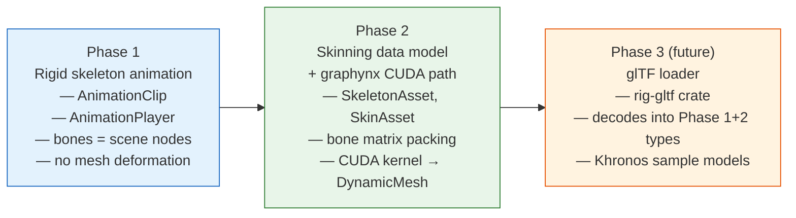

Each phase builds on the previous. glTF is a future consumer of the types established in
phases 1 and 2 — it does not drive the data model.

---

## 3. Crate Dependency Graph

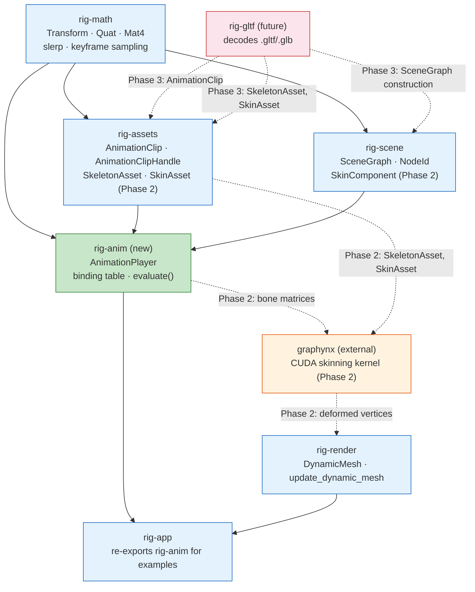

`rig-anim` sits between `rig-assets`/`rig-scene` and `rig-app`. It has no dependency on
`rig-render` or `rig-gpu` — animation is a world-model concern, not a GPU concern.

---

## 4. Phase 1 — Rigid Skeleton Animation

### 4.1 AnimationClip asset

`AnimationClip` is an immutable asset stored in `rig-assets`. It describes how a set of
named scene nodes should move over time.

```rust
/// Immutable keyframe animation clip.
pub struct AnimationClip {
    /// Total duration in seconds.
    pub duration: f32,
    /// Whether playback loops when it reaches `duration`.
    pub looping: bool,
    /// One channel per animated node property.
    pub channels: Vec<AnimationChannel>,
}

pub struct AnimationChannel {
    /// Name of the target scene node. Resolved to `NodeId` at bind time.
    pub target_node: String,
    /// Which transform property this channel drives.
    pub property: ChannelProperty,
    /// Keyframe times and values with interpolation mode.
    pub sampler: KeyframeSampler,
}

pub enum ChannelProperty {
    Translation,
    Rotation,
    Scale,
}
```

Clips are referenced by `AnimationClipHandle` (a typed `u32` index into `AssetStore`),
following the same pattern as `MeshHandle`, `MaterialHandle`, etc.

### 4.2 Keyframe channels

Each channel has independent keyframe times, matching the glTF model where translation,
rotation, and scale channels can have different sample rates.

```rust
pub struct KeyframeSampler {
    /// Keyframe timestamps in seconds, strictly increasing.
    pub times: Vec<f32>,
    /// Interpolation mode applied between keyframes.
    pub interpolation: Interpolation,
    /// Keyframe values — variant matches `ChannelProperty`.
    pub values: KeyframeValues,
}

pub enum KeyframeValues {
    Translations(Vec<Vec3>),
    Rotations(Vec<Quat>),
    Scales(Vec<Vec3>),
    /// Cubic spline: in-tangent, value, out-tangent per keyframe.
    CubicTranslations(Vec<[Vec3; 3]>),
    CubicRotations(Vec<[Quat; 3]>),
    CubicScales(Vec<[Vec3; 3]>),
}
```

### 4.3 Interpolation modes

Three modes, matching the glTF 2.0 specification
([Appendix C](https://registry.khronos.org/glTF/specs/2.0/glTF-2.0.html#appendix-c-interpolation)):

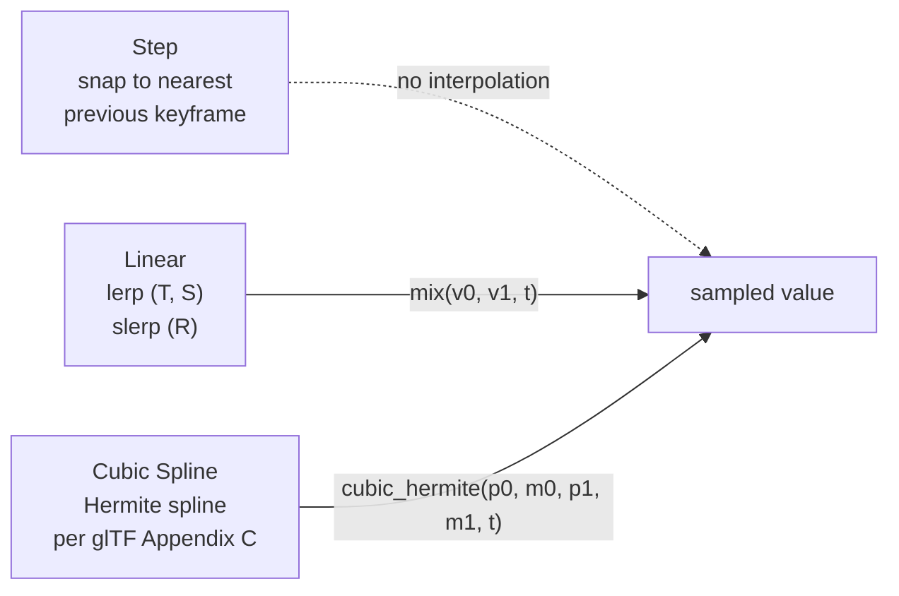

Sampling uses a **binary search with cached last index** (matching GTE's
`KeyframeController::GetKeyInfo`) so sequential playback is O(1) amortized:

```rust
/// Sample the channel at `time`, returning the interpolated value.
/// `last_index` is a mutable hint updated each call for O(1) sequential access.
pub fn sample_translation(sampler: &KeyframeSampler, time: f32, last_index: &mut usize) -> Vec3;
pub fn sample_rotation(sampler: &KeyframeSampler, time: f32, last_index: &mut usize) -> Quat;
pub fn sample_scale(sampler: &KeyframeSampler, time: f32, last_index: &mut usize) -> Vec3;
```

These functions live in `rig-math` (or `rig-anim`'s `sampler` module) and have no
dependency on scene or renderer types.

### 4.4 AnimationPlayer and binding

`AnimationPlayer` is the per-instance playback controller. It lives in `rig-anim` and
holds mutable state: current time, speed, and a **binding table** that maps clip channel
indices to `NodeId` handles.

```rust
pub struct AnimationPlayer {
    pub clip: AnimationClipHandle,
    pub time: f32,
    pub speed: f32,
    pub looping: bool,
    /// Resolved at bind time: channel index → NodeId in the scene graph.
    binding: Vec<Option<NodeId>>,
    /// Per-channel cached keyframe index for O(1) sequential sampling.
    last_indices: Vec<[usize; 3]>, // [T, R, S] per channel
}
```

**Binding** resolves channel target names to `NodeId` handles once, at startup or when
the clip is assigned:

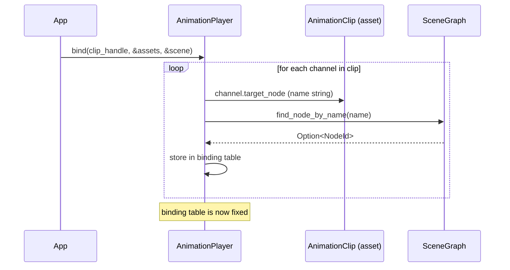

Unresolved names (node not found) store `None` and are silently skipped during evaluation.
This is intentional: a clip authored for a full character can be bound to a partial scene
without errors.

### 4.5 Per-frame playback pipeline

Each frame, the app advances the player, samples the clip, and writes transforms into the
scene graph. Normal `update_world_transforms()` propagation then handles the rest.

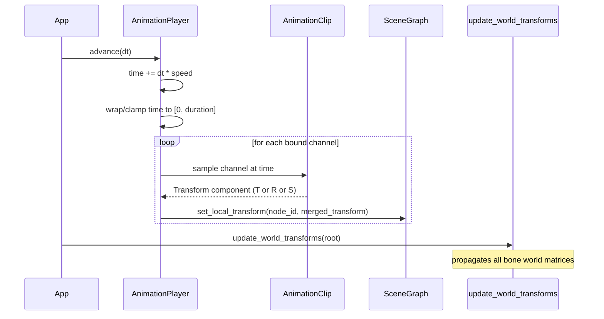

The player merges T, R, S channels into a single `Transform` per node before writing.
If only rotation is animated, translation and scale are left at their current values.

### 4.6 Bones as scene nodes

In Phase 1, bones are **ordinary `SceneGraph` nodes** — no separate skeleton structure.

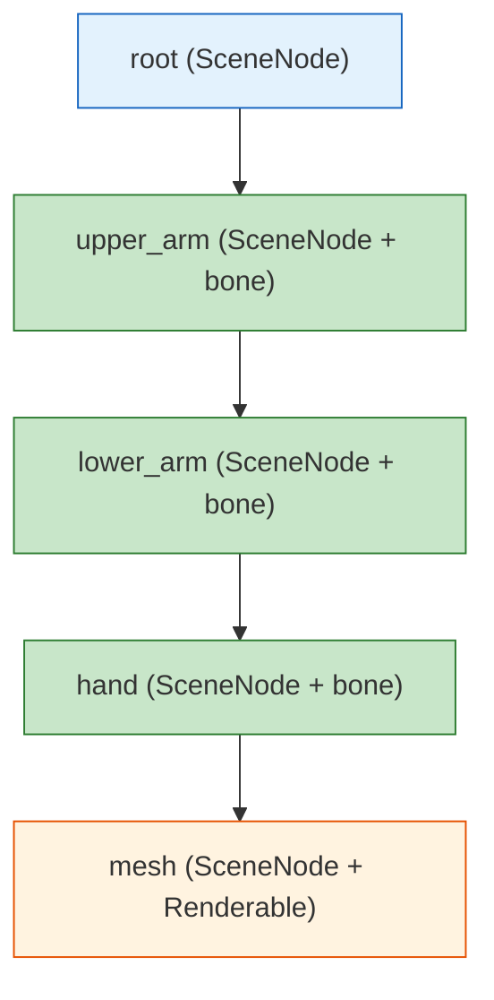

Benefits:
- transform propagation is free — `update_world_transforms()` already handles it
- cameras and lights can be parented to bones without special cases
- no duplication of hierarchy logic

The renderable mesh node sits at the end of the bone chain. For rigid animation, the mesh
node's world transform is the product of all ancestor bone transforms — exactly what the
existing traversal computes.

---

## 5. Phase 2 — Skinning Data Model + graphynx CUDA Path

Phase 2 adds the data types needed for mesh deformation and wires them into graphynx as a
CUDA compute graph node. The rendering output path reuses the existing `DynamicMesh`
infrastructure from the metaballs milestone.

### 5.1 SkeletonAsset

`SkeletonAsset` is an immutable asset in `rig-assets`. It stores the bind-pose skeleton
as flat, `bytemuck::Pod`-compatible arrays — directly mappable to CUDA device memory.

```rust
/// Immutable bind-pose skeleton.
///
/// All arrays are parallel: index `i` describes joint `i`.
pub struct SkeletonAsset {
    /// Human-readable joint names (for binding and debugging).
    pub joint_names: Vec<String>,
    /// Parent joint index. `None` for root joints.
    pub parent_indices: Vec<Option<u16>>,
    /// Inverse bind matrix for each joint: transforms from model space to joint space.
    /// Stored as flat `[[f32; 16]]` for direct CUDA upload.
    pub inverse_bind_matrices: Vec<[[f32; 4]; 4]>,
}
```

`SkeletonHandle` follows the same typed-index pattern as other asset handles.

### 5.2 SkinAsset

`SkinAsset` stores per-vertex skinning data. It is separate from `MeshAsset` so unskinned
meshes pay no memory or processing cost.

```rust
/// Per-vertex skinning data for one mesh.
pub struct SkinAsset {
    /// Up to 4 joint indices per vertex, packed as `[u16; 4]`.
    /// Unused slots are zero.
    pub joint_indices: Arc<[u8]>, // bytemuck-cast from Vec<[u16; 4]>
    /// Corresponding blend weights per vertex, packed as `[f32; 4]`.
    /// Weights for each vertex sum to 1.0.
    pub joint_weights: Arc<[u8]>, // bytemuck-cast from Vec<[f32; 4]>
    /// Number of vertices.
    pub vertex_count: u32,
}
```

### 5.3 SkinComponent

`SkinComponent` is a scene component (stored in `SceneGraph`'s component maps) that
attaches skinning data to a renderable node.

```rust
pub struct SkinComponent {
    /// The bind-pose skeleton.
    pub skeleton: SkeletonHandle,
    /// Per-vertex bone indices and weights for this mesh.
    pub skin: SkinHandle,
    /// Maps skeleton joint index → scene NodeId.
    /// Resolved at bind time from joint names.
    pub joint_nodes: Vec<Option<NodeId>>,
}
```

### 5.4 Bone matrix packing

Each frame, `rig-anim` collects the current world transforms of all joint nodes and
computes the final skinning matrices:

```
skinning_matrix[i] = joint_world_transform[i] * inverse_bind_matrix[i]
```

These are packed into a flat `Vec<[[f32; 4]; 4]>` — the primary input tensor to the
graphynx skinning node.

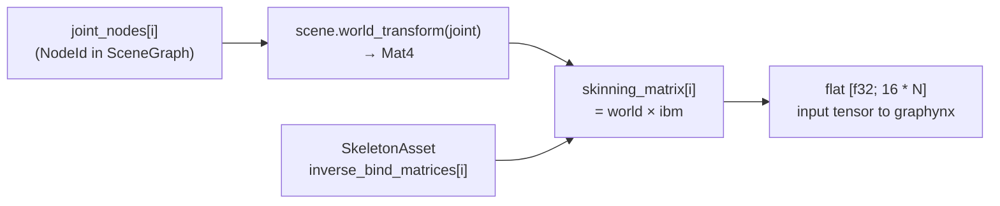

### 5.5 graphynx skinning node

The skinning computation runs as a graphynx compute graph node dispatched to the CUDA
backend. The node takes four input tensors and produces one output tensor:

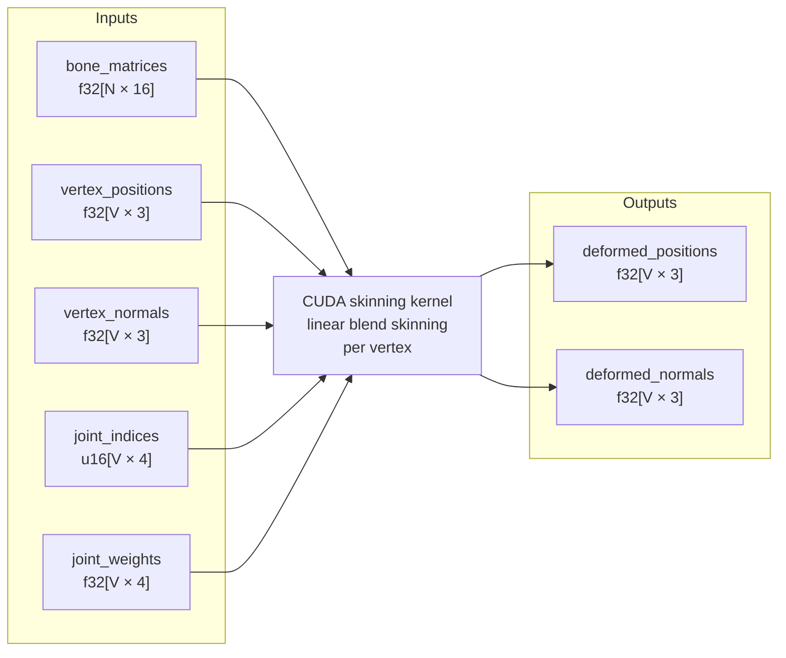

The CUDA kernel implements **linear blend skinning** (LBS), the same algorithm used by
GTE's `SkinController`:

```
position_out = Σᵢ weight[i] * (bone_matrix[joint[i]] * position_rest)
normal_out   = normalize(Σᵢ weight[i] * (bone_matrix[joint[i]] * normal_rest))
```

Normals are transformed by the same skinning matrix (valid for rigid/uniform-scale bones).
For non-uniform scale, the inverse-transpose should be used — this is a future refinement.

### 5.6 Data handoff to the renderer

The graphynx output tensors are read back and written into the existing `DynamicMesh`
GPU buffers via `Renderer::update_dynamic_mesh()`:

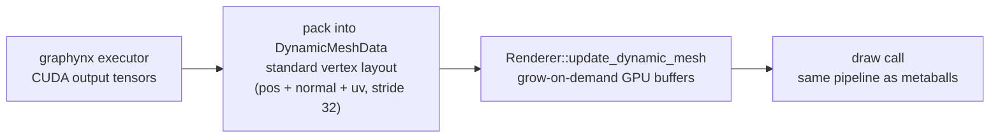

UV coordinates are not deformed — they are copied from the rest-pose mesh unchanged.

The data handoff is a CPU-side copy from CUDA pinned memory to the staging buffer. A
future optimization could use CUDA-Vulkan interop (via `VK_KHR_external_memory`) to
eliminate the copy entirely, but this is deferred until profiling shows it is a
bottleneck.

---

## 6. Phase 3 — glTF Loader (Future)

Phase 3 introduces a `rig-gltf` crate that decodes `.gltf`/`.glb` files into the types
established in phases 1 and 2. glTF is a consumer of the animation system, not its driver.

### 6.1 glTF concept mapping

| glTF concept | Framework type | Notes |
|---|---|---|
| `animation` | `AnimationClip` | One clip per glTF animation |
| `animation.channel` | `AnimationChannel` | target node + property |
| `animation.sampler` | `KeyframeSampler` | times + values + interpolation |
| `animation.sampler.interpolation` | `Interpolation` | STEP / LINEAR / CUBICSPLINE |
| `skin` | `SkeletonAsset` | joints + inverseBindMatrices |
| `skin.joints[i]` | `joint_nodes[i]` in `SkinComponent` | resolved to `NodeId` |
| `JOINTS_0` accessor | `SkinAsset.joint_indices` | u8 or u16 per glTF spec |
| `WEIGHTS_0` accessor | `SkinAsset.joint_weights` | f32 normalized |
| `node` | `SceneGraph` node | hierarchy + local transform |
| `mesh` | `MeshAsset` | geometry |
| `material` | `MaterialAsset` | PBR → Blinn-Phong approximation |
| `camera` | `CameraComponent` | perspective / orthographic |

### 6.2 Decoder crate

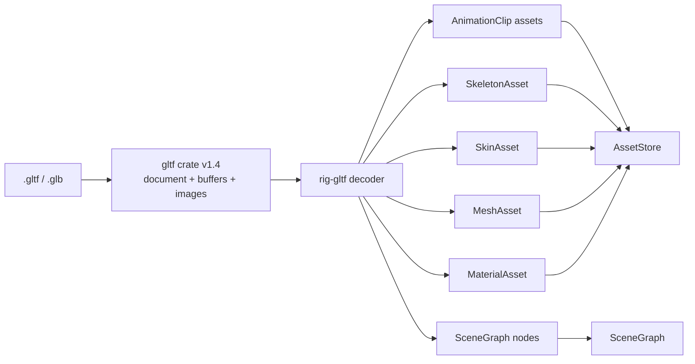

The `gltf` crate ([docs.rs/gltf](https://docs.rs/gltf/latest/gltf/)) provides typed
access to all glTF structures. `rig-gltf` adapts them into framework types following the
same pattern as `rig-import` adapts `rig-loader` decoded data.

---

## 7. Example Assets

### 7.1 Phase 1 — procedural geometry

Phase 1 examples use **MeshFactory primitives** assembled into articulated hierarchies
with hand-coded keyframes. No external model files are required. This matches the
existing pattern of `mesh_showcase`, `platonic_solids`, and `metaballs`.

A robot arm example builds its geometry entirely from `mesh_factory::create_box()` calls,
parented in a chain of scene nodes.

### 7.2 Phase 3 — Khronos glTF sample assets

When glTF loading lands, the following CC-licensed models from the
[Khronos glTF-Sample-Assets](https://github.com/KhronosGroup/glTF-Sample-Assets)
repository are the natural test suite. They live under `assets/models/animated/` and are
tracked by Git LFS (`.glb` is already in `.gitattributes`).

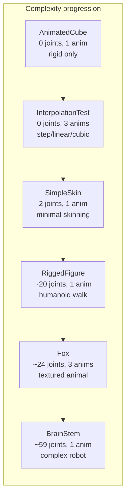

| Model | File | License | Joints | Animations | Purpose |
|-------|------|---------|--------|------------|---------|
| AnimatedCube | `AnimatedCube.glb` | CC BY 4.0 | 0 (rigid) | 1 (rotation) | Simplest animation test — no skin |
| InterpolationTest | `InterpolationTest.glb` | CC BY 4.0 | 0 (rigid) | 3 | Tests step / linear / cubic spline modes |
| SimpleSkin | `SimpleSkin.glb` | CC BY 4.0 | 2 | 1 | Minimal 2-joint skinning test |
| RiggedSimple | `RiggedSimple.glb` | CC BY 4.0 | ~5 | 1 | Simple rigged mesh |
| RiggedFigure | `RiggedFigure.glb` | CC BY 4.0 | ~20 | 1 (walk) | Humanoid stick figure |
| Fox | `Fox.glb` | CC BY 4.0 | ~24 | 3 (run/walk/survey) | Textured animal, multiple clips |
| BrainStem | `BrainStem.glb` | CC BY 4.0 | ~59 | 1 | Complex articulated robot, deep hierarchy |

Download URLs follow the pattern:
```
https://github.com/KhronosGroup/glTF-Sample-Assets/raw/main/Models/<Name>/glTF-Binary/<Name>.glb
```

These should be added to `scripts/download_assets.sh` (or a new
`scripts/download_animated_assets.sh`) to fetch into `.asset-downloads/gltf/` and copy
to `assets/models/animated/`.

---

## 8. Example Demos

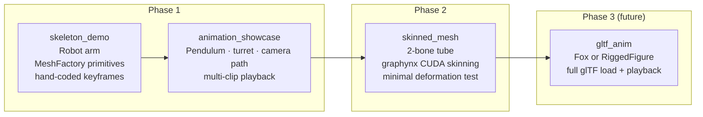

### `examples/skeleton_demo` (Phase 1)

A 5-segment articulated robot arm built from `mesh_factory::create_box()` segments. Each
segment is a scene node parented to the previous. Hand-coded rotation keyframes drive each
joint independently. The overlay HUD shows current animation time, playback speed, and
playing/paused state.

Controls:
- `W` / `S` / `A` / `D` — move camera horizontally/forward/backward
- `Q` / `E` — move camera down / up
- Arrow keys — rotate camera
- `Space` — pause / resume
- `+` / `-` — speed up / slow down
- `Escape` — close the window
- `F3` — toggle overlay

### `examples/animation_showcase` (Phase 1)

Three independent animated objects in one scene:
- **Pendulum** — single rotation channel, sinusoidal keyframes
- **Turret** — two-level hierarchy (base yaw + barrel pitch), looping patrol
- **Camera dolly** — translation channel drives the active camera along a path

Demonstrates multi-player playback, looping, and camera animation.

### `examples/skinned_mesh` (Phase 2)

A programmatic tube mesh (cylinder subdivided into 8 rings along its length) with 2
joints. The lower joint rotates over time, bending the tube. graphynx dispatches the
skinning to the CUDA backend. The overlay shows vertex count, joint count, and frame
time for the CUDA kernel.

### `examples/gltf_anim` (Phase 3, future)

Loads a glTF model (Fox or RiggedFigure) via `rig-gltf`, constructs the scene graph,
binds the first animation clip, and plays it in a loop. The overlay shows model name,
joint count, animation name, and current time.

---

## 9. Extension Rules

When extending the animation system, follow these rules.

### Good additions to `rig-anim`

- new interpolation modes (e.g. Bezier, ease-in/out)
- animation blending and crossfade
- animation state machines (idle → walk → run)
- procedural animation generators (IK, look-at, spring)
- morph target weight animation (alongside transform channels)

### Good additions to `rig-assets`

- `AnimationClip` variants (e.g. additive clips)
- `SkeletonAsset` extensions (e.g. bone constraints, rest-pose transforms)
- `SkinAsset` extensions (e.g. 8-bone weights for high-quality deformation)

### Bad additions

- GPU buffer handles or bind group layouts in `AnimationClip` or `SkeletonAsset`
- wgpu types in `rig-anim`
- scene graph mutation inside the CUDA kernel or graphynx node
- hard-coding a maximum bone count in `rig-anim` (that belongs in the CUDA kernel or
  the graphynx op parameters)

### Rule of thumb

If the data still makes sense when no renderer or CUDA runtime exists, it belongs in
`rig-anim` or `rig-assets`. If it only exists to satisfy a GPU binding or kernel
launch parameter, it belongs in `rig-render` or graphynx.
