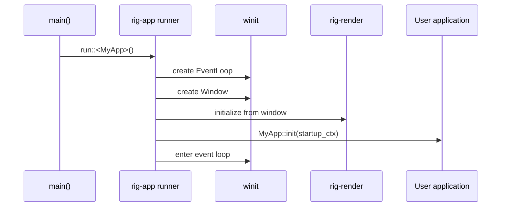
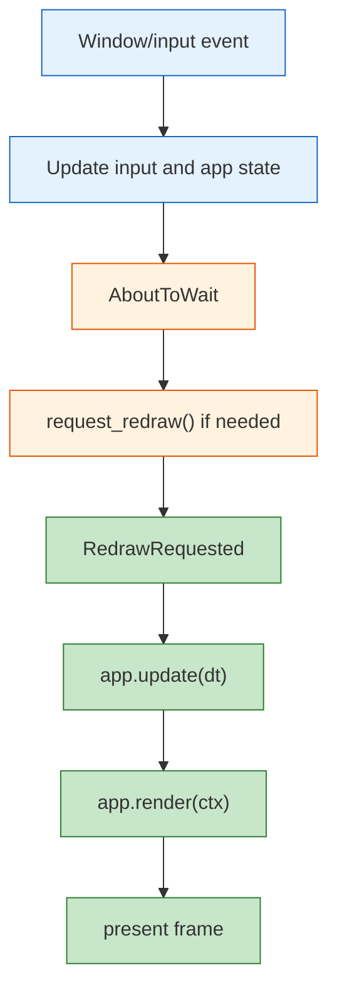

# Application Framework, Runtime, and Interaction

**Crates**: `rig-app`, `rig-scene`, `rig-render`, `rig-math`
**Purpose**: Define the runtime shell around scene update, rendering, input, and utility controllers

---

## Table of Contents

1. [Role of rig-app](#1-role-of-rig-app)
2. [Runner and Startup](#2-runner-and-startup)
3. [Application Trait](#3-application-trait)
4. [Context Types](#4-context-types)
5. [Event Model](#5-event-model)
6. [Input Handling](#6-input-handling)
7. [Frame Timing](#7-frame-timing)
8. [Camera Model](#8-camera-model)
9. [Controllers](#9-controllers)
10. [Render Extraction and Submission](#10-render-extraction-and-submission)
11. [Surface Lifecycle and Error Handling](#11-surface-lifecycle-and-error-handling)
12. [Worked Example](#12-worked-example)
13. [GTE Comparison](#13-gte-comparison)

---

## 1. Role of rig-app

`rig-app` is the runtime shell around the engine.

It is responsible for:

- creating the `winit` event loop
- creating the window
- initializing the renderer
- managing input and frame timing
- driving application update and redraw
- exposing utility controllers such as camera movement helpers

It is not responsible for:

- owning scene internals directly
- defining GPU resource caching policy
- embedding render-pass-specific logic into the scene graph

The app layer should stay thin and practical.

---

## 2. Runner and Startup

The runner initializes the runtime and then hands control to `winit`.

### 2.1 Startup phases



### 2.2 Error handling

Startup should return `Result`, not assume infallibility.

```rust
pub fn run<A: Application + 'static>() -> anyhow::Result<()> {
    // create event loop and window
    // initialize renderer
    // initialize app state
    // run event loop
}
```

Reasons startup can fail:

- no suitable adapter
- surface creation failure
- shader compilation failure
- missing assets
- user application initialization failure

---

## 3. Application Trait

The application trait should separate startup, update, and render responsibilities.

```rust
pub trait Application: Sized {
    fn init(ctx: &mut StartupContext) -> anyhow::Result<Self>;

    fn update(&mut self, ctx: &mut UpdateContext, dt: f32) -> anyhow::Result<()>;

    fn render(&mut self, ctx: &mut RenderContext) -> anyhow::Result<()>;

    fn on_window_event(
        &mut self,
        _ctx: &mut UpdateContext,
        _event: &winit::event::WindowEvent,
    ) -> anyhow::Result<()> {
        Ok(())
    }
}
```

### Why this split

- startup needs setup access
- update needs world mutation and input
- render needs renderer-facing operations

This is a better fit than one public mutable “god context” passed everywhere.

---

## 4. Context Types

The exact API can evolve, but the architectural direction is stable: use narrower context
types instead of exposing all subsystems as public fields.

### 4.1 StartupContext

Used once during initialization.

```rust
pub struct StartupContext<'a> {
    pub scene: &'a mut SceneGraph,
    pub assets: &'a mut AssetStore,
    pub renderer: &'a mut Renderer,
    pub window: &'a Window,
}
```

### 4.2 UpdateContext

Used during simulation and scene updates.

```rust
pub struct UpdateContext<'a> {
    pub scene: &'a mut SceneGraph,
    pub input: &'a InputState,
    pub timer: &'a FrameTimer,
    pub active_camera: &'a mut Option<NodeId>,
}
```

### 4.3 RenderContext

Used during redraw.

```rust
pub struct RenderContext<'a> {
    pub scene: &'a SceneGraph,
    pub assets: &'a AssetStore,
    pub renderer: &'a mut Renderer,
    pub active_camera: Option<NodeId>,
}
```

### Design intent

- update code should not casually reach into renderer internals
- render code should not mutate arbitrary scene internals by default
- context structure should make illegal states harder to express

---

## 5. Event Model

Use redraw-driven rendering.

### 5.1 High-level flow



### 5.2 Why redraw-driven

This fits `winit` and `wgpu` better than doing all rendering from `AboutToWait`:

- clearer redraw semantics
- cleaner resize handling
- easier surface reconfiguration
- more explicit control over when a frame is produced

### 5.3 Typical event loop behavior

```rust
match event {
    Event::WindowEvent { event, .. } => {
        // update input state
        // forward event to app
        // handle resize / close / occlusion
    }
    Event::AboutToWait => {
        window.request_redraw();
    }
    Event::WindowEvent {
        event: WindowEvent::RedrawRequested,
        ..
    } => {
        // tick timer
        // app.update(...)
        // app.render(...)
    }
    _ => {}
}
```

---

## 6. Input Handling

`InputState` tracks current keyboard and mouse state.

```rust
pub struct InputState {
    keys: HashSet<KeyCode>,
    mouse_buttons: HashSet<MouseButton>,
    mouse_x: f64,
    mouse_y: f64,
    mouse_dx: f64,
    mouse_dy: f64,
}
```

Useful queries:

- `is_key_pressed(key)`
- `is_mouse_button_pressed(button)`
- `mouse_position()`
- `mouse_delta()`

The runner updates input state from `winit` events. Application code reads it through
`UpdateContext`.

---

## 7. Frame Timing

`FrameTimer` measures delta time and optional FPS statistics.

```rust
pub struct FrameTimer {
    last_instant: Instant,
    frame_count: u64,
    current_fps: f32,
}
```

Typical API:

```rust
impl FrameTimer {
    pub fn tick(&mut self) -> f32;
    pub fn fps(&self) -> f32;
    pub fn frame_count(&self) -> u64;
}
```

This stays in `rig-app` because it is runtime orchestration state, not math or scene data.

---

## 8. Camera Model

The camera should be modeled as pose plus projection, with derived matrices.

### 8.1 Pose and projection

```rust
pub struct Camera {
    pub pose: Transform,
    pub projection: Projection,
}
```

Or, if the camera is stored as a scene node plus component:

- node transform gives pose
- `CameraComponent` gives projection

### 8.2 Derived APIs

```rust
impl Camera {
    pub fn view_matrix(&self) -> Mat4;
    pub fn projection_matrix(&self, aspect: f32) -> Mat4;
    pub fn projection_view_matrix(&self, aspect: f32) -> Mat4;
    pub fn frustum_planes(&self, aspect: f32) -> [Vec4; 6];
}
```

### 8.3 Design notes

- avoid public mutable cached basis vectors like `right`
- avoid public `dirty` flags
- prefer logically read-only getters

This reduces borrowing friction and keeps camera invariants in one place.

---

## 9. Controllers

Controllers are utilities, not mandatory built-ins.

### 9.1 CameraRig

`CameraRig` translates input into camera node motion.

```rust
pub struct CameraRig {
    pub translation_speed: f32,
    pub rotation_speed: f32,
    active_motions: HashSet<CameraMotion>,
}
```

Recommended behavior:

- the app chooses whether to install and use it
- it mutates a target node transform or camera pose through scene APIs
- it does not rely on poking internal camera fields directly

### 9.2 TrackBall

`TrackBall` maps mouse drags to object rotation.

```rust
pub struct TrackBall {
    active: bool,
    width: f32,
    height: f32,
    target_node: Option<NodeId>,
    initial_point: Vec3,
    initial_rotation: Quat,
}
```

Recommended behavior:

- opt-in utility
- rotates a chosen scene node through scene mutation APIs
- does not assume a hard-coded global root object

---

## 10. Render Extraction and Submission

`rig-app` should not own a `PVWUpdater`-style bridge object. Instead, render flow should be:

1. app updates scene
2. scene recomputes world transforms and bounds
3. app or renderer selects the active camera node
4. renderer extracts visible renderables
5. renderer allocates frame resources and uploads typed data
6. renderer records draw commands and presents


The important boundary is that renderer upload policy is renderer-owned.

---

## 11. Surface Lifecycle and Error Handling

The runtime should handle `wgpu` surface cases explicitly.

### 11.1 Resize

- update window dimensions
- reconfigure the surface
- recreate depth/offscreen targets if needed

### 11.2 Occlusion or minimization

- skip drawing gracefully
- do not treat it as a hard error

### 11.3 Outdated or lost surface

- reconfigure or recreate surface-dependent resources

### 11.4 Out of memory

- return an error and exit cleanly

This behavior should be owned by the runner and renderer, not spread through scene code.

---

## 12. Worked Example

```rust
struct TriangleApp {
    triangle: NodeId,
    camera: NodeId,
}

impl Application for TriangleApp {
    fn init(ctx: &mut StartupContext) -> anyhow::Result<Self> {
        let triangle_mesh = ctx.assets.add_mesh(MeshAsset { /* ... */ });
        let triangle_material = ctx.assets.add_material(MaterialAsset { /* ... */ });

        let triangle = ctx.scene.create_node("triangle");
        ctx.scene.set_renderable(
            triangle,
            Renderable {
                mesh: triangle_mesh,
                material: triangle_material,
            },
        )?;

        let camera = ctx.scene.create_node("camera");
        ctx.scene.set_camera(
            camera,
            CameraComponent {
                projection: Projection::Perspective {
                    fov_y_radians: 60.0_f32.to_radians(),
                    near: 0.1,
                    far: 100.0,
                },
            },
        )?;

        Ok(Self { triangle, camera })
    }

    fn update(&mut self, ctx: &mut UpdateContext, dt: f32) -> anyhow::Result<()> {
        // update scene state here
        Ok(())
    }

    fn render(&mut self, ctx: &mut RenderContext) -> anyhow::Result<()> {
        ctx.renderer.render_scene(ctx.scene, ctx.assets, ctx.active_camera)?;
        Ok(())
    }
}
```

This example keeps scene mutation in update and rendering in the renderer.

---

## 13. GTE Comparison

GTE still informs some concepts, but the runtime shape is different.

| GTE | Rust direction |
|-----|----------------|
| layered application/window inheritance | runner + app trait + narrow contexts |
| `OnIdle()` render loop | redraw-driven `winit` flow |
| `Window3` owns camera/trackball/PVW directly | app utilities + scene camera nodes + renderer extraction |
| camera rig mutations via class internals | utility controllers through explicit APIs |
| matrix bridge object (`PVWUpdater`) | renderer-owned frame extraction and upload |

The result is more idiomatic for Rust because ownership stays explicit and subsystems have
cleaner boundaries.
