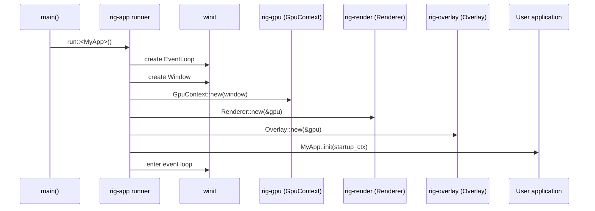
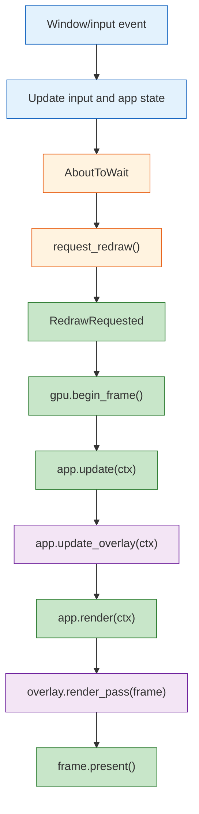

# Application Framework, Runtime, and Interaction

**Crates**: `rig-app`, `rig-gpu`, `rig-render`, `rig-overlay`, `rig-scene`, `rig-math`
**Purpose**: Define the runtime shell around scene update, rendering, overlay, input, and utility controllers

---

## Table of Contents

1. [Role of rig-app](#1-role-of-rig-app)
2. [Runner and Startup](#2-runner-and-startup)
3. [Application Trait](#3-application-trait)
4. [Context Types](#4-context-types)
5. [Event Model](#5-event-model)
6. [Input Handling](#6-input-handling)
7. [Frame Timing](#7-frame-timing)
8. [Camera Model](#8-camera-model)
9. [Controllers](#9-controllers)
10. [Render Extraction and Submission](#10-render-extraction-and-submission)
11. [Overlay System](#11-overlay-system)
12. [Surface Lifecycle and Error Handling](#12-surface-lifecycle-and-error-handling)
13. [Worked Example](#13-worked-example)
14. [GTE Comparison](#14-gte-comparison)

---

## 1. Role of rig-app

`rig-app` is the runtime shell around the engine.

It is responsible for:

- creating the `winit` event loop
- creating the window
- initializing `GpuContext` (device, queue, surface)
- initializing the renderer, overlay, and asset store
- managing input and frame timing
- driving application update, overlay update, and redraw
- presenting the finished frame
- exposing utility controllers such as camera movement helpers

It is not responsible for:

- owning scene internals directly
- defining GPU resource caching policy
- embedding render-pass-specific logic into the scene graph

The app layer should stay thin and practical.

---

## 2. Runner and Startup

The runner initializes the runtime and then hands control to `winit`.

### 2.1 Startup phases


```mermaid
sequenceDiagram
    participant Main as main()
    participant Runner as rig-app runner
    participant Winit as winit
    participant Gpu as rig-gpu (GpuContext)
    participant Renderer as rig-render (Renderer)
    participant Overlay as rig-overlay (Overlay)
    participant App as User application

    Main->>Runner: run::<MyApp>()
    Runner->>Winit: create EventLoop
    Runner->>Winit: create Window
    Runner->>Gpu: GpuContext::new(window)
    Runner->>Renderer: Renderer::new(&gpu)
    Runner->>Overlay: Overlay::new(&gpu)
    Runner->>App: MyApp::init(startup_ctx)
    Runner->>Winit: enter event loop
```

### 2.2 Error handling

Startup should return `Result`, not assume infallibility.

```rust
pub fn run<A: Application + 'static>() -> anyhow::Result<()> {
    // create event loop and window
    // initialize renderer
    // initialize app state
    // run event loop
}
```

Reasons startup can fail:

- no suitable adapter
- surface creation failure
- shader compilation failure
- missing assets
- user application initialization failure

---

## 3. Application Trait

The application trait separates startup, update, overlay update, and render responsibilities.

```rust
pub trait Application: Sized {
    fn init(ctx: &mut StartupContext) -> anyhow::Result<Self>;

    /// Called every frame. `dt` is the elapsed time in seconds since the last frame.
    fn update(&mut self, ctx: &mut UpdateContext<'_>, dt: f32) -> anyhow::Result<()>;

    fn render(&mut self, ctx: &mut RenderContext<'_>) -> anyhow::Result<()>;

    fn update_overlay(&mut self, _ctx: &mut OverlayUpdateContext<'_>) -> anyhow::Result<()> {
        Ok(())
    }

    fn on_window_event(
        &mut self,
        _ctx: &mut UpdateContext<'_>,
        _event: &winit::event::WindowEvent,
    ) -> anyhow::Result<()> {
        Ok(())
    }
}
```

### Why this split

- startup needs setup access (scene, assets, renderer, overlay, gpu)
- update needs world mutation and input
- render needs renderer-facing operations and the current `Frame`
- overlay update is separate so it can access the `Overlay` registry without conflicting borrows with the scene

This is a better fit than one public mutable "god context" passed everywhere.

---

## 4. Context Types

Narrower context types are used instead of exposing all subsystems as public fields.

### 4.1 StartupContext

Used once during initialization.

```rust
pub struct StartupContext<'a> {
    pub scene: &'a mut SceneGraph,
    pub assets: &'a mut AssetStore,
    pub renderer: &'a mut Renderer,
    pub overlay: &'a mut Overlay,
    pub gpu: &'a GpuContext,
    pub active_camera: &'a mut Option<NodeId>,
}
```

`active_camera` is exposed here so the application can set the initial camera during
`init()` without needing a separate call.

### 4.2 UpdateContext

Used during simulation and scene updates.

```rust
pub struct UpdateContext<'a> {
    pub scene: &'a mut SceneGraph,
    pub assets: &'a AssetStore,
    pub input: &'a InputState,
    pub timer: &'a FrameTimer,
    pub active_camera: &'a mut Option<NodeId>,
    // private: exit_requested
}
```

`UpdateContext` also exposes:

```rust
impl UpdateContext<'_> {
    /// Signal the runner to exit cleanly after the current frame.
    pub fn request_exit(&mut self);
}
```

Call `ctx.request_exit()` from `update()` or `on_window_event()` to trigger a clean
shutdown (e.g. on Escape key). The runner checks the flag after `update()` returns and
calls `event_loop.exit()`.

### 4.3 RenderContext

Used during redraw. Holds a live `Frame` so the app can record render passes.

```rust
pub struct RenderContext<'a> {
    pub scene: &'a SceneGraph,
    pub assets: &'a AssetStore,
    pub renderer: &'a mut Renderer,
    pub gpu: &'a GpuContext,
    pub frame: &'a mut Frame,
    pub active_camera: Option<NodeId>,
}
```

### 4.4 OverlayUpdateContext

Used after `update()` to refresh overlay text elements.

```rust
pub struct OverlayUpdateContext<'a> {
    pub overlay: &'a mut Overlay,
    pub timer: &'a FrameTimer,
}
```

Convenience methods:

```rust
impl OverlayUpdateContext<'_> {
    pub fn set_text(&mut self, id: ElementId, text: impl Into<String>) -> anyhow::Result<()>;
    pub fn set_position(&mut self, id: ElementId, pos: Position) -> anyhow::Result<()>;
}
```

### Design intent

- update code should not casually reach into renderer internals
- render code should not mutate arbitrary scene internals by default
- overlay update has its own context to avoid borrow conflicts with scene/renderer
- context structure makes illegal states harder to express

---

## 5. Event Model

Use redraw-driven rendering.

### 5.1 High-level flow


```mermaid
flowchart TD
    WE["Window/input event"] --> Handle["Update input and app state"]
    Handle --> Wait["AboutToWait"]
    Wait --> Req["request_redraw()"]
    Req --> Redraw["RedrawRequested"]
    Redraw --> BF["gpu.begin_frame()"]
    BF --> Update["app.update(ctx)"]
    Update --> Overlay["app.update_overlay(ctx)"]
    Overlay --> Render["app.render(ctx)"]
    Render --> OP["overlay.render_pass(frame)"]
    OP --> Present["frame.present()"]

    style WE fill:#e3f2fd,stroke:#1565c0
    style Handle fill:#e3f2fd,stroke:#1565c0
    style Wait fill:#fff3e0,stroke:#e65100
    style Req fill:#fff3e0,stroke:#e65100
    style Redraw fill:#c8e6c9,stroke:#2e7d32
    style BF fill:#c8e6c9,stroke:#2e7d32
    style Update fill:#c8e6c9,stroke:#2e7d32
    style Overlay fill:#f3e5f5,stroke:#6a1b9a
    style Render fill:#c8e6c9,stroke:#2e7d32
    style OP fill:#f3e5f5,stroke:#6a1b9a
    style Present fill:#c8e6c9,stroke:#2e7d32
```

### 5.2 Why redraw-driven

This fits `winit` and `wgpu` better than doing all rendering from `AboutToWait`:

- clearer redraw semantics
- cleaner resize handling
- easier surface reconfiguration
- more explicit control over when a frame is produced

### 5.3 Typical event loop behavior

```rust
match event {
    Event::WindowEvent { event, .. } => {
        // update input state
        // forward event to app
        // handle resize / close / occlusion
    }
    Event::AboutToWait => {
        window.request_redraw();
    }
    Event::WindowEvent {
        event: WindowEvent::RedrawRequested,
        ..
    } => {
        // tick timer
        // app.update(...)
        // app.render(...)
    }
    _ => {}
}
```

---

## 6. Input Handling

`InputState` tracks current keyboard and mouse state.

```rust
pub struct InputState {
    keys: HashSet<KeyCode>,
    pub mouse_buttons: HashSet<MouseButton>,
    pub mouse_position: Vec2,  // current cursor position in pixels, origin top-left
    pub mouse_delta: Vec2,     // per-frame accumulated movement, reset each frame
}
```

Useful queries:

- `is_key_pressed(key)` — keyboard
- `is_mouse_button_pressed(button)` — mouse buttons
- `mouse_position` — current cursor position
- `mouse_delta` — movement since last frame reset

The runner updates input state from winit events:
- `KeyboardInput` → `update_key()`
- `CursorMoved` → `update_mouse_position()`
- `MouseInput` → `update_mouse_button()`

`reset_mouse_delta()` is called at the start of each frame so `mouse_delta` always
reflects only the current frame's movement.

---

## 7. Frame Timing

`FrameTimer` measures delta time and optional FPS statistics.

```rust
pub struct FrameTimer {
    last_instant: Instant,
    frame_count: u64,
    current_fps: f32,
}
```

Typical API:

```rust
impl FrameTimer {
    pub fn tick(&mut self) -> f32;
    pub fn fps(&self) -> f32;
    pub fn frame_count(&self) -> u64;
}
```

This stays in `rig-app` because it is runtime orchestration state, not math or scene data.

---

## 8. Camera Model

The camera should be modeled as pose plus projection, with derived matrices.

### 8.1 Pose and projection

```rust
pub struct Camera {
    pub pose: Transform,
    pub projection: Projection,
}
```

Or, if the camera is stored as a scene node plus component:

- node transform gives pose
- `CameraComponent` gives projection

### 8.2 Derived APIs

```rust
impl Camera {
    pub fn view_matrix(&self) -> Mat4;
    pub fn projection_matrix(&self, aspect: f32) -> Mat4;
    pub fn projection_view_matrix(&self, aspect: f32) -> Mat4;
    pub fn frustum_planes(&self, aspect: f32) -> [Vec4; 6];
}
```

### 8.3 Design notes

- avoid public mutable cached basis vectors like `right`
- avoid public `dirty` flags
- prefer logically read-only getters

This reduces borrowing friction and keeps camera invariants in one place.

---

## 9. Controllers

Controllers are utilities, not mandatory built-ins.

### 9.1 CameraRig

`CameraRig` translates input into camera node motion.

```rust
pub struct CameraRig {
    pub translation_speed: f32,
    pub rotation_speed: f32,
    active_motions: HashSet<CameraMotion>,
}
```

Recommended behavior:

- the app chooses whether to install and use it
- it mutates a target node transform or camera pose through scene APIs
- it does not rely on poking internal camera fields directly

### 9.2 TrackBall

`TrackBall` is an opt-in arc-ball controller that maps mouse drags to camera rotation
around a target scene node.

```rust
pub struct TrackBall {
    pub target: NodeId,
    pub distance: f32,
    pub sensitivity: f32,
    // yaw and pitch are private internal state
}
```

Behavior:
- **Left mouse drag**: orbit (yaw/pitch) around the target node's world position
- **Right mouse drag**: dolly (adjust distance from target)
- Pitch is clamped to ±89° to prevent gimbal flip

Usage:

```rust
// In init():
let trackball = TrackBall::new(target_node, 5.0);

// In update():
trackball.update(ctx.input, ctx.scene, camera_node, dt)?;
```

`TrackBall` and `CameraRig` are independent — `CameraRig` is a keyboard-driven fly
camera while `TrackBall` is a mouse-driven orbit camera.

---

## 10. Render Extraction and Submission

`rig-app` should not own a `PVWUpdater`-style bridge object. Instead, render flow should be:

1. app updates scene
2. scene recomputes world transforms and bounds
3. app or renderer selects the active camera node
4. renderer computes frustum planes from the camera projection-view matrix
5. renderer calls `extract_renderables_culled` — objects outside the frustum and `Hidden` nodes are excluded automatically
6. renderer allocates frame resources and uploads typed data
7. renderer records draw commands and presents


```mermaid
flowchart LR
    App["Application update"] --> Scene["SceneGraph update"]
    Scene --> Cam["Choose active camera"]
    Cam --> Cull["Frustum cull + extract visible"]
    Cull --> Upload["Frame allocation + uploads"]
    Upload --> Draw["Draw + present"]

    style App fill:#e3f2fd,stroke:#1565c0
    style Scene fill:#e3f2fd,stroke:#1565c0
    style Cam fill:#fff3e0,stroke:#e65100
    style Cull fill:#f3e5f5,stroke:#6a1b9a
    style Upload fill:#c8e6c9,stroke:#2e7d32
    style Draw fill:#c8e6c9,stroke:#2e7d32
```

Frustum culling is the **default** render path. `extract_renderables_culled` is called with
the six planes derived from the camera's projection-view matrix via
`frustum_planes_from_projection_view`. When no active camera is set, the renderer falls
back to unculled extraction.

The important boundary is that renderer upload policy is renderer-owned.

---

## 11. Overlay System

`rig-overlay` provides a retained 2D text overlay rendered on top of the 3D scene.

### 11.1 Architecture

```
rig-overlay
  ElementRegistry   — non-GPU, testable; stores TextElement by ElementId
  Overlay           — wraps glyphon TextRenderer; owns font system + atlas
```

`Overlay` renders in a separate render pass that uses `LoadOp::Load` so it composites
over the already-rendered 3D scene without clearing it.

### 11.2 Element lifecycle

Elements are registered once in `Application::init` and updated each frame in
`Application::update_overlay`.

```rust
// init
let fps_id = ctx.overlay.add_text(TextElement {
    text: "FPS: 0".into(),
    position: Position::Anchor { anchor: Anchor::TopRight, offset: [8.0, 8.0] },
    color: [1.0, 1.0, 1.0, 1.0],
    font_size: 16.0,
});

// update_overlay
ctx.set_text(fps_id, format!("FPS: {:.0}", ctx.timer.fps()))?;
```

### 11.3 Positioning

```rust
pub enum Position {
    /// Pixel coordinates from top-left.
    Absolute { x: f32, y: f32 },
    /// Offset from a named corner/edge anchor.
    Anchor { anchor: Anchor, offset: [f32; 2] },
}

pub enum Anchor {
    TopLeft, TopRight, BottomLeft, BottomRight,
    TopCenter, BottomCenter, LeftCenter, RightCenter,
    Center,
}
```

### 11.4 Visibility toggle

The runner intercepts **F3** key presses and toggles `overlay_visible` before forwarding
the event to the application. When hidden, `overlay.render_pass` is skipped entirely.

### 11.5 Frame integration

The runner owns the two-phase frame lifecycle:

```
begin_frame()
  → app.update()
  → app.update_overlay()
  → app.render()          ← 3D scene pass(es)
  → overlay.render_pass() ← 2D text pass (LoadOp::Load)
frame.present()
```

---

## 12. Surface Lifecycle and Error Handling

The runtime should handle `wgpu` surface cases explicitly.

### 12.1 Resize

- update window dimensions
- reconfigure the surface
- recreate depth/offscreen targets if needed

### 12.2 Occlusion or minimization

- skip drawing gracefully
- do not treat it as a hard error

### 12.3 Outdated or lost surface

- reconfigure or recreate surface-dependent resources

### 12.4 Out of memory

- return an error and exit cleanly

This behavior should be owned by the runner and renderer, not spread through scene code.

---

## 13. Worked Example

```rust
struct TriangleApp {
    triangle: NodeId,
    camera: NodeId,
    fps_id: ElementId,
}

impl Application for TriangleApp {
    fn init(ctx: &mut StartupContext) -> anyhow::Result<Self> {
        let triangle_mesh = ctx.assets.add_mesh(MeshAsset { /* ... */ });
        let triangle_material = ctx.assets.add_material(MaterialAsset { /* ... */ });

        let triangle = ctx.scene.create_node("triangle");
        ctx.scene.set_renderable(
            triangle,
            Renderable { mesh: triangle_mesh, material: triangle_material },
        )?;

        let camera = ctx.scene.create_node("camera");
        ctx.scene.set_camera(
            camera,
            CameraComponent {
                projection: Projection::Perspective {
                    fov_y_radians: 60.0_f32.to_radians(),
                    near: 0.1,
                    far: 100.0,
                },
            },
        )?;
        // StartupContext exposes active_camera so we can set it during init.
        *ctx.active_camera = Some(camera);

        let fps_id = ctx.overlay.add_text(TextElement {
            text: "FPS: 0".into(),
            position: Position::Anchor { anchor: Anchor::TopRight, offset: [8.0, 8.0] },
            color: [1.0, 1.0, 1.0, 1.0],
            font_size: 16.0,
        });

        Ok(Self { triangle, camera, fps_id })
    }

    fn update(&mut self, ctx: &mut UpdateContext<'_>, dt: f32) -> anyhow::Result<()> {
        // Use dt (seconds since last frame) to drive animations.
        let _ = dt;
        // Signal clean exit on Escape.
        if ctx.input.is_key_pressed(KeyCode::Escape) {
            ctx.request_exit();
        }
        Ok(())
    }

    fn render(&mut self, ctx: &mut RenderContext<'_>) -> anyhow::Result<()> {
        ctx.renderer.render_scene(ctx.gpu, ctx.frame, ctx.scene, ctx.assets, ctx.active_camera)?;
        Ok(())
    }

    fn update_overlay(&mut self, ctx: &mut OverlayUpdateContext<'_>) -> anyhow::Result<()> {
        ctx.set_text(self.fps_id, format!("FPS: {:.0}", ctx.timer.fps()))
    }
}
```

This example keeps scene mutation in `update`, rendering in `render`, and overlay text
updates in `update_overlay`. The runner calls all three in order each frame.

---

## 14. GTE Comparison

GTE still informs some concepts, but the runtime shape is different.

| GTE | Rust direction |
|-----|----------------|
| layered application/window inheritance | runner + app trait + narrow contexts |
| `OnIdle()` render loop | redraw-driven `winit` flow |
| `Window3` owns camera/trackball/PVW directly | app utilities + scene camera nodes + renderer extraction |
| camera rig mutations via class internals | utility controllers through explicit APIs |
| matrix bridge object (`PVWUpdater`) | renderer-owned frame extraction and upload |

The result is more idiomatic for Rust because ownership stays explicit and subsystems have
cleaner boundaries.
