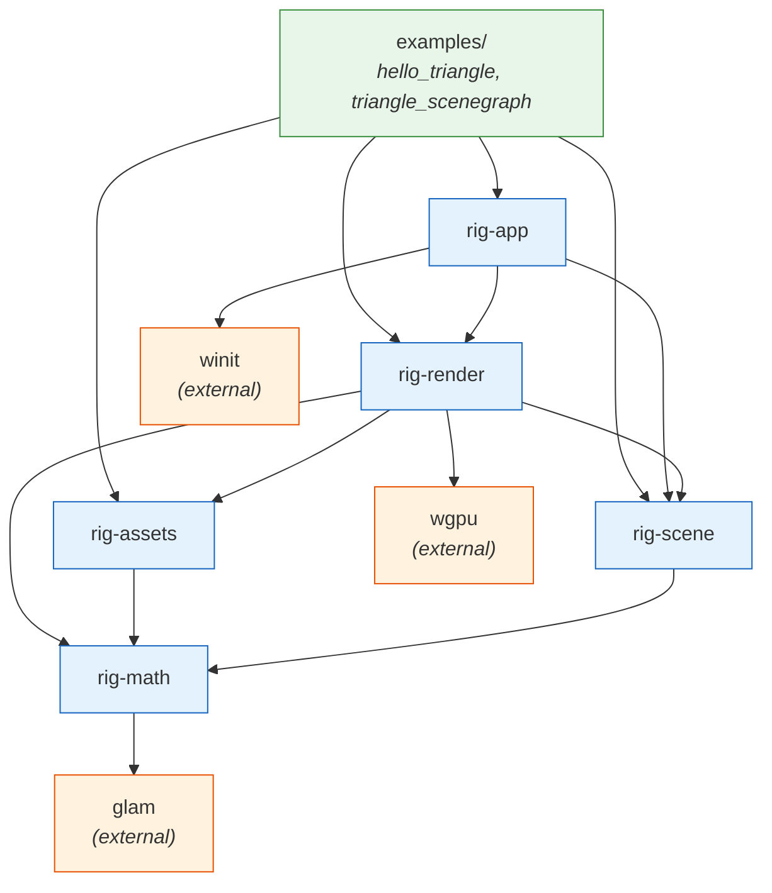
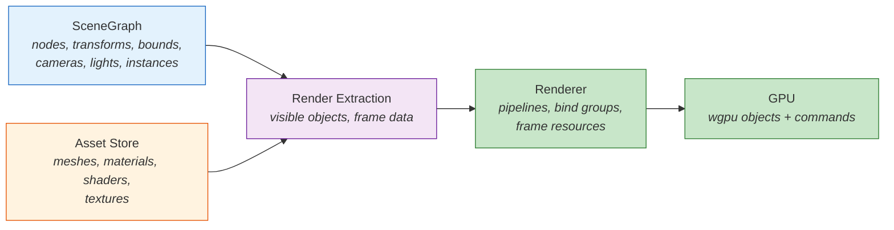
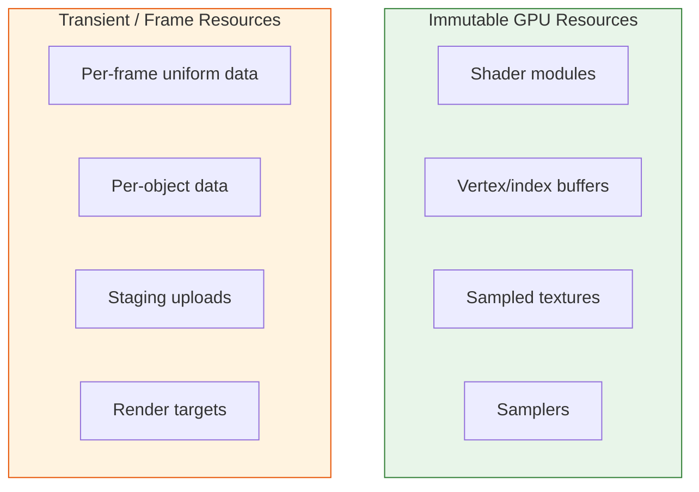
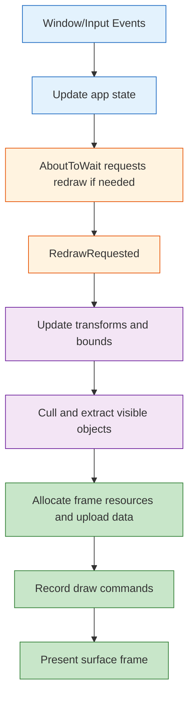

# Architecture Document

**Project**: Personal 3D & Physics Research Framework in Rust
**Platforms**: Linux (X11/Wayland), macOS (Cocoa)
**Reference codebase**: GeometricTools (historical reference only)
**Date**: 2026-04-09

---

## Table of Contents

1. [Goals and Non-Goals](#1-goals-and-non-goals)
2. [Rust Design Principles](#2-rust-design-principles)
3. [Workspace Structure](#3-workspace-structure)
4. [Crate Dependency Graph](#4-crate-dependency-graph)
5. [Core Ownership Boundaries](#5-core-ownership-boundaries)
6. [Identity and Handles](#6-identity-and-handles)
7. [Scene Model](#7-scene-model)
8. [Asset Model](#8-asset-model)
9. [Renderer Model](#9-renderer-model)
10. [Application Model](#10-application-model)
11. [Frame Lifecycle](#11-frame-lifecycle)
12. [Milestone Roadmap](#12-milestone-roadmap)
13. [Mapping from GeometricTools](#13-mapping-from-geometrictools)

---

## 1. Goals and Non-Goals

### Goals

- Build a cross-platform Rust framework for graphics and later physics research.
- Keep ownership and lifetimes explicit and simple.
- Keep scene data separate from renderer implementation details.
- Share immutable assets efficiently across many scene instances.
- Support incremental growth from a single triangle to richer scenes.
- Stay practical with `wgpu`, `winit`, and `glam` instead of building a large abstraction stack too early.

### Non-Goals

- Reproducing GeometricTools class structure in Rust.
- Designing a fully generic renderer API before concrete needs exist.
- Encoding GPU bind groups, shader source, or pipeline state directly into scene nodes.
- Building a full ECS as the first architecture step.

### Design stance

GeometricTools remains useful as a source of ideas for scene graphs, cameras, and culling,
but it is not the architectural template. The Rust version should optimize first for clear
boundaries, maintainability, and `wgpu`-friendly ownership.

---

## 2. Rust Design Principles

### 2.1 Keep scene and renderer separate

The scene graph describes world state: hierarchy, transforms, bounds, cameras, lights,
and renderable instances. The renderer owns GPU concerns: pipelines, bind groups,
surface management, frame resources, and uploads.

### 2.2 Use stable generational handles

Arena indices alone are not enough because deleted nodes may be reused. Public handles
must include a generation so stale handles fail validation instead of silently referring
to a different object.

### 2.3 Separate immutable assets from mutable frame state

Meshes, textures, samplers, and shader source are shareable immutable assets. Per-object
uniform data, transient uploads, and render targets are mutable runtime resources and are
managed differently.

### 2.4 Prefer owned handles over borrowed cache references

`wgpu` objects are cheap to clone. API boundaries should return owned handles or opaque
IDs, not long-lived borrows into caches that create artificial borrow conflicts.

### 2.5 Keep invariants behind methods

Core types such as `SceneGraph`, `Camera`, and renderer state should not expose public
mutable internals by default. Public APIs should preserve invariants around transform
propagation, camera basis validity, and resource lifetime.

### 2.6 Keep abstractions concrete until there is real pressure to generalize

The first renderer should be a concrete `wgpu` renderer. Traits should be introduced only
when there is a clear need for multiple implementations or test seams.

---

## 3. Workspace Structure

```
graphics/                           # workspace root
  Cargo.toml                        # [workspace] members
  docs/
    ARCHITECTURE.md                 # this file
    SCENEGRAPH.md                   # scene graph and world model
    RESOURCES.md                    # assets, GPU resources, frame resources
    APPLICATION.md                  # runtime, event loop, app shell
  crates/
    math/                           # rig-math
      Cargo.toml
      src/lib.rs
    scene/                          # rig-scene
      Cargo.toml
      src/lib.rs
    assets/                         # rig-assets
      Cargo.toml
      src/lib.rs
    render/                         # rig-render
      Cargo.toml
      src/lib.rs
    app/                            # rig-app
      Cargo.toml
      src/lib.rs
  examples/
    hello_triangle/                 # milestone 1
      Cargo.toml
      src/main.rs
    triangle_scenegraph/            # milestone 2
      Cargo.toml
      src/main.rs
  GeometricTools/                   # reference only, not part of the workspace
```

### Crate purposes

| Crate | Purpose | Key dependencies |
|------|---------|------------------|
| `rig-math` | Math primitives and geometry helpers | glam |
| `rig-scene` | Scene hierarchy, transforms, bounds, cameras, lights, renderable instances | rig-math |
| `rig-assets` | Immutable meshes, materials, shader source, textures, asset handles | rig-math |
| `rig-render` | Concrete `wgpu` renderer, GPU caches, frame resources, extraction, drawing | rig-math, rig-scene, rig-assets, wgpu |
| `rig-app` | Runner, input, timing, event loop integration, utility controllers | rig-scene, rig-render, winit |

---

## 4. Crate Dependency Graph



`rig-math` is the leaf. `rig-app` is the runtime shell. `rig-render` depends on scene and
assets, but scene and assets do not depend on the renderer.

---

## 5. Core Ownership Boundaries

Three boundaries drive the architecture.

### 5.1 Scene boundary

The scene graph owns world-facing state:

- hierarchy
- local and world transforms
- bounds
- cameras and lights
- references to renderable assets

It does not own:

- shader modules
- `wgpu::Buffer`
- bind groups
- render pipelines
- per-frame upload buffers

### 5.2 Asset boundary

Assets are immutable, shareable content. A mesh or material may be referenced by many
scene nodes. Asset APIs should make sharing cheap and obvious.

### 5.3 Renderer boundary

The renderer owns all GPU state and converts scene + assets into draw work.



---

## 6. Identity and Handles

### Scene handles

Scene objects use generational handles.

```rust
#[derive(Clone, Copy, PartialEq, Eq, Hash, Debug)]
pub struct NodeId {
    index: u32,
    generation: u32,
}
```

This avoids stale-handle bugs after deletion and slot reuse.

### Asset handles

Assets use stable lightweight handles.

```rust
pub struct MeshHandle(u32);
pub struct MaterialHandle(u32);
pub struct ShaderHandle(u32);
pub struct TextureHandle(u32);
```

Whether these are backed by `slotmap`, a custom store, or typed indices is an
implementation detail. The important point is that scene instances refer to assets by
handle, not by embedding large blobs of asset data.

---

## 7. Scene Model

`rig-scene` is responsible for the world model.

### 7.1 Node storage

The scene uses an arena tree with generational handles.

```rust
pub struct SceneNode {
    name: String,
    parent: Option<NodeId>,
    first_child: Option<NodeId>,
    next_sibling: Option<NodeId>,
    local_transform: Transform,
    world_transform: Mat4,
    world_bound: BoundingSphere,
    visibility: VisibilityMode,
}
```

### 7.2 Components

Components describe scene concepts, not renderer internals.

```rust
pub struct Renderable {
    pub mesh: MeshHandle,
    pub material: MaterialHandle,
}

pub struct CameraComponent {
    pub projection: Projection,
}

pub struct LightComponent {
    pub kind: LightKind,
}
```

### 7.3 Responsibilities

`rig-scene` should provide:

- node creation and deletion
- hierarchy operations
- transform propagation
- bounds updates
- culling support inputs
- typed component access

It should not provide:

- uniform uploads
- shader binding rules
- pipeline creation
- render pass orchestration

---

## 8. Asset Model

`rig-assets` stores immutable shared content.

### 8.1 Example asset types

```rust
pub struct MeshAsset {
    pub vertex_layout: VertexLayout,
    pub vertex_data: Arc<[u8]>,
    pub index_data: Arc<[u8]>,
    pub local_bounds: BoundingSphere,
}

pub struct MaterialAsset {
    pub shader: ShaderHandle,
    pub parameters: MaterialParams,
    pub textures: Vec<TextureHandle>,
}

pub struct ShaderAsset {
    pub source: Arc<str>,
}
```

### 8.2 Why a separate asset layer

- many instances can share one mesh or material
- scene nodes stay small and world-focused
- renderer caching becomes simpler
- asset loading and authoring stay decoupled from frame rendering

---

## 9. Renderer Model

`rig-render` is a concrete `wgpu` renderer.

### 9.1 Responsibilities

- own `Device`, `Queue`, `Surface`, and surface configuration
- cache immutable GPU resources
- manage transient frame resources
- extract renderable data from scene + assets
- specialize pipelines per pass and target state
- record render commands and present

### 9.2 Split immutable and transient resources



Only immutable resources are good candidates for content-addressed deduplication.

### 9.3 Render extraction

The renderer reads the scene and assets and builds a frame-local list of drawables.

```rust
pub struct ExtractedObject {
    pub node: NodeId,
    pub mesh: MeshHandle,
    pub material: MaterialHandle,
    pub world: Mat4,
}
```

This replaces the earlier PVW-updater-style coupling. Matrix packing, buffer upload,
bind groups, and draw commands are renderer concerns.

### 9.4 Renderer structure

```rust
pub struct Renderer {
    device: wgpu::Device,
    queue: wgpu::Queue,
    surface: wgpu::Surface<'static>,
    surface_config: wgpu::SurfaceConfiguration,
    immutable_cache: ImmutableResourceCache,
    frame_resources: FrameResources,
    pipelines: PipelineCache,
}
```

---

## 10. Application Model

`rig-app` is the runtime shell around the renderer.

### 10.1 Responsibilities

- create and own the `winit` event loop
- initialize the renderer and the initial app state
- manage input and timing
- drive update and redraw
- expose app-facing contexts with narrower responsibilities

### 10.2 App-facing API

The application trait should not require direct mutation of every subsystem.

```rust
pub trait Application: Sized {
    fn init(ctx: &mut StartupContext) -> anyhow::Result<Self>;
    fn update(&mut self, ctx: &mut UpdateContext, dt: f32) -> anyhow::Result<()>;
    fn render(&mut self, ctx: &mut RenderContext) -> anyhow::Result<()>;
}
```

The exact context split can evolve, but the intent is stable:

- startup context for setup
- update context for world mutation
- render context for presenting views

Controllers such as `CameraRig` and `TrackBall` remain utilities, not mandatory global
subsystems that always mutate state implicitly.

---

## 11. Frame Lifecycle

The runtime follows a redraw-driven flow that fits `winit` and `wgpu` well.



### Surface handling

The renderer should handle these cases explicitly:

- resize -> reconfigure surface
- occluded/minimized -> skip drawing gracefully
- outdated/lost surface -> recreate or reconfigure
- out of memory -> fail fast and return an error

---

## 12. Milestone Roadmap

### Milestone 1: Minimal triangle

Goal: prove `wgpu` + `winit` setup works.

Built directly in the example with no framework abstractions beyond what is needed.

### Milestone 2: Triangle through scene + assets + renderer

Goal: render the same triangle through the new architecture.

What gets built:

- `rig-scene`: nodes, transforms, basic renderable component
- `rig-assets`: mesh asset, material asset, shader asset
- `rig-render`: extraction, immutable buffer cache, simple pipeline creation
- `rig-app`: redraw-driven runner

### Milestone 3+

Add incrementally:

- active camera selection from scene
- lights and material models
- frustum culling
- texture support
- multiple objects and shared assets
- offscreen passes if needed
- physics integration later

---

## 13. Mapping from GeometricTools

This mapping is now informational only.

| GTE (C++) | Rust direction |
|-----------|----------------|
| `Application` / `WindowApplication` / `Window3` | `rig-app` runner + app trait |
| `GraphicsEngine` hierarchy | concrete `wgpu` renderer in `rig-render` |
| `Spatial` / `Node` | scene arena nodes in `rig-scene` |
| `Visual` | renderable scene component referencing asset handles |
| `VertexBuffer` / `IndexBuffer` / `VisualEffect` | immutable assets + renderer-owned GPU resources |
| `PVWUpdater` | renderer extraction + frame upload step |
| `CameraRig` / `TrackBall` | optional utilities in `rig-app` |
| `Environment` | normal Rust config / paths |

### Key differences from GTE

1. Scene and renderer are separate crates.
2. Scene components describe world state, not GPU state.
3. Handles are generational instead of raw recycled indices.
4. Resource caching is limited to immutable resources.
5. Per-frame uploads and render targets are explicit runtime allocations.
