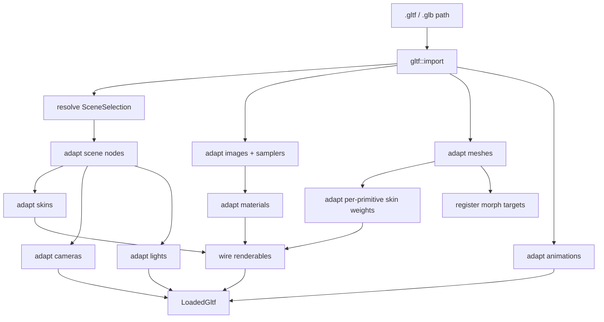
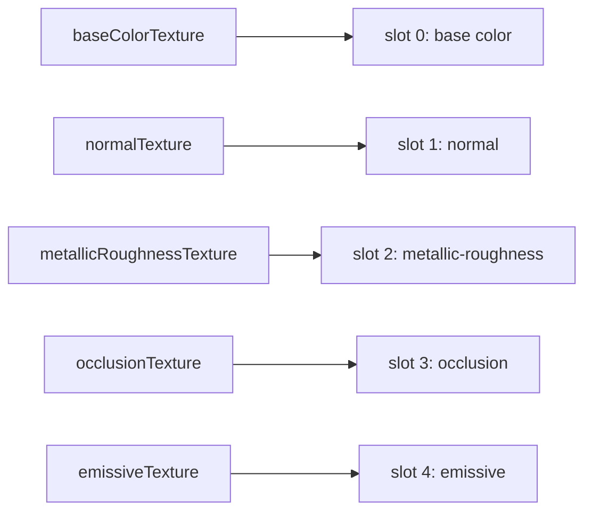
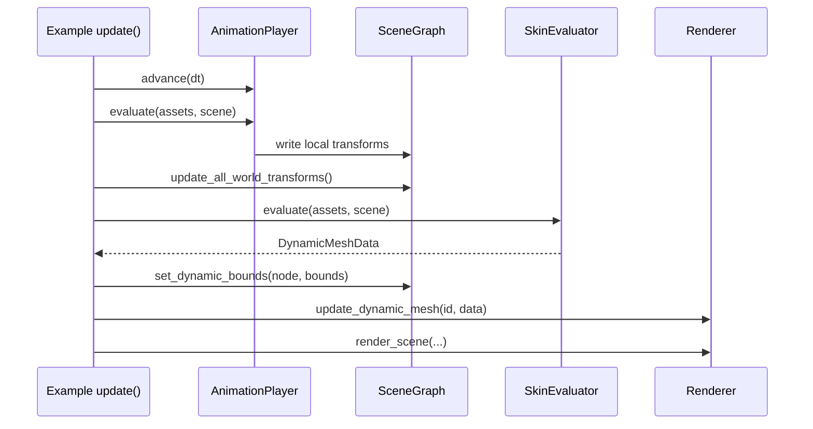

# glTF Loader Architecture

**Crate**: `rig-gltf`  
**Purpose**: Adapt glTF 2.0 `.gltf` and `.glb` files into `rig-assets` assets and `rig-scene` nodes.  
**Examples**: `gltf_demo`, `gltf_skinned_demo`

---

## Scope

`rig-gltf` parses glTF files with the `gltf` crate and adapts supported data into the existing engine model:

- scene nodes, local transforms, cameras, and `KHR_lights_punctual` lights
- meshes in the standard 48-byte vertex layout with MikkTSpace tangents
- PBR metallic-roughness materials and five texture slots
- animation clips for transforms and morph target weights
- skin assets, skin weights, skinned primitive descriptors, and morph target assets
- multi-scene selection by default scene, index, or name

`rig-gltf` does not own GPU resources and does not depend on `rig-render`. Runtime mesh deformation stays in `rig-skin`; rendering stays in `rig-render`.

---

## Loading flow



The loader registers immutable assets in `AssetStore` and mutates the caller-provided `SceneGraph`. `LoadedGltf` returns handles and node maps so examples can build runtime systems without re-reading glTF files.

---

## Public API

Use `load_gltf` for the default scene:

```rust,no_run
use rig_gltf::load_gltf;
# use rig_assets::{AssetStore, ShaderHandle};
# use rig_scene::SceneGraph;
# let mut scene = SceneGraph::new();
# let mut store = AssetStore::new();
# let shader = ShaderHandle::from_raw(0);

let loaded = load_gltf("assets/models/gltf/DamagedHelmet.glb", shader, &mut scene, &mut store)?;
println!("{} root nodes", loaded.root_nodes.len());
# Ok::<(), rig_gltf::GltfError>(())
```

Use `load_gltf_scene` for explicit multi-scene selection:

```rust,no_run
use rig_gltf::{SceneSelection, load_gltf_scene};
# use rig_assets::{AssetStore, ShaderHandle};
# use rig_scene::SceneGraph;
# let mut scene = SceneGraph::new();
# let mut store = AssetStore::new();
# let shader = ShaderHandle::from_raw(0);

let loaded = load_gltf_scene(
    "multi_scene.glb",
    SceneSelection::Name("preview".to_string()),
    shader,
    &mut scene,
    &mut store,
)?;
# let _ = loaded;
# Ok::<(), rig_gltf::GltfError>(())
```

`LoadedGltf::skinned_primitives` describes every loaded primitive that has both a glTF skin and per-vertex skin weights. `gltf_skinned_demo` uses these descriptors to create `SkinEvaluator` instances and replace those renderables with dynamic mesh IDs.

---

## Adaptation map

| glTF concept | Engine representation |
|--------------|-----------------------|
| Scene | Selected roots in `LoadedGltf::root_nodes` |
| Node hierarchy | `SceneGraph` arena nodes with local transforms |
| Mesh primitive | `MeshAsset` in standard 48-byte vertex layout |
| Material | `MaterialAsset` with PBR parameters and texture slots |
| Image + sampler | `TextureAsset` + `SamplerDescriptor` handles |
| Perspective camera | `Projection::Perspective` |
| Orthographic camera | `Projection::Orthographic` |
| Directional / point / spot light | `LightKind::{Directional, Point, Spot}` |
| Animation | `AnimationClip` asset, one handle per glTF animation |
| Skin | `SkinAsset` + `SkinWeights` assets |
| Skinned primitive | `SkinnedPrimitive` descriptor for runtime CPU skinning |
| Morph targets | `MorphTargets` asset and morph weight animation channels |

Unsupported primitive topologies return `GltfError::UnsupportedTopology`; missing required positions return `GltfError::MissingPositions`.

---

## Material slot mapping

`rig-gltf` follows the renderer's five-slot PBR layout described in `docs/MATERIAL.md`:



Absent textures use renderer fallback textures. Material factors are copied into `MaterialParams`, including base color, emissive color, metallic factor, and roughness factor.

---

## Animation, skinning, and morph runtime



`AnimationPlayer` writes transform channels directly into the scene graph and stores evaluated morph weights by target node. CPU skinning is an opt-in runtime step: `rig-gltf` only exposes asset handles and descriptors, while examples decide which primitives become dynamic meshes.

The dynamic mesh renderer pads upload writes to `wgpu::COPY_BUFFER_ALIGNMENT`, so index buffers with non-4-byte byte lengths (for example odd `Uint16` index counts) can be uploaded safely.

---

## Examples

- `gltf_demo` loads `assets/models/gltf/DamagedHelmet.glb` by default and renders static glTF content with PBR materials.
- `gltf_skinned_demo` loads `assets/models/gltf/BrainStem.glb` by default, evaluates the first animation, CPU-skins all skinned primitives, and uploads dynamic mesh data each frame.

Run examples from the Nix development shell. On non-NixOS NVIDIA systems, use the same `nixGL` setup as the other GPU examples.

```bash
nix develop --impure
cargo run -p gltf_demo
cargo run -p gltf_skinned_demo
```

---

## Current limitations

- Alpha modes and double-sided material state are not implemented yet.
- Skinning is CPU-side and example-driven; there is no persistent scene skin component.
- Morph targets are loaded and can be CPU-evaluated, but no dedicated morph demo is wired yet.
- Tangent morph deltas are not adapted.
- glTF extension coverage is intentionally narrow beyond `KHR_lights_punctual`.
