# Asset Loading Pipeline

**Crates**: `rig-loader`, `rig-import`, `rig-assets`, `rig-app`  
**Purpose**: Decode files from disk or memory, adapt them into framework assets, and register them in `AssetStore`.

---

## 1. Three-layer architecture

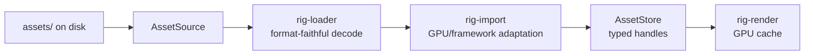

`rig-loader` answers “what does this file contain?” `rig-import` answers “how does this map to the renderer?”

## 2. Crate dependency graph

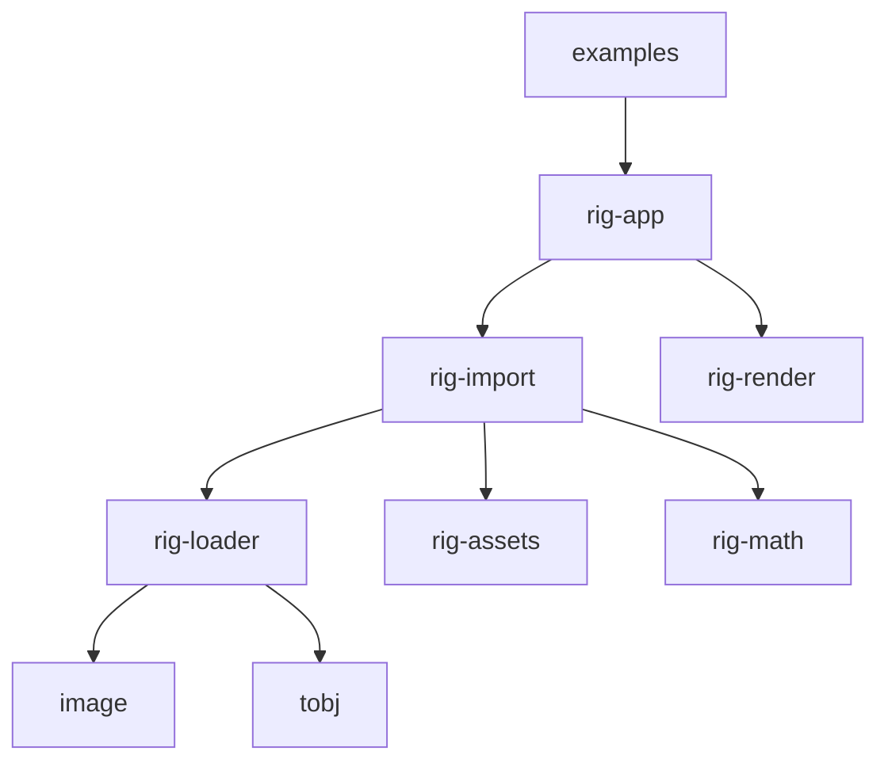

`rig-loader` has no `rig-*` dependencies. Examples access the importer via `rig_app::rig_import::*`.

## 3. AssetSource implementations

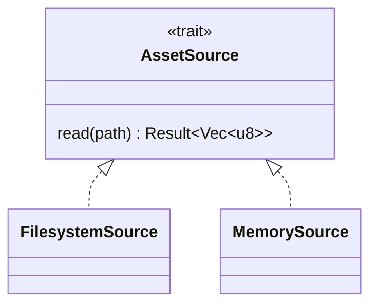

`FilesystemSource` reads relative to the current working directory by default. `MemorySource` supports integration tests without temporary files.

## 4. Loader call flow

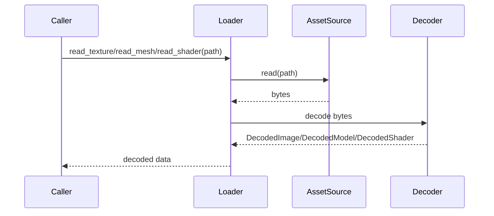

OBJ loading reads referenced MTL files as siblings of the OBJ path.

## 5. Importer call flow

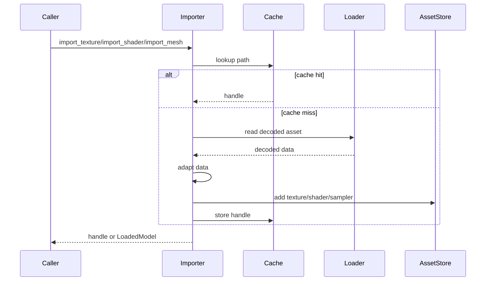

`import_mesh()` returns `LoadedModel`; callers register meshes and materials individually.

## 6. Dedup cache lifecycle

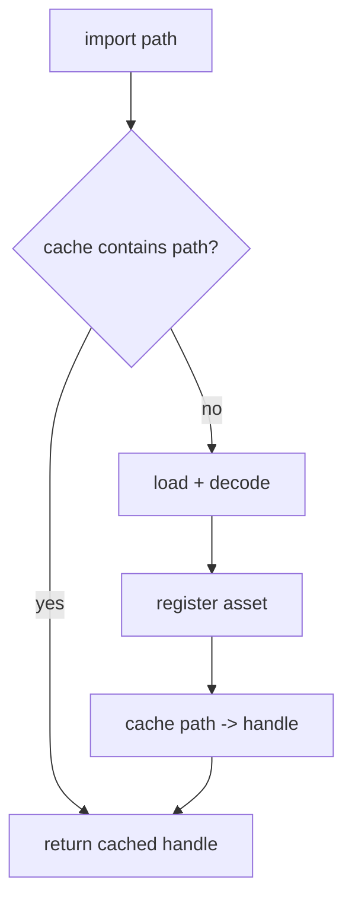

The importer is a local startup object; its cache dies after initialization.

## 7. Shader pipeline

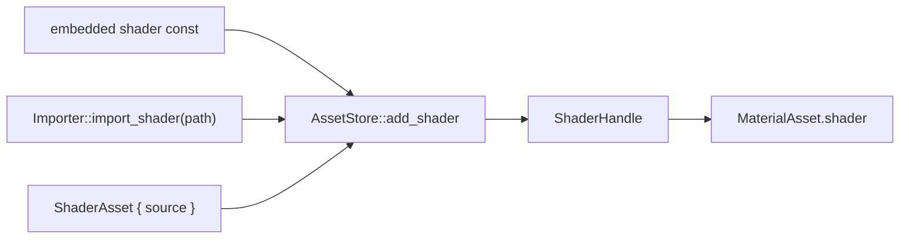

Runtime-loaded WGSL uses the same renderer path as embedded shader strings after registration.

## 8. import_mesh sequence

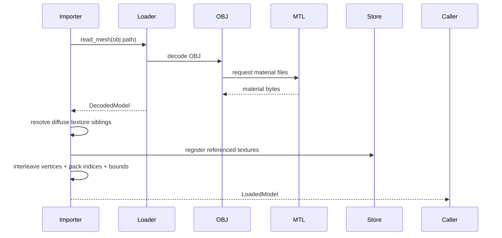

## 9. GPU adaptation decisions

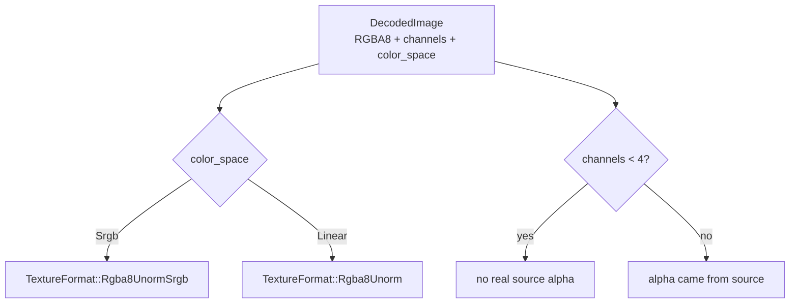

The current image decoder defaults to sRGB, which matches diffuse texture loading.

## 10. Vertex interleaving pipeline

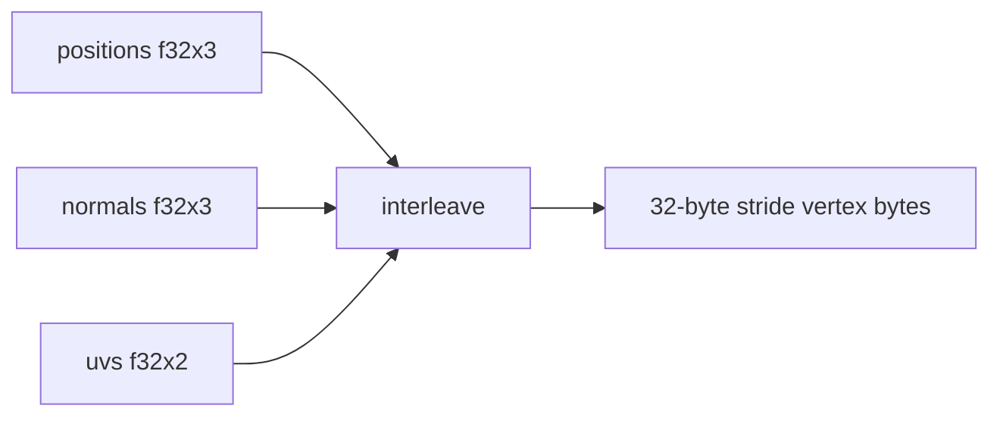

```text
byte 0..12   position: f32 x 3
byte 12..24  normal:   f32 x 3
byte 24..32  uv:       f32 x 2
```

## 11. Example progression

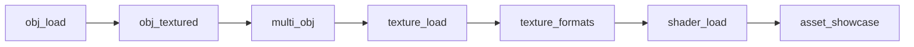

Run `cargo run -p gen_test_textures` once before texture examples.

## 12. Error handling

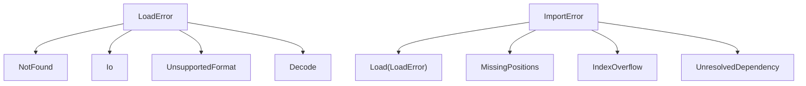

Loader errors describe source/format failures. Import errors describe validation and adaptation failures.

## 13. Future extension points

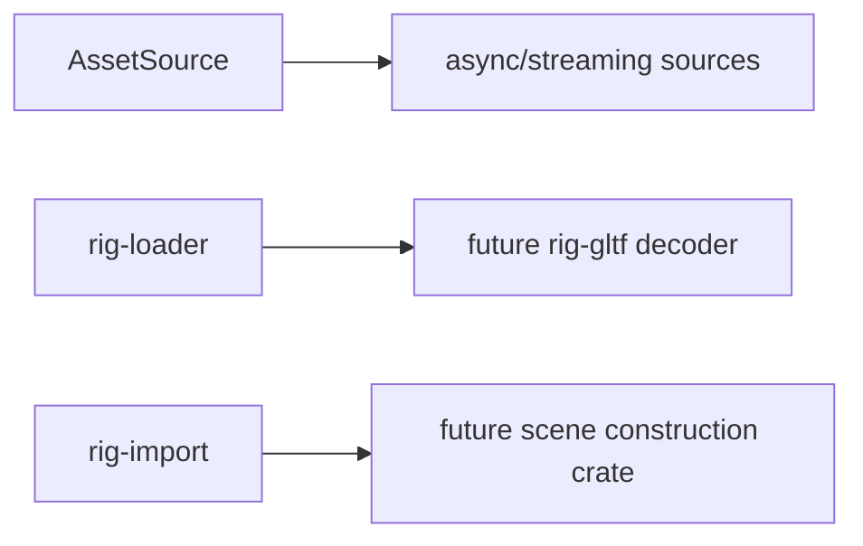

glTF scene construction remains out of scope for this milestone.
