# Material Pipeline, Terrain Generation & glTF Roadmap

**Project**: Personal 3D & Physics Research Framework in Rust
**Status**: Planning — brainstormed 2026-05-15
**Covers**: PBR material expansion, normal maps, procedural terrain, glTF loader

---

## Table of Contents

1. [Context](#1-context)
2. [Chosen Direction](#2-chosen-direction)
3. [Dependencies](#3-dependencies)
4. [Phase A — Material System](#4-phase-a--material-system)
5. [Phase B — Noise & Terrain](#5-phase-b--noise--terrain)
6. [Phase C — Terrain Sub-Problems](#6-phase-c--terrain-sub-problems)
7. [Phase D — glTF Loader](#7-phase-d--gltf-loader)
8. [Open Questions](#8-open-questions)
9. [Prior Art & References](#9-prior-art--references)

---

## 1. Context

The engine reached milestone 10 (CPU skinning) with a solid foundation:
scene graph, PBR shader (Cook-Torrance), dynamic meshes, marching cubes,
keyframe animation, and a full asset loading pipeline. The next chapter is
visual richness — normal maps, a full PBR texture stack, and procedural
terrain — culminating in glTF support that opens access to thousands of
authored assets.

### 1.1 Scope

This document is responsible for:

- the five-slot PBR material binding layout and its migration from the current
  single-texture layout
- tangent vector generation and the 48-byte vertex layout expansion
- normal map sampling and TBN matrix construction in the PBR shader
- procedural terrain generation via noise-driven marching cubes and heightmaps
- noise-generated normal maps as a bridge between the two tracks
- terrain research sub-problems: domain warping, erosion, chunking, LOD,
  triplanar texturing
- the `rig-gltf` crate design and its adaptation of glTF assets into engine types

This document is **not** responsible for:

- renderer internals (pipeline creation, bind group allocation, frame resources)
  — see `docs/RESOURCES.md`
- scene graph structure or transform propagation — see `docs/SCENEGRAPH.md`
- animation playback or skinning — see `docs/ANIMATION.md`
- the overlay system or GPU context — see `docs/APPLICATION.md`

### 1.2 What exists today

| Area | State |
|------|-------|
| PBR shader | Cook-Torrance, metallic-roughness, single diffuse texture, `flags: u32` ready |
| Texture system | GPU cache, sampler cache, PNG/JPEG/TGA loading |
| Vertex layout | 32 bytes — position + normal + UV |
| Material asset | `textures: Vec<(TextureHandle, SamplerHandle)>` flat list |
| Dynamic meshes | `DynamicMeshData` + `DynamicMesh` GPU path |
| Marching cubes | Accepts `Fn(Vec3) -> f32` scalar field |
| Noise | None yet |
| Tangents | Not in vertex layout |
| glTF | Not started |

### 1.3 What is missing

- Tangent vectors in the vertex layout (required for normal mapping)
- Named texture slots (normal, metallic-roughness, occlusion, emissive)
- Normal map sampling + TBN matrix in the PBR shader
- Procedural noise source
- Terrain mesh generation (heightmap and volumetric)
- glTF file parsing and adaptation into engine asset types

---

## 2. Chosen Direction

A multi-session development arc in four phases:

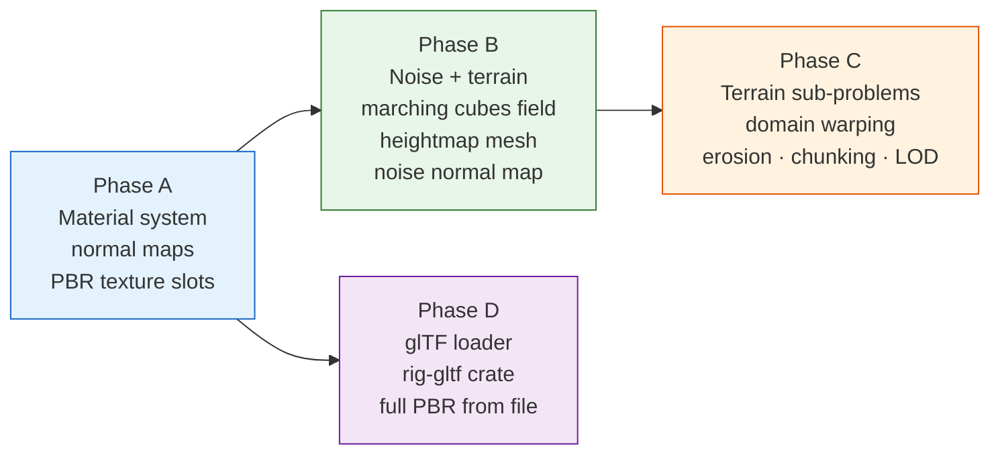

**Design principle:** let glTF's metallic-roughness material model drive the
texture slot layout. Design the slots once to match the spec, then every
subsequent feature (normal maps, terrain textures, glTF materials) fills the
same slots without redesign.

**Each phase produces a visible demo.** No long stretches without feedback.

---

## 3. Dependencies

Only three new crates are needed for the entire arc:

| Crate | Version | Purpose | Where |
|-------|---------|---------|-------|
| [`noise`](https://github.com/razaekel/noise-rs) | 0.9 | Perlin, Simplex, fBm, Ridged, Worley, combinators | example crates only |
| [`gltf`](https://github.com/gltf-rs/gltf) | 1.4 | glTF 2.0 file parsing | `rig-gltf` |
| [`mikktspace`](https://github.com/gltf-rs/mikktspace) | 0.3 | Tangent generation (Mikkelsen algorithm) | `rig-assets` |

**`noise`** stays in example crates. `marching_cubes::extract()` already
accepts any `Fn(Vec3) -> f32` closure — examples compose noise with it from
the outside. Adding `noise` to `rig-assets` would pull `rand`, `rand_xorshift`,
and `num-traits` into a leaf crate that currently has no such dependencies.

**`mikktspace`** goes into `rig-assets` alongside `mesh_factory` and
`marching_cubes`. This is the single place that owns tangent generation for
all mesh sources. One rule applies everywhere: meshes with valid UVs run
`mikktspace`; meshes with degenerate UVs (marching cubes `[0,0]`
placeholders) use a normal-derived fallback (`T = normalize(cross(N, up))`).
`rig-import` and `rig-gltf` call into `rig-assets` for tangent generation
rather than owning it themselves — no duplication, no cycle.

**`gltf`** goes into the new `rig-gltf` crate alongside the adaptation logic.

### 3.1 Updated crate dependency graph

The diagram below shows the full workspace after all four phases are complete.
New crates and dependencies are highlighted in green.

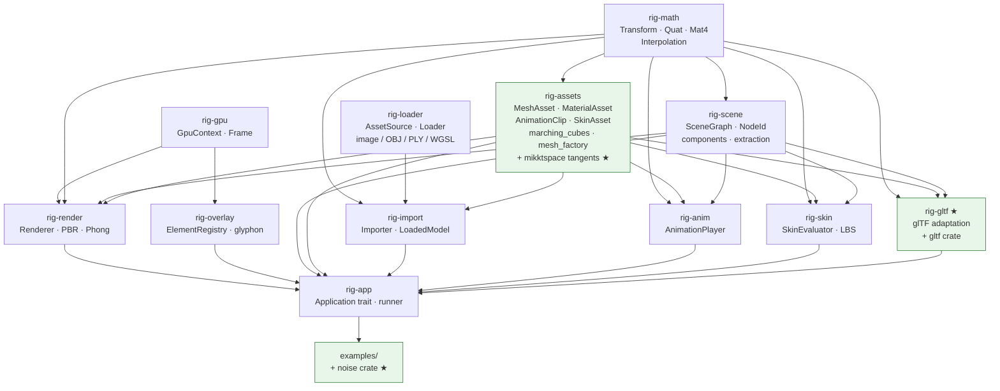

---

## 4. Phase A — Material System

**Goal:** full PBR texture stack with normal mapping. This is the prerequisite
for everything visual in phases B and D.

### 4.1 Five-slot binding layout

glTF's metallic-roughness material defines exactly five texture slots. Adopt
this layout as the engine standard so that every subsequent feature — normal
maps, terrain textures, glTF materials — fills the same slots without
redesign.

#### Why fallback textures instead of shader permutations

The alternative to fallback textures is a separate pipeline per combination of
active slots (32 permutations for 5 binary flags). Each pipeline variant
requires a separate `wgpu::RenderPipeline` compilation, a separate bind group
layout, and separate draw-call dispatch logic. Fallback textures eliminate all
of this: the shader is always the same, the bind group layout is always the
same, and the GPU samples a 1×1 constant texture for absent slots at
negligible cost.

#### Binding table

| Slot | Binding | Name | Fallback (RGBA bytes) | Encodes |
|------|---------|------|-----------------------|---------|
| 0 | group 1, binding 1+2 | base color | `[255, 255, 255, 255]` white | albedo × vertex color |
| 1 | group 1, binding 3+4 | metallic-roughness | `[255, 255, 255, 255]` white | B = metallic, G = roughness |
| 2 | group 1, binding 5+6 | normal map | `[128, 128, 255, 255]` flat | tangent-space XYZ |
| 3 | group 1, binding 7+8 | occlusion | `[255, 255, 255, 255]` white | R = occlusion factor |
| 4 | group 1, binding 9+10 | emissive | `[0, 0, 0, 255]` black | RGB emissive radiance |

The flat normal fallback `[128, 128, 255, 255]` decodes to `[0, 0, 1]` in
tangent space — a normal pointing straight out of the surface, producing no
perturbation when no normal map is bound.

The `flags: u32` field in `MaterialUniforms` encodes which slots carry real
data. The shader reads all five slots unconditionally but uses `flags` to
decide whether to apply the result:

```wgsl
const HAS_BASE_COLOR_MAP:       u32 = 1u;
const HAS_METALLIC_ROUGHNESS:   u32 = 2u;
const HAS_NORMAL_MAP:           u32 = 4u;
const HAS_OCCLUSION_MAP:        u32 = 8u;
const HAS_EMISSIVE_MAP:         u32 = 16u;
```

#### Bind group layout migration

```mermaid
flowchart LR
    subgraph OLD["Current layout — 3 bindings"]
        direction TB
        O0["binding 0\nMaterialUniforms\nuniform buffer"]
        O1["binding 1\nt_diffuse\ntexture_2d"]
        O2["binding 2\ns_diffuse\nsampler"]
    end

    subgraph NEW["New layout — 11 bindings"]
        direction TB
        N0["binding 0\nMaterialUniforms + flags\nuniform buffer"]
        N1["binding 1  t_base_color"]
        N2["binding 2  s_base_color"]
        N3["binding 3  t_metallic_roughness"]
        N4["binding 4  s_metallic_roughness"]
        N5["binding 5  t_normal"]
        N6["binding 6  s_normal"]
        N7["binding 7  t_occlusion"]
        N8["binding 8  s_occlusion"]
        N9["binding 9  t_emissive"]
        N10["binding 10 s_emissive"]
    end

    OLD -->|"Phase A migration"| NEW

    style OLD fill:#fff3e0,stroke:#e65100
    style NEW fill:#e8f5e9,stroke:#2e7d32
```

**Migration note:** the current `material_bind_group_layout` in `rig-render`
has 3 entries (uniform + 1 texture + 1 sampler). Expanding to 11 entries
(uniform + 5×(texture+sampler)) is a breaking change to the bind group layout.
Every existing material draw call must be updated to supply all 11 bindings,
pointing to fallback textures for absent slots. All existing examples will
require this update before they compile against the new renderer.

**`MaterialAsset` type change:** the `textures` field changes from
`Vec<(TextureHandle, SamplerHandle)>` to
`Vec<Option<(TextureHandle, SamplerHandle)>>`. Each entry corresponds to one
of the five PBR slots in order: base color, metallic-roughness, normal,
occlusion, emissive. A `None` entry causes the renderer to substitute the
appropriate fallback texture at draw time. All existing code that constructs a
`MaterialAsset` must be updated — wrap existing entries in `Some(...)` and
pad the vector to five elements with `None` for unused slots.

### 4.2 Vertex layout expansion

Add a tangent attribute. Stride grows from 32 to 48 bytes:

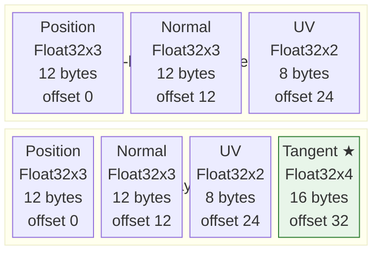

```text
Position:  Float32x3  @ location 0, offset  0   (12 bytes)
Normal:    Float32x3  @ location 1, offset 12   (12 bytes)
UV:        Float32x2  @ location 2, offset 24   ( 8 bytes)
Tangent:   Float32x4  @ location 3, offset 32   (16 bytes)  ← new
stride = 48 bytes
```

#### Why tangent `.w` stores handedness

UV maps can be mirrored — for example, the left and right sides of a
character's face often share a single texture by flipping the U axis. A
mirrored UV region produces a tangent frame with the opposite winding from
the surrounding geometry. Storing the handedness sign in `.w` allows the
shader to reconstruct the correct bitangent with a single multiply:

```wgsl
let B = cross(N, T) * in.world_tangent.w;  // w = +1.0 or -1.0
```

Without this, mirrored UV regions would show inverted normal map lighting.

**Backward compatibility:** existing shaders (Phong, textured, triangle) do
not declare `location 3` and are unaffected by the new attribute. The
`PipelineKey` already encodes the full `VertexLayout` — old meshes with
32-byte stride get their own cached pipeline and continue to work with old
shaders unchanged.

**Trade-off:** unconditional tangent generation increases vertex buffer size
by 50% for all meshes, including those that never use a normal map. This is
an intentional simplicity trade-off — a single vertex layout reduces pipeline
permutation count and avoids conditional paths in the importer. For this
project's scale (research framework, <100k vertices typical) the memory cost
is negligible.

### 4.3 Tangent computation

Tangent generation lives in `rig-assets` as a shared `tangent_utils` module,
called by `mesh_factory`, `marching_cubes`, and `rig-import` alike. One rule
applies to all mesh sources:

- **Valid UVs → `mikktspace`** — the Mikkelsen Tangent Space algorithm,
  referenced by the glTF 2.0 spec. Ensures normal maps baked in Blender,
  Substance Painter, or any DCC tool produce correct results.
- **Degenerate UVs → normal-derived fallback** — `T = normalize(cross(N, up))`
  with a secondary axis fallback when N≈up. Used by marching cubes, whose
  vertices carry `[0,0]` placeholder UVs that would produce garbage if fed to
  mikktspace.

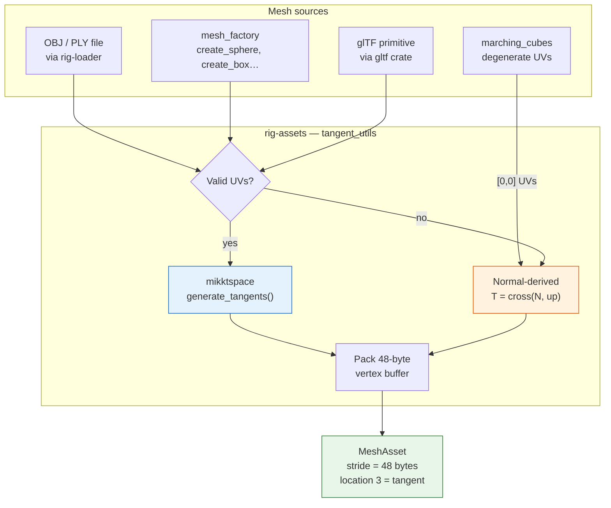

The `mikktspace::Geometry` trait implementation provides positions, normals,
UVs, and face indices to the algorithm. `generate_tangents()` calls back with
computed tangent vectors (including handedness in `.w`) which are interleaved
into the vertex buffer at offset 32.

`rig-import` and `rig-gltf` call `tangent_utils::generate_tangents()` from
`rig-assets` — they do not own a separate copy of `mikktspace`.

### 4.4 PBR shader changes

The vertex shader gains a tangent input at location 3 and passes it through
to the fragment stage as a world-space vector. The fragment shader builds a
TBN matrix and optionally overrides the geometric normal with the sampled
tangent-space normal.

#### Fragment shader data flow

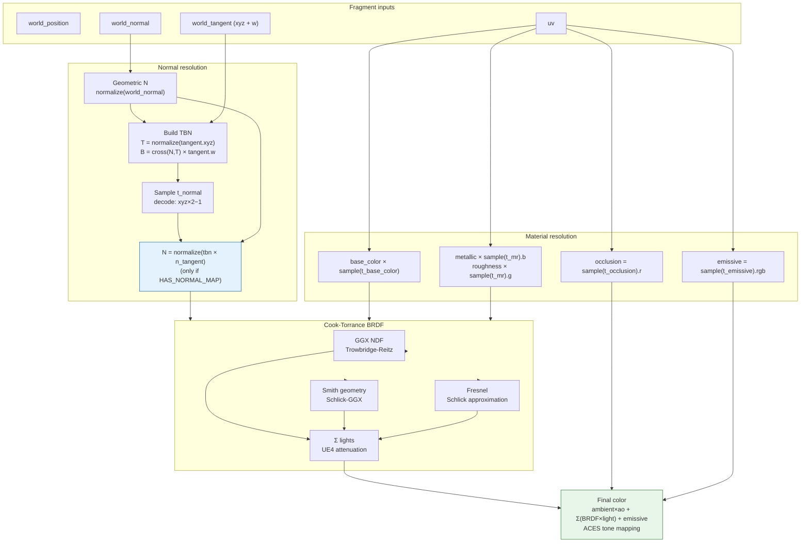

#### Shader pseudocode

```wgsl
// ── Normal resolution ────────────────────────────────────────────────────────

// N must be declared before TBN construction
var N: vec3<f32> = normalize(in.world_normal);

// Build TBN from interpolated vertex attributes
let T   = normalize(in.world_tangent.xyz);
let B   = cross(N, T) * in.world_tangent.w;
let tbn = mat3x3<f32>(T, B, N);

// Conditionally override N with the normal map sample
if (material.flags & HAS_NORMAL_MAP) != 0u {
    let n_ts = textureSample(t_normal, s_normal, in.uv).xyz * 2.0 - 1.0;
    N = normalize(tbn * n_ts);
}

// ── Material resolution ──────────────────────────────────────────────────────

let base  = textureSample(t_base_color, s_base_color, in.uv);
let mr    = textureSample(t_metallic_roughness, s_metallic_roughness, in.uv);
let ao    = textureSample(t_occlusion, s_occlusion, in.uv).r;
let emit  = textureSample(t_emissive, s_emissive, in.uv).rgb;

let albedo    = base.rgb * material.base_color.rgb;
let metallic  = mr.b * material.metallic;
let roughness = mr.g * material.roughness;

// N is now used for all subsequent BRDF calculations
```

Metallic and roughness scalar parameters act as multipliers against the
texture sample — matching glTF spec behaviour. When the map is absent the
fallback white texture means the scalars pass through unchanged.

### 4.5 Fallback texture initialization

The renderer creates three fallback textures at startup, shared across the five
slots (white is reused for base color, metallic-roughness, and occlusion). Each is
a 1×1 `Rgba8Unorm` texture uploaded immediately via `queue.write_texture`.
They are stored on the `Renderer` struct and referenced by every material that
omits the corresponding slot:

```rust
pub struct Renderer {
    // ... existing fields ...

    // Fallback textures — one per PBR slot, shared across all materials
    pub(crate) fallback_white:       wgpu::Texture,  // base color, metallic-roughness, occlusion
    pub(crate) fallback_flat_normal: wgpu::Texture,  // normal map → [128, 128, 255, 255]
    pub(crate) fallback_black:       wgpu::Texture,  // emissive → [0, 0, 0, 255]
    pub(crate) fallback_sampler:     wgpu::Sampler,  // shared linear sampler
}
```

The three textures cover all five slots: white is reused for base color,
metallic-roughness, and occlusion; flat normal for the normal slot; black for
emissive. A single shared sampler (linear, clamp-to-edge) is used for all
fallback slots.

### 4.6 Demo

An existing OBJ model (from the asset library) with a hand-applied normal map
texture. Demonstrates that the multi-texture material system works end-to-end
before the glTF loader exists.

### 4.7 Worked example — normal map on an OBJ model

> **Note:** the code below is illustrative pseudocode showing the planned
> post-Phase-A API. The `MaterialAsset` fields and `Importer` method signatures
> will change as part of this phase; the current codebase does not yet support
> the `textures: Vec&lt;Option&lt;...&gt;&gt;` type or 48-byte vertex stride.

```rust
fn startup(ctx: &mut StartupContext) -> Self {
    let mut importer = Importer::new(FileSource::new("assets/"));

    // Load the PBR shader (now with 11 bindings)
    let shader = ctx.assets.add_shader(ShaderAsset {
        source: Arc::from(PBR_SHADER),
    });

    // Import the base mesh (rig-import now computes tangents automatically)
    let mesh = importer.import_mesh(&"rock.obj".into(), &MeshConfig::default(), shader, ctx.assets)?;

    // Load the normal map texture
    let normal_tex = importer.import_texture(
        &"rock_normal.png".into(),
        &TextureConfig { color_space: ColorSpace::Linear, .. Default::default() },
        ctx.assets,
    )?;
    let normal_sampler = ctx.assets.add_sampler(SamplerDescriptor::default());

    // Build a material with the normal map in slot 2, fallbacks elsewhere
    let material = ctx.assets.add_material(MaterialAsset {
        shader,
        parameters: MaterialParams {
            roughness: 0.8,
            metallic:  0.0,
            ..Default::default()
        },
        // Slots: [base_color, metallic_roughness, normal, occlusion, emissive]
        // None entries will be filled with renderer fallback textures at draw time
        textures: vec![
            None,                                    // slot 0: use fallback white
            None,                                    // slot 1: use fallback white
            Some((normal_tex, normal_sampler)),      // slot 2: real normal map
            None,                                    // slot 3: use fallback white
            None,                                    // slot 4: use fallback black
        ],
    });

    // Wire into scene graph as usual
    let node = ctx.scene.add_node(Transform::IDENTITY, None);
    ctx.scene.set_renderable(node, Renderable {
        mesh: MeshSource::Static(mesh),
        material,
        visible: true,
    });
}
```

---

## 5. Phase B — Noise & Terrain

**Goal:** procedural terrain using the `noise` crate, two approaches, one
demo each.

### 5.1 Noise dependency and composition

Add `noise = "0.9"` as a dependency of the **example crates** that need it
(`terrain_mc`, `terrain_heightmap`). No changes to library crates are needed
— `marching_cubes::extract()` already accepts any `Fn(Vec3) -> f32` closure,
and `create_terrain_mesh` (§5.3) will accept any `Fn(f32, f32) -> f32`.

**Note on f64:** `noise::NoiseFn::get()` takes `[f64; N]` and returns `f64`.
The engine uses `f32` throughout. The cast (`as f32`, `as f64`) is explicit
and cheap — terrain generation runs once at startup, not per-frame.

#### Noise types and their terrain uses

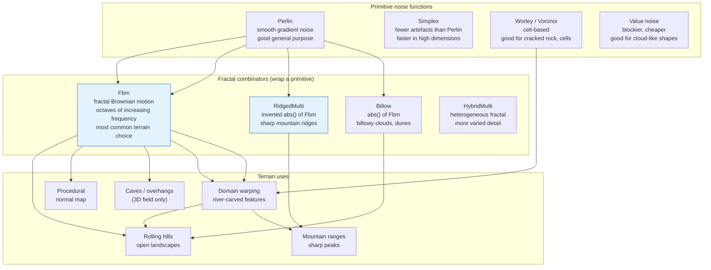

#### Key fBm parameters

| Parameter | Effect | Typical range |
|-----------|--------|---------------|
| `octaves` | Detail level — more octaves = finer features | 4–8 |
| `frequency` | Overall scale — higher = more compressed features | 0.5–2.0 |
| `lacunarity` | Frequency multiplier per octave — 2.0 doubles each time | 1.5–2.5 |
| `persistence` | Amplitude multiplier per octave — lower = smoother | 0.3–0.6 |

### 5.2 Two terrain approaches

The two approaches are complementary, not competing. Use heightmaps for large
open landscapes with good UV texturing; use marching cubes for volumetric
features (caves, overhangs, floating islands).

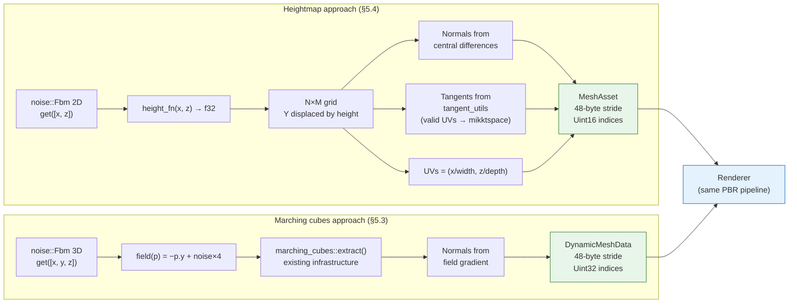

### 5.3 First demo — marching cubes terrain

**Estimated effort: ~20 minutes.** Swap the metaballs scalar field for a
noise-based terrain field. The entire existing pipeline is reused unchanged.

#### Understanding the field function

The field `f(p) = -p.y + noise(p) * scale` works as follows:

- `-p.y` creates a downward bias: points below Y=0 are positive (inside),
  points above are negative (outside). Without noise this would be a flat
  ground plane at Y=0.
- `noise(p) * scale` perturbs the boundary. Where noise is positive the
  surface rises; where negative it dips. Large `scale` values create dramatic
  overhangs and caves.
- The iso-value of `0.0` is the surface. Points where `f > 0` are solid.

```rust
use noise::{Fbm, MultiFractal, NoiseFn, Perlin, Seedable};

let fbm = Fbm::<Perlin>::new(42)
    .set_octaves(6)
    .set_frequency(0.5)
    .set_persistence(0.5);

// Ground plane biased by 3D noise — creates caves and overhangs
let field = |p: Vec3| -> f32 {
    let n = fbm.get([p.x as f64 * 0.1, p.y as f64 * 0.1, p.z as f64 * 0.1]) as f32;
    -p.y + n * 4.0
};

let mesh = marching_cubes::extract(&field, &grid_params, 0.0, None);
```

This reuses the entire existing pipeline: `GridParams`, `DynamicMeshData`,
`DynamicMesh` GPU upload, PBR shader. The example is `examples/terrain_mc/`.

**What you get:** caves, overhangs, floating islands — anything 3D noise
produces at the isosurface boundary.

### 5.4 Heightmap terrain

Add `create_terrain_mesh` to `mesh_factory`. A regular N×M grid in XZ with Y
displaced by a `Fn(f32, f32) -> f32` height function:

```rust
pub fn create_terrain_mesh(
    width: f32,
    depth: f32,
    cols: u32,
    rows: u32,
    height_fn: &dyn Fn(f32, f32) -> f32,
) -> MeshAsset
```

Normals are computed from the cross product of the partial derivatives of the
height function (central differences). UVs are `(x/width, z/depth)` —
natural for tiling textures. Tangents are computed via
`rig-assets::tangent_utils` (valid UVs → mikktspace) and written into the
48-byte layout so the mesh is immediately compatible with the normal map shader
from Phase A.

**What you get:** large, cheap, texturable terrain. No overhangs. Suitable
for open landscapes. The example is `examples/terrain_heightmap/`.

### 5.5 Noise-generated normal map

Generate a `TextureAsset` from noise gradients at startup — no geometry
displacement needed. For each texel `(u, v)`, sample the noise field at four
neighbouring points and compute a finite-difference normal in tangent space.

**Parameterization choice:** the normal map samples noise at texel coordinates
`(u, v) ∈ [0,1]` independently of the terrain mesh's noise scale. This is
intentional for the first demo — the normal map adds fine rock-grain surface
detail at a different frequency from the large terrain shape, at zero extra
triangle cost. The two are decoupled: the terrain defines the macro silhouette,
the normal map defines the micro surface.

> **Production terrain engines** typically combine both approaches: a
> geometry-matched normal map (same noise parameterization as the mesh,
> capturing detail the triangle budget can't represent) blended with one or
> more tiling detail normal maps (rock grain, mud cracks, grass blades) scaled
> by a separate factor. Blending is done in the fragment shader by adding the
> tangent-space normals and renormalizing. This is a natural Phase C extension
> once the basic pipeline is proven.

```rust
// Sample height at neighbouring texels (fbm returns f64, cast to f32)
let h_r = fbm.get([u + eps, v]) as f32;
let h_l = fbm.get([u - eps, v]) as f32;
let h_u = fbm.get([u, v + eps]) as f32;
let h_d = fbm.get([u, v - eps]) as f32;

// Finite-difference normal in tangent space
let dx = (h_r - h_l) / (2.0 * eps * scale);
let dy = (h_u - h_d) / (2.0 * eps * scale);
let n = normalize(Vec3::new(-dx, -dy, 1.0));

// Encode to RGBA Rgba8Unorm: map [-1, 1] → [0, 255]
pixel = [
    (n.x * 0.5 + 0.5),
    (n.y * 0.5 + 0.5),
    (n.z * 0.5 + 0.5),
    1.0,
];
```

Upload as a `TextureAsset` and bind to the normal map slot (Phase A). This
is the bridge between the noise work and the material system — a procedural
normal map applied to a heightmap terrain gives rock-grain surface detail at
zero extra triangle cost.

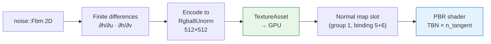

### 5.6 Worked example — heightmap terrain with procedural normal map

> **Note:** the code below is illustrative pseudocode showing the planned
> post-Phase-A and Phase-B API. `create_terrain_mesh` does not exist yet
> and `MaterialAsset.textures` uses the planned `Vec&lt;Option&lt;...&gt;&gt;` type.

```rust
fn startup(ctx: &mut StartupContext) -> Self {
    use noise::{Fbm, MultiFractal, NoiseFn, Perlin, Seedable};

    let fbm = Fbm::<Perlin>::new(42)
        .set_octaves(6)
        .set_frequency(0.8)
        .set_persistence(0.45);

    // ── Terrain mesh ─────────────────────────────────────────────────────────
    let height_fn = |x: f32, z: f32| -> f32 {
        fbm.get([x as f64 * 0.02, z as f64 * 0.02]) as f32 * 8.0
    };
    let mesh = mesh_factory::create_terrain_mesh(256.0, 256.0, 128, 128, &height_fn);
    let mesh_handle = ctx.assets.add_mesh(mesh);

    // ── Procedural normal map ─────────────────────────────────────────────────
    let res = 512usize;
    let eps = 1.0 / res as f64;
    let scale = 0.5_f32;
    let mut pixels = vec![0u8; res * res * 4];
    for row in 0..res {
        for col in 0..res {
            let u = col as f64 / res as f64;
            let v = row as f64 / res as f64;
            let h_r = fbm.get([u + eps, v]) as f32;
            let h_l = fbm.get([u - eps, v]) as f32;
            let h_u = fbm.get([u, v + eps]) as f32;
            let h_d = fbm.get([u, v - eps]) as f32;
            let dx = (h_r - h_l) / (2.0 * eps as f32 * scale);
            let dy = (h_u - h_d) / (2.0 * eps as f32 * scale);
            let n = Vec3::new(-dx, -dy, 1.0).normalize();
            let i = (row * res + col) * 4;
            pixels[i]     = ((n.x * 0.5 + 0.5) * 255.0) as u8;
            pixels[i + 1] = ((n.y * 0.5 + 0.5) * 255.0) as u8;
            pixels[i + 2] = ((n.z * 0.5 + 0.5) * 255.0) as u8;
            pixels[i + 3] = 255;
        }
    }
    let normal_tex = ctx.assets.add_texture(TextureAsset {
        width: res as u32, height: res as u32,
        format: TextureFormat::Rgba8Unorm,
        data: Arc::from(pixels),
    });
    let sampler = ctx.assets.add_sampler(SamplerDescriptor {
        address_mode_u: AddressMode::Repeat,
        address_mode_v: AddressMode::Repeat,
        mag_filter: FilterMode::Linear,
        min_filter: FilterMode::Linear,
    });

    // ── Material with procedural normal map ───────────────────────────────────
    let shader = ctx.assets.add_shader(ShaderAsset { source: Arc::from(PBR_SHADER) });
    let material = ctx.assets.add_material(MaterialAsset {
        shader,
        parameters: MaterialParams { roughness: 0.9, metallic: 0.0, ..Default::default() },
        textures: vec![
            None,
            None,
            Some((normal_tex, sampler)),  // slot 2: procedural normal map
            None,
            None,
        ],
    });

    // ── Scene node ────────────────────────────────────────────────────────────
    let node = ctx.scene.add_node(Transform::IDENTITY, None);
    ctx.scene.set_renderable(node, Renderable {
        mesh: MeshSource::Static(mesh_handle),
        material,
        visible: true,
    });
}
```

---

## 6. Phase C — Terrain Sub-Problems

These are research sessions, each self-contained. Order is flexible.

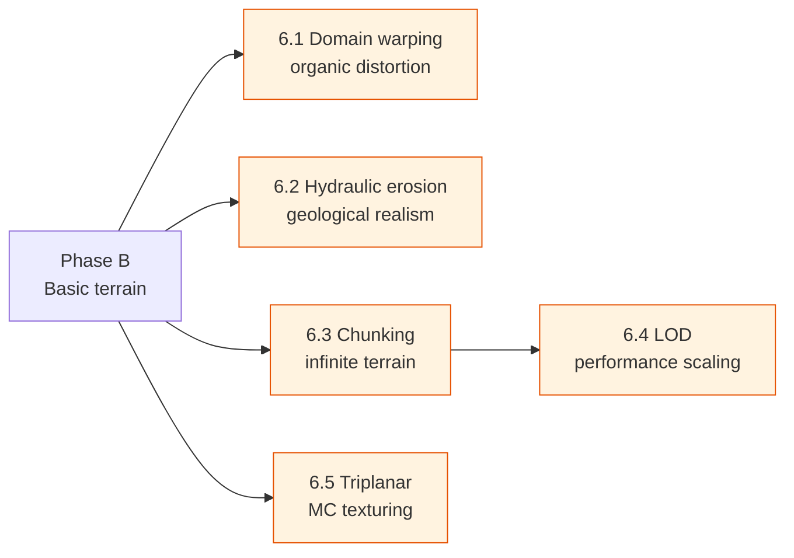

### 6.1 Domain warping

Feed noise into itself before sampling. The key insight: instead of sampling
the noise at the actual point `(x, z)`, first compute a displacement vector
from noise, then sample at the displaced point. This creates organic,
river-carved distortions that look nothing like raw fBm.

```rust
// First layer: compute warp offsets
let warp_x = fbm.get([x * 0.1,       z * 0.1      ]);
let warp_z = fbm.get([x * 0.1 + 5.2, z * 0.1 + 1.3]);

// Second layer: sample at warped coordinates
let height = fbm.get([
    (x + warp_x * 80.0) * 0.01,
    (z + warp_z * 80.0) * 0.01,
]);
```

The offset constants (`5.2`, `1.3`) decorrelate the two warp components so
they don't produce the same displacement in X and Z. The warp amplitude
(`80.0`) controls how dramatically the terrain is distorted.

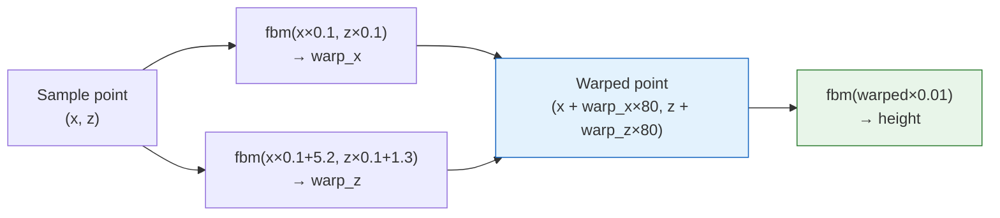

Reference: Inigo Quilez — [iquilezles.org/articles/warp](https://iquilezles.org/articles/warp/)

### 6.2 Hydraulic erosion

A CPU post-process on the heightmap. Simulates water droplets flowing
downhill, picking up and depositing sediment. Turns "random bumps" into
"believable geology" — ridgelines, valleys, alluvial fans.

#### Algorithm overview

Each iteration simulates one water droplet from spawn to evaporation:

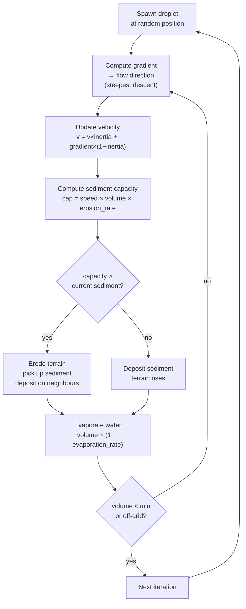

The algorithm operates on a `Vec<f32>` height array and plugs directly into
`create_terrain_mesh` — no renderer changes needed.

Classic algorithm: Benes & Forsbach (2002), refined by Sebastian Lague's
implementation.

### 6.3 Chunking

Noise is defined everywhere — terrain can be infinite. A chunk manager
creates and destroys scene nodes as the camera moves.

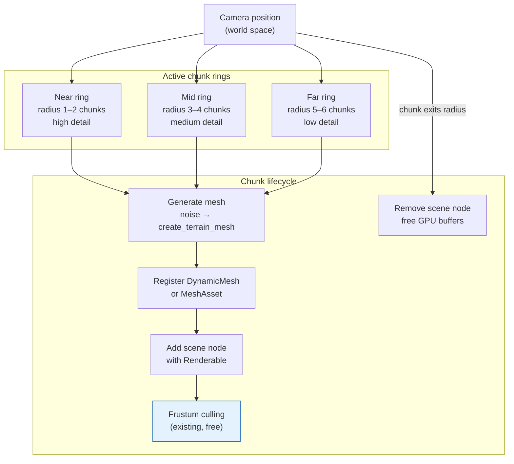

- Fixed chunk size (e.g. 256×256 world units)
- Generate chunks within a radius around the camera
- Destroy chunks beyond a larger radius
- Scene graph frustum culling handles per-frame visibility at no extra cost

The scene graph does not need a spatial index for this — chunk nodes are
regular scene nodes and culling is already implemented.

### 6.4 Level of detail (LOD)

Near chunks use high-resolution grids (256×256), far chunks use coarse grids
(16×16). The same `create_terrain_mesh` function is called with different
`cols`/`rows` arguments per LOD level.

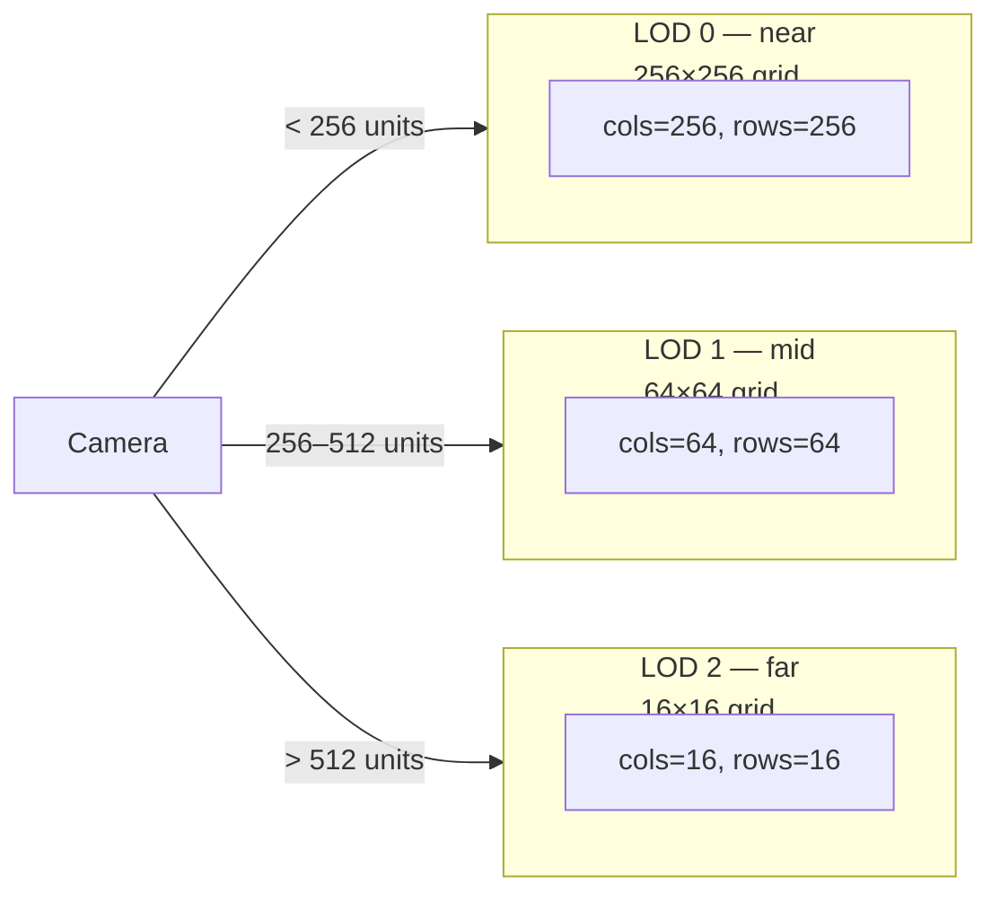

**Geomorphing** blends vertex positions between LOD levels at runtime to avoid
popping. This is where terrain systems get technically deep — it requires
storing both the high-res and low-res Y values per vertex and interpolating
based on camera distance in the vertex shader.

### 6.5 Triplanar texturing

Marching cubes terrain has no meaningful UVs (the current output is `[0,0]`
placeholder). UV unwrapping is not possible for arbitrary isosurfaces — the
topology changes every frame for dynamic terrain. Triplanar projection solves
this without UV unwrapping: sample the texture three times (XY, YZ, XZ planes)
and blend by the absolute normal component.

#### Why triplanar is necessary for MC terrain

A heightmap has a natural UV parameterization: `(x/width, z/depth)`. A
marching cubes mesh does not — vertices are placed at arbitrary positions on
the isosurface and have no consistent 2D parameterization. World-space
triplanar projection is the standard solution: it uses the vertex's world
position as the UV coordinate for each of the three axis-aligned projections,
then blends them by how much the surface faces each axis.

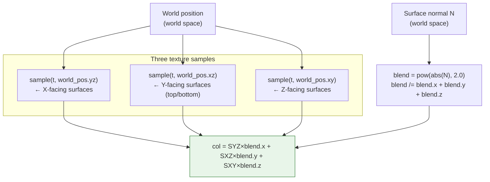

```wgsl
// Exponent controls blend sharpness — 1.0 is soft, 4.0 is sharp.
// 2.0 is a good starting point for natural-looking terrain.
let blend = pow(abs(N), vec3<f32>(2.0));
let blend_norm = blend / (blend.x + blend.y + blend.z);
let col = textureSample(t_diffuse, s_diffuse, world_pos.yz) * blend_norm.x
        + textureSample(t_diffuse, s_diffuse, world_pos.xz) * blend_norm.y
        + textureSample(t_diffuse, s_diffuse, world_pos.xy) * blend_norm.z;
```

---

## 7. Phase D — glTF Loader

**Goal:** a new `rig-gltf` workspace crate that adapts the `gltf` crate's
parsed output into engine asset types. The material system (Phase A) must be
complete first — the five-slot layout is the destination that glTF materials
map into.

### 7.1 Crate placement

`rig-gltf` is a **peer of `rig-import`**, not a consumer of it. The two crates
solve the same shape of problem (decode → adapt → register) but for completely
different file formats:

- `rig-import` wraps `rig-loader` and handles OBJ/PLY — external MTL files,
  file-path-based texture deduplication, `DecodedMesh` adaptation
- `rig-gltf` wraps the `gltf` crate — self-contained binary buffers, integer
  index-based deduplication, glTF-specific material and skin models

They share nothing concrete. Tangent generation is now in `rig-assets`, so
there is no reason for `rig-gltf` to depend on `rig-import`.

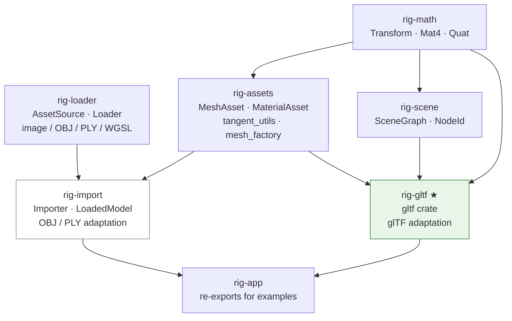

`rig-gltf` depends on: `gltf`, `rig-assets`, `rig-scene`, `rig-math`. It does
not depend on `rig-import`, `rig-render`, or `rig-gpu`. Tangent computation
calls into `rig-assets::tangent_utils` — no duplication of `mikktspace`.

### 7.2 Adaptation map

| glTF concept | Engine type | Notes |
|-------------|-------------|-------|
| `Mesh` + `Primitive` | `MeshAsset` | Tangents from accessor or computed via `rig-assets::tangent_utils` |
| `Material` (PBR metallic-roughness) | `MaterialAsset` | All 5 texture slots filled or fallback |
| `Texture` + `Sampler` | `TextureAsset` + `SamplerDescriptor` | Sampler wrap/filter mapped |
| `Node` tree | `SceneGraph` hierarchy | Recursive, preserving parent/child |
| `Camera` | Scene camera node | Perspective and orthographic |
| `Light` (KHR_lights_punctual) | Scene light component | Point, spot, directional |
| `Animation` | `AnimationClip` asset | Channels mapped to node handles |
| `Skin` | `SkinAsset` + `SkinWeights` | Inverse bind matrices + joint indices |

### 7.3 Loading flow

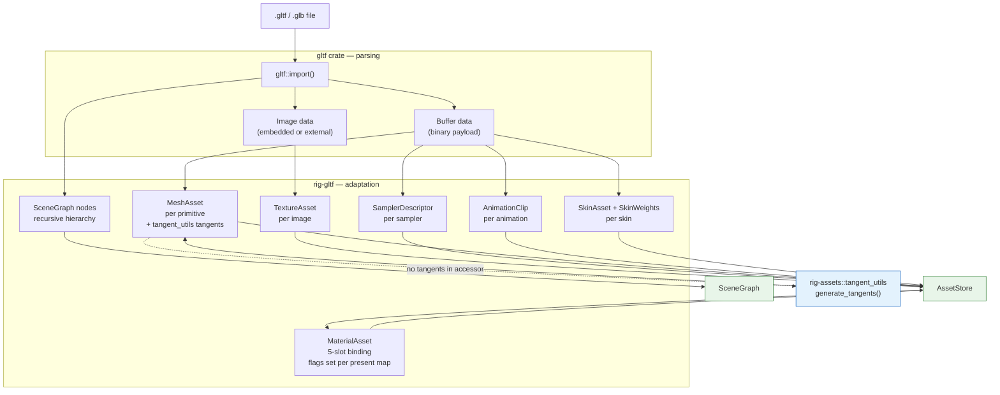

### 7.4 Material adaptation detail

glTF's PBR metallic-roughness material maps directly onto the five-slot layout:

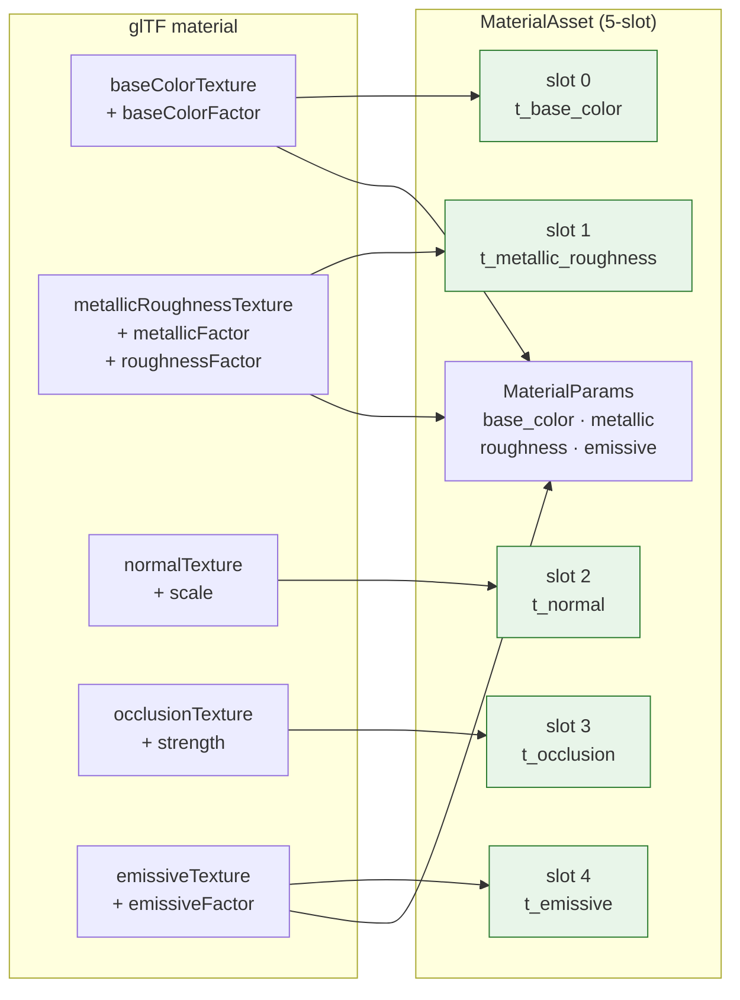

When a glTF texture is absent, the corresponding `textures` slot is `None`
and the renderer substitutes the appropriate fallback texture at draw time.
The `flags` field is set to reflect which slots have real data.

### 7.5 Demo

Khronos glTF sample models rendered with full PBR:
- `DamagedHelmet.glb` — normal map, emissive, occlusion
- `BrainStem.glb` — skinned animation
- `FlightHelmet.glb` — large scene, many materials and texture slots

### 7.6 Extension rules

The five-slot layout is designed to be extended without breaking existing
materials. Future additions that fit within the existing architecture:

- **Additional texture slots** — clearcoat, sheen, transmission, iridescence
  (glTF KHR extensions). Add new bindings beyond slot 4, new flag bits, new
  shader samples. Existing materials are unaffected.
- **Texture transforms** (`KHR_texture_transform`) — a per-slot UV transform
  matrix in `MaterialUniforms`. Existing materials use identity transforms.
- **Multiple UV sets** — glTF allows different textures to use different UV
  channels. Add a second UV attribute at location 4 and a per-slot UV index
  in `MaterialUniforms`.
- **Double-sided rendering** — a `double_sided: bool` flag in `MaterialAsset`
  maps to `wgpu::Face::None` cull mode in the pipeline key. No shader changes.
- **Alpha modes** — opaque (current), mask (alpha cutout), blend (transparent).
  Mask requires a `cutoff: f32` in `MaterialUniforms`; blend requires a
  separate render pass for transparency.

---

## 8. Open Questions

### 8.1 Resolved decisions

| Question | Decision |
|----------|----------|
| Does `standard_layout()` become 48-byte globally, or do layouts coexist? | **48-byte globally.** One layout, one code path. Memory cost accepted — consistency over savings. |
| What happens to existing shaders when the material bind group expands to 11 bindings? | **Single 11-binding layout for all shaders.** Old shaders (Phong, textured) refactored to declare all 11 bindings; unused slots sample fallback textures. |
| What happens to marching cubes output after Phase A? | **48-byte with normal-derived tangents** — `T = normalize(cross(N, up))`. Future-proof; mikktspace is not used because MC UVs are degenerate. |
| Where does `mikktspace` live, and how do factory shapes get tangents? | **`mikktspace` moves to `rig-assets`** as a shared `tangent_utils` module. One rule: valid UVs → mikktspace; degenerate UVs → normal-derived fallback. `rig-import` and `rig-gltf` call into `rig-assets`. |
| Should the heightmap normal map share the terrain's noise parameterization? | **Decoupled for the first demo** — normal map adds fine rock-grain detail at a different frequency. Production approach (geometry-matched + tiling detail blend) noted in §5.5 as a Phase C extension. |

### 8.2 Open

| Question | Impact |
|----------|--------|
| Triplanar vs. world-space UVs for marching cubes terrain | Phase C texturing approach |
| Should noise-generated normal maps be baked at startup or regenerated per-frame? | Performance vs. flexibility |
| Chunk granularity — how large before GPU upload cost dominates? | Phase C chunking design |
| Erosion simulation — CPU post-process or something more integrated? | Phase C research scope |
| glTF sparse accessors — support or skip for now? | Phase D scope |

---

## 9. Prior Art & References

- **noise-rs** — [github.com/razaekel/noise-rs](https://github.com/razaekel/noise-rs)
- **gltf-rs** — [github.com/gltf-rs/gltf](https://github.com/gltf-rs/gltf)
- **mikktspace** — [github.com/gltf-rs/mikktspace](https://github.com/gltf-rs/mikktspace)
- **glTF 2.0 spec** — [registry.khronos.org/glTF/specs/2.0/glTF-2.0.html](https://registry.khronos.org/glTF/specs/2.0/glTF-2.0.html)
- **glTF PBR metallic-roughness** — [registry.khronos.org/glTF/specs/2.0/glTF-2.0.html#reference-material-pbrmetallicroughness](https://registry.khronos.org/glTF/specs/2.0/glTF-2.0.html#reference-material-pbrmetallicroughness)
- **Inigo Quilez — Domain Warping** — [iquilezles.org/articles/warp](https://iquilezles.org/articles/warp/)
- **Sebastian Lague — Hydraulic Erosion** — [github.com/SebLague/Hydraulic-Erosion](https://github.com/SebLague/Hydraulic-Erosion)
- **Benes & Forsbach (2002)** — "Layered Data Representation for Visual Simulation of Terrain Erosion"
- **Mikkelsen tangent space** — [mikktspace.com](http://www.mikktspace.com/)
- **Khronos glTF sample models** — [github.com/KhronosGroup/glTF-Sample-Models](https://github.com/KhronosGroup/glTF-Sample-Models)
- **Paul Bourke — Marching Cubes** — already implemented in `crates/assets/src/marching_cubes.rs`
- **Cook-Torrance BRDF** — already implemented in `crates/render/src/helpers.rs` (`PBR_SHADER`)
