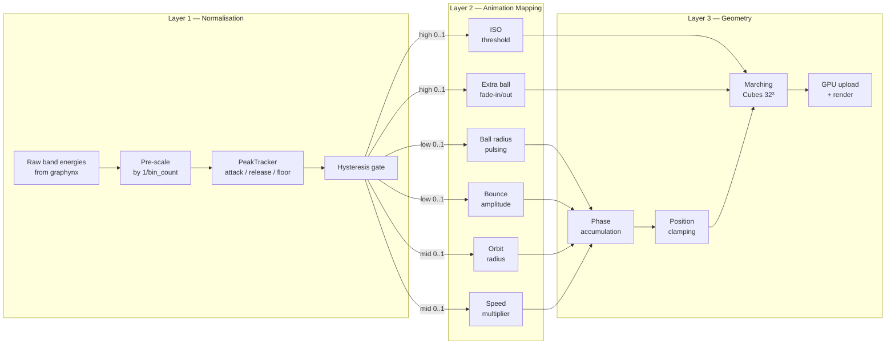
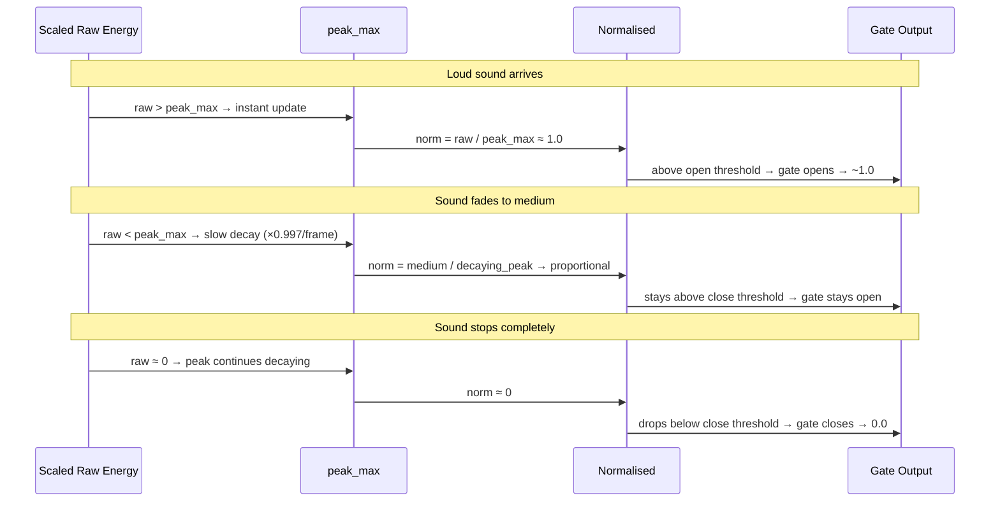
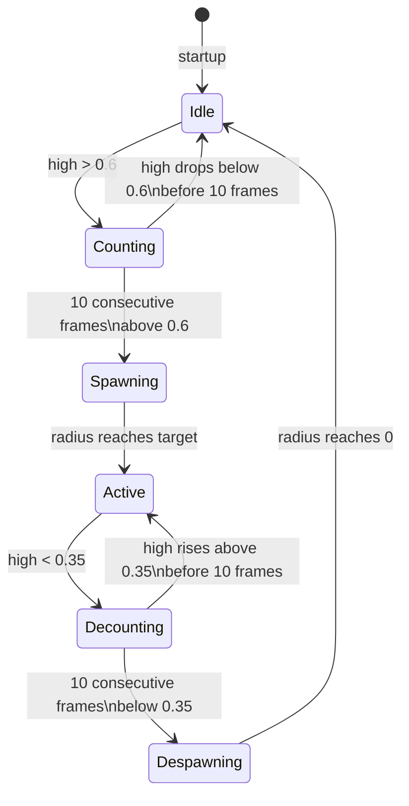
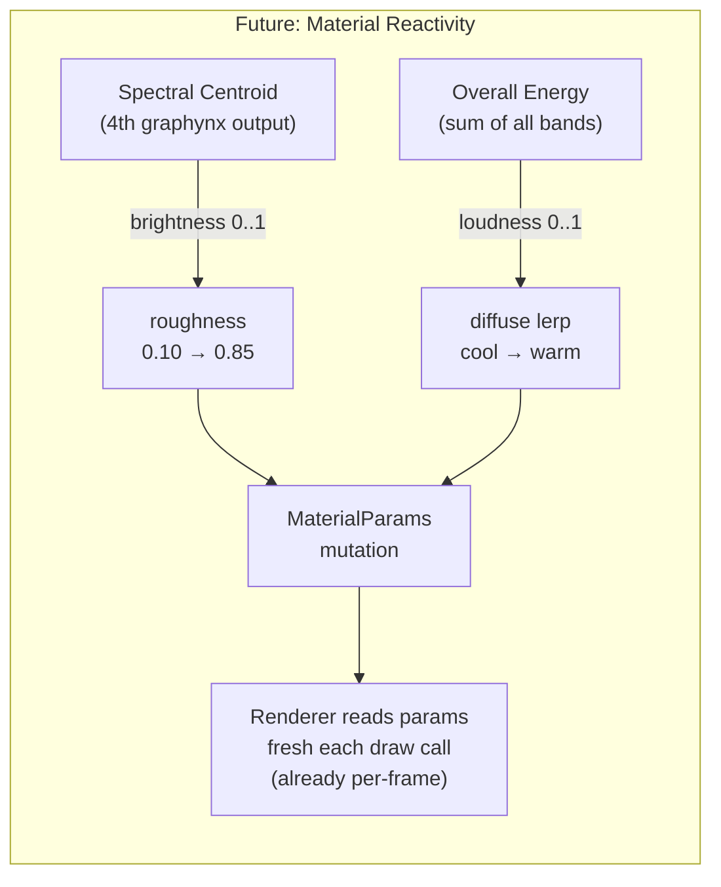
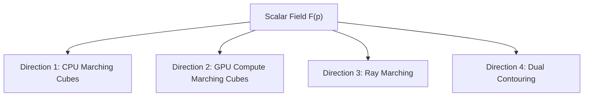

# Metaballs and Implicit Surface Rendering

**Status**: Direction 1 (CPU Marching Cubes) implemented.
Directions 2–4 are planned — see the [Roadmap](#roadmap) section.

---

## Table of Contents

1. [What are Metaballs?](#1-what-are-metaballs)
2. [The Scalar Field](#2-the-scalar-field)
3. [Marching Cubes Algorithm](#3-marching-cubes-algorithm)
4. [Gradient Normals](#4-gradient-normals)
5. [DynamicMesh Architecture](#5-dynamicmesh-architecture)
6. [Scene Graph Integration](#6-scene-graph-integration)
7. [Demo: `examples/procedural/metaballs`](#7-demo-examplesmetaballs)
8. [Voice-Reactive Variant: `examples/procedural/voice_metaballs`](#8-voice-reactive-variant-examplesvoice_metaballs)
9. [Roadmap — Four Directions](#9-roadmap--four-directions)

---

## 1. What are Metaballs?

Metaballs are smooth, organic-looking blobs defined implicitly — not by explicit triangle
meshes, but by a scalar field in 3D space. Each ball contributes an influence that falls
off with distance. Where the total influence exceeds a threshold (the *iso-value*), the
surface exists.

The key property: when two balls approach each other, their fields add together and the
surface merges smoothly — the "blobby" effect. This makes metaballs useful for simulating
liquids, organic tissue, and soft-body objects.

---

## 2. The Scalar Field

Each ball `i` has a center `cᵢ` and a radius `rᵢ`. The field contribution at point `p` is:

```
fᵢ(p) = rᵢ² / |p - cᵢ|²
```

The total field is the sum over all balls:

```
F(p) = Σᵢ fᵢ(p) = Σᵢ rᵢ² / |p - cᵢ|²
```

The isosurface is the set of all points where `F(p) = 1.0` (the iso-value).

**Properties:**
- At distance `r` from the center of a single ball, `f = r² / r² = 1.0` — the surface
  of an isolated ball is exactly its radius sphere.
- As `p → cᵢ`, `fᵢ → ∞` — the field is singular at ball centers.
- The field is `C∞` everywhere except at ball centers.
- Two nearby balls merge when their combined field exceeds 1.0 between them.

**In code** (`examples/metaballs/src/main.rs`):

```rust
let field = |p: Vec3| -> f32 {
    balls.iter().map(|b| {
        let d2 = (p - b.center).length_squared().max(1e-6);
        b.radius * b.radius / d2
    }).sum()
};
```

---

## 3. Marching Cubes Algorithm

Marching Cubes (Lorensen & Cline, 1987) extracts a triangle mesh from a scalar field by
marching through a regular grid of cubic cells.

### 3.1 Grid Setup

The grid spans a bounding box (e.g. `[-4, 4]³`) divided into `N³` cells (48³ in the
demo). Each grid vertex stores the field value at that point.

```
grid_params = GridParams {
    min: Vec3::splat(-4.0),
    max: Vec3::splat(4.0),
    resolution: [48, 48, 48],
}
```

Cell size: `(max - min) / resolution` per axis.

### 3.2 Cell Classification

For each cell, evaluate the field at its 8 corners. Each corner is either *inside*
(field ≥ iso-value) or *outside* (field < iso-value). The 8 binary flags form an 8-bit
*cube index* (0–255).

```
cube_index = 0;
for (i, corner) in corners.iter().enumerate() {
    if field(corner) >= iso_value {
        cube_index |= 1 << i;
    }
}
```

Index 0 (all outside) and 255 (all inside) produce no triangles.

### 3.3 Edge Table

The *edge table* (256 entries, one per cube index) is a bitmask of which of the 12 cell
edges are intersected by the surface. If bit `e` is set, the surface crosses edge `e`.

```rust
const EDGE_TABLE: [u16; 256] = [ /* Paul Bourke */ ];
```

Reference: [paulbourke.net/geometry/polygonise/](http://paulbourke.net/geometry/polygonise/)

### 3.4 Vertex Interpolation

For each active edge, interpolate the vertex position linearly between the two corner
positions, weighted by how close each corner is to the iso-value:

```
t = (iso_value - v0) / (v1 - v0)
vertex = p0 + t * (p1 - p0)
```

This places the vertex exactly on the isosurface (within floating-point precision).

### 3.5 Triangle Table

The *triangle table* (256 × 16 entries) maps each cube index to a list of edge triplets
forming triangles. Each triplet of edge indices `[e0, e1, e2]` forms one triangle using
the interpolated vertices on those edges. The list is terminated by `-1`.

```rust
const TRI_TABLE: [[i8; 16]; 256] = [ /* Paul Bourke */ ];
```

### 3.6 Vertex Deduplication

Adjacent cells share edges. Without deduplication, each cell emits its own copy of
shared vertices, producing a non-manifold mesh with doubled geometry.

Deduplication uses a `HashMap<(cell_flat_index, edge_index), vertex_index>`. Before
emitting a new vertex, check if the edge has already been processed by a neighboring
cell. If so, reuse the existing vertex index.

This produces a proper indexed mesh with shared vertices — essential for correct normal
smoothing.

### 3.7 Output Format

The MC module outputs `DynamicMeshData` using the framework's `standard_layout()`:

```
Position: Float32x3  @ location 0, offset  0
Normal:   Float32x3  @ location 1, offset 12
UV:       Float32x2  @ location 2, offset 24
stride = 32 bytes
```

Indices are `u32` (Uint32 format) to handle meshes with > 65535 vertices.

UVs are `[0.0, 0.0]` placeholder — the Phong shader does not sample UVs for untextured
materials.

---

## 4. Gradient Normals

Face normals (cross product of triangle edges) produce a faceted appearance at 48³
resolution. Gradient normals give smooth Phong shading.

The gradient of the scalar field at point `p` is estimated via central differences:

```
∂F/∂x ≈ (F(p + ε·x̂) - F(p - ε·x̂)) / 2ε
∂F/∂y ≈ (F(p + ε·ŷ) - F(p - ε·ŷ)) / 2ε
∂F/∂z ≈ (F(p + ε·ẑ) - F(p - ε·ẑ)) / 2ε

gradient = Vec3(∂F/∂x, ∂F/∂y, ∂F/∂z)
normal = -normalize(gradient)   // negate: gradient points inward (increasing field)
```

`ε` is set to `cell_size * 0.01` — small enough for accuracy, large enough to avoid
numerical instability near ball centers.

This requires 6 additional field evaluations per vertex. At 48³ with ~10K active
vertices, this adds ~60K field evaluations per frame — negligible on a modern CPU.

---

## 5. DynamicMesh Architecture

### 5.1 The Problem

The existing renderer assumes immutable meshes: `ImmutableResourceCache` caches GPU
buffers by `MeshHandle` and never invalidates them. Metaballs need per-frame mesh
updates — a fundamentally different access pattern.

### 5.2 Solution: DynamicMesh

`DynamicMesh` (in `rig-render`) owns a mutable vertex + index buffer pair on the GPU:

```rust
pub struct DynamicMesh {
    vertex_buffer: wgpu::Buffer,  // usage: VERTEX | COPY_DST
    index_buffer:  wgpu::Buffer,  // usage: INDEX  | COPY_DST
    vertex_capacity: usize,       // bytes
    index_capacity:  usize,       // bytes
    index_count: u32,
    vertex_layout: VertexLayout,
    index_format: wgpu::IndexFormat,
}
```

**No double-buffering**: `queue.write_buffer()` copies data into wgpu's internal staging
ring buffer. The destination buffer is not touched until the GPU processes the command.
No stall, no synchronisation needed.

**Grow-on-demand**: when new data exceeds the current buffer capacity, the buffer is
reallocated at `next_power_of_two(required)` bytes. After the first few frames, the
metaball surface stabilises in size and no further allocations occur.

### 5.3 Lifecycle

```
init():
  renderer.register_dynamic_mesh(gpu, layout, Uint32, initial_cap) -> DynamicMeshId

update():
  marching_cubes::extract(&field, &params, 1.0) -> DynamicMeshData
  store staged_vertices, staged_indices, staged_index_count
  scene.set_dynamic_bounds(node, data.local_bounds)

render():
  renderer.update_dynamic_mesh(gpu, id, &vertices, &indices, count)
  renderer.render_scene(gpu, frame, scene, assets, camera)
```

The CPU/GPU split is deliberate: `UpdateContext` intentionally does not expose the GPU
queue (update is pure logic), while `RenderContext` does. Staging on the app struct
bridges the two phases.

---

## 6. Scene Graph Integration

Dynamic meshes participate in the scene graph like static meshes. This gives them
frustum culling, transform hierarchy, visibility, and draw sorting for free.

### 6.1 MeshSource

`Renderable` uses `MeshSource` instead of a bare `MeshHandle`:

```rust
pub enum MeshSource {
    Static(MeshHandle),
    Dynamic(DynamicMeshId),
}

pub struct Renderable {
    pub mesh: MeshSource,
    pub material: MaterialHandle,
}
```

### 6.2 Dynamic Bounds

Static meshes get their bounding sphere from `MeshAsset::local_bounds` (set at creation
time). Dynamic meshes update their bounds every frame via:

```rust
scene.set_dynamic_bounds(node, data.local_bounds)?;
```

`compute_world_bounds()` branches on `MeshSource` to read from either the asset store
(static) or the `dynamic_bounds` map (dynamic).

### 6.3 Frustum Culling

`extract_renderables_culled()` uses `world_bound` (propagated from `local_bounds` via
`compute_world_bounds`) for sphere-frustum tests. Dynamic meshes are culled identically
to static meshes — the renderer sees no difference.

### 6.4 Draw Dispatch

In `record_scene_pass()`, the draw loop branches on `MeshSource`:

```
Static(handle)  → ImmutableResourceCache::mesh_buffers()
Dynamic(id)     → Renderer::dynamic_meshes[id]
```

Both paths produce the same types (vertex buffer ref, index buffer ref, index count,
index format, vertex layout) and feed into the same pipeline + draw call.

---

## 7. Demo: `examples/procedural/metaballs`

### Scene

- 4 metaballs with radii 0.8–1.2, bouncing inside a `[-4, 4]³` bounding box
- 48³ grid resolution (~110K cells evaluated per frame)
- PHONG_SHADER with white material → polished chrome / liquid metal appearance
- One directional light (white, intensity 1.2) + one point light for highlights
- Fly-camera for free exploration

### Overlay (F3 to toggle)

| Element | Content |
|---------|---------|
| FPS | Current frame rate |
| Triangles | Output triangle count from last MC extraction |
| Grid | Resolution: 48³ |
| Wireframe | ON / OFF / N/A (if hardware unsupported) |

### Controls

| Key | Action |
|-----|--------|
| W / S | Move forward / backward |
| A / D | Strafe left / right |
| Q / E | Move up / down |
| Arrow keys | Rotate camera (yaw / pitch) |
| F3 | Toggle overlay |
| F4 | Toggle wireframe (scene-wide) |
| Escape | Exit |

### Performance (RTX 2080 + Zen 2/3 CPU)

| Stage | Budget |
|-------|--------|
| Field evaluation (48³ × 8 corners × 4 balls) | ~1 ms |
| Gradient normals (~10K vertices × 6 evals) | ~0.1 ms |
| GPU upload (~1.5 MB vertex + ~0.6 MB index) | ~0.2 ms |
| GPU render | < 0.1 ms |
| **Total** | **< 2 ms** |

---

## 8. Voice-Reactive Variant: `examples/procedural/voice_metaballs`

`examples/procedural/voice_metaballs` is a voice-reactive extension of the base metaballs
demo. It integrates the [graphynx](https://github.com/vansweej/graphynx) signal
processing engine as a path dependency to drive metaball animation parameters
from real-time spectral analysis.

The app tries to open the default microphone on startup. If no device is
available it falls back to `SynthSource` automatically. Press **M** to toggle
between live and synth at runtime.

### 8.1 Architecture overview

The update loop is structured as three sequential layers:



### 8.2 Signal pipeline

Each frame, audio is captured and fed through a graphynx graph:

```
[audio: f32 × 1024] → Window(Hann) → FFT(Magnitude) → BandExtract(3 bands, EMA α=0.6)
                                                                  ↓
                                                       [energies: f32 × 3]
```

Raw energies are then **pre-scaled by `1/bin_count`** before entering the peak
tracker. This compensates for the large difference in bin counts between bands:

| Band | Hz range | Approx. bin count (FFT=1024, sr=44100) |
|------|----------|----------------------------------------|
| Low  | 20–250   | ~5                                     |
| Mid  | 250–4000 | ~87                                    |
| High | 4000–20000 | ~372                                 |

Without pre-scaling, the high band outputs ~74× more than the low band for
identical signal content, causing the low band to appear near-zero during
peak-tracker startup.

### 8.3 Normalisation — PeakTracker

Raw (pre-scaled) energies are normalised to [0, 1] by a per-band adaptive peak
tracker with a hysteresis gate.

**Algorithm (per frame, per band):**

1. `peak_max = max(peak_max × RELEASE, scaled_raw)` — fast attack, slow release
2. `norm = scaled_raw / max(peak_max, FLOOR)` — FLOOR prevents divide-by-zero
3. Gate hysteresis: open when `norm > 0.10`, close when `norm < 0.05`
4. Output: `normalised = if gate_open { norm } else { 0.0 }`

The gate hysteresis prevents flicker when the normalised value hovers near the
threshold (e.g. during the slow peak-max decay after a loud sound stops).



### 8.4 Multi-axis animation mapping

Each frequency band drives a **distinct, legible visual channel**:

| Band | Primary axis | Secondary axis | Visual read at full energy |
|------|-------------|---------------|---------------------------|
| **Low** (20–250 Hz) | Ball **radius** pulsing (1.0× → 2.2×) | Vertical **bounce amplitude** (2.5 → 5.5 units) | Balls swell and bounce higher |
| **Mid** (250–4000 Hz) | Orbit **radius** (1.5 → 5.0 units) | Orbit **speed** multiplier (0.5× → 2.5×) | Balls spread outward and orbit faster |
| **High** (4000–20000 Hz) | **ISO threshold** (0.9 → 2.5) | Extra **ball count** (2 extra balls fade in) | Surface tightens; satellite blobs appear |

**Idle state** (all bands gated to 0): 4 small balls, tight orbit (1.5 units),
slow drift (0.5×), blobby merged surface (ISO=0.9). A calm "breathing blob" that
expands and fractures when sound arrives.

### 8.5 Phase accumulation

Ball positions are computed from **accumulated phases** rather than wall-clock
time. This ensures that changes to the speed multiplier never cause position
discontinuities — only the *rate* of phase accumulation changes:

```
phase += dt × speed_mult × base_freq
position = orbit_radius × sin(phase)
```

The speed multiplier itself is smoothed with a slow EMA (α = 0.03, ~33 frames
to 63% of target) to prevent jarring velocity changes.

### 8.6 Extra ball state machine

Six `Ball` structs are always allocated. Balls 0–3 are always visible. Balls 4–5
fade in when the high band is sustained above the spawn threshold for 10
consecutive frames (~167 ms), preventing flicker from transients.



### 8.7 Voice presets

Three synthetic voice presets are switchable at runtime:

| Key | Preset  | Fundamental | Formants                 |
|-----|---------|-------------|--------------------------|
| `1` | Male    | 120 Hz      | 700 / 1200 / 2500 Hz     |
| `2` | Female  | 220 Hz      | 900 / 1800 / 2800 Hz     |
| `3` | Neutral | 170 Hz      | 800 / 1500 / 2650 Hz     |

Switching preset rebuilds the graphynx graph and resets the peak tracker and
extra ball state.

### 8.8 Controls

| Key | Action |
|-----|--------|
| `1` / `2` / `3` | Switch voice preset |
| `M` | Toggle live / synth audio |
| `W` / `S` | Move forward / backward |
| `A` / `D` | Strafe left / right |
| `Q` / `E` | Move up / down |
| Arrow keys | Rotate camera (yaw / pitch) |
| `F3` | Toggle overlay |
| `F4` | Toggle wireframe |
| `Escape` | Exit |

### 8.9 HUD overlay

| Element | Content |
|---------|---------|
| Preset | Current voice preset + key hint |
| Audio | Current audio mode (Live / Synth) + key hint |
| Bands | Normalised band energies L / M / H in [0, 1] |
| Peaks | Current `peak_max` per band (shows tracker adaptation) |
| Triangles | Output triangle count from last MC extraction |

### 8.10 Dependencies

Depends on graphynx crates, provided by the Nix flake at `vendor/graphynx`
(pinned via `flake.lock`). Enter `nix develop --impure` to provision the
dependency automatically. The current CPU backend (`backends-cpu`) requires
no CUDA toolchain.

---

## 8.11 Future: Material Reactivity

> **NOT IMPLEMENTED** — planned for a separate session.

### Concept

Map audio analysis to PBR material properties, giving the metaball surface a
visual "mood" that reflects the sound character:

| Audio feature | Material axis | Idle | Full energy |
|--------------|--------------|------|-------------|
| Spectral centroid (brightness) | `roughness` | 0.10 (mirror-shiny) | 0.85 (matte) |
| Overall energy (loudness) | `diffuse` colour | Cool blue-grey | Warm orange |



### Why this is feasible without pipeline changes

The renderer (`crates/render/src/renderer.rs`, lines 638–664) creates a fresh
`MaterialUniforms` GPU buffer **every draw call**, reading from
`material.parameters` at that moment. Mutating `MaterialParams` between frames
is therefore automatically picked up by the renderer — no pipeline rebuild, no
new bind group layout, no shader changes required.

### Implementation path

1. **Add spectral centroid** as a 4th graphynx output (new `SpectralCentroid` op,
   or compute from the raw spectrum in the example).
2. **Obtain mutable `AssetStore` access in `update()`**. Currently `UpdateContext`
   does not expose `&mut AssetStore`. Options:
   - Add `assets: &mut AssetStore` to `UpdateContext` (preferred)
   - Stage material changes in app state and apply in `render()` before
     `render_scene()`
3. **Mutate `MaterialParams`** each frame based on normalised audio values, with
   a slow EMA (α ≈ 0.05) to prevent abrupt colour/roughness jumps.

### Open question

Does adding `&mut AssetStore` to `UpdateContext` break the ownership model?
The renderer also borrows assets during `render()`. Investigate in a separate
session before implementing.

---

## 9. Roadmap — Four Directions

All four directions render the same metaball field. They differ in *where* the work
happens (CPU vs GPU) and *what* they produce (triangle mesh vs ray-marched pixels).



### Comparison

| | D1: CPU MC | D2: GPU MC | D3: Ray March | D4: Dual Contour |
|---|---|---|---|---|
| **Where** | CPU | GPU compute | GPU fragment | CPU |
| **Output** | Triangle mesh | Triangle mesh | Pixels | Triangle mesh |
| **Normals** | Gradient (central diff) | Gradient (in shader) | Gradient (in shader) | Hermite data |
| **Sharp features** | No | No | No | Yes |
| **CPU load** | High | Low | Low | High |
| **GPU load** | Low | High | High | Low |
| **Reuses DynamicMesh** | Yes (defines it) | Yes | No | Yes |
| **New crates touched** | rig-assets, rig-scene, rig-render, rig-gpu | rig-gpu, rig-render | rig-render | rig-assets, rig-render |

---

### Direction 1: CPU Marching Cubes ✓ (this implementation)

**Approach**: evaluate the field on a 48³ grid on the CPU, run the MC algorithm, upload
the resulting triangle mesh to a `DynamicMesh` GPU buffer each frame.

**What's built**: `rig-assets::marching_cubes` module, `DynamicMesh` in `rig-render`,
`MeshSource` enum in `rig-assets` + `rig-scene`, `examples/procedural/metaballs`.

**Performance**: ~2ms total at 48³ on a modern CPU. Bottleneck is field evaluation.

**Limitations**: CPU-bound; resolution is limited by frame budget. At 96³ (8× more
cells), the CPU cost rises to ~16ms — too slow for 60 fps.

**What can be reused by D2–D4**: `DynamicMesh` type and registry, `MeshSource` enum,
scene graph integration, `examples/procedural/metaballs` field function and ball animation.

---

### Direction 2: GPU Compute Marching Cubes

**Approach**: move field evaluation and the MC algorithm entirely to a wgpu compute
shader. The CPU only animates ball positions and uploads them as a small uniform buffer.
The GPU writes vertices directly into a storage buffer, which is then used as a vertex
buffer for the draw call.

**Key differences from D1**:
- Field evaluation: compute shader reads ball positions from a uniform, evaluates at
  each grid vertex in parallel
- MC algorithm: one compute thread per cell; atomic counter or prefix-sum for vertex
  allocation
- Output: `STORAGE | VERTEX` buffer — no CPU readback, no `queue.write_buffer()`
- Draw: `draw_indirect` with a count written by the compute shader

**Crates touched**:
- `rig-gpu`: no change (device already created with correct limits)
- `rig-render`: new `GpuMarchingCubes` type (compute pipeline + storage buffers),
  `Renderer::register_gpu_dynamic_mesh()`, draw dispatch handles new variant
- `rig-assets`: reuse `DynamicMeshId` and `MeshSource::Dynamic`

**Performance**: field evaluation parallelises over 110K grid vertices → ~0.05ms at
48³. Can scale to 128³ or 256³ within frame budget.

**What can be reused from D1**: `DynamicMeshId`, `MeshSource`, scene graph integration,
ball animation code, overlay.

---

### Direction 3: Ray Marching

**Approach**: no mesh extraction at all. A full-screen quad fragment shader
sphere-traces the scalar field per pixel. For each pixel, march a ray from the camera
through the field until `F(p) ≥ 1.0` (or a max step count is reached). Compute the
normal from the field gradient at the hit point. Apply Phong shading in the shader.

**Key differences from D1**:
- No `DynamicMesh`, no MC, no CPU field evaluation
- A custom wgpu render pipeline with a full-screen triangle vertex shader and a
  ray-marching fragment shader
- Ball positions uploaded as a uniform buffer each frame
- Resolution is screen resolution, not grid resolution — quality scales with pixel count
- Soft shadows and ambient occlusion are natural extensions

**Crates touched**:
- `rig-render`: new `RayMarchPipeline` type, new `Renderer::render_ray_march()` method
  (or a new `RenderPass` variant), custom WGSL shader with sphere-tracing loop
- `rig-assets`: no change
- `rig-scene`: no change (metaballs node not needed — or kept for transform/visibility)

**Performance**: ~0.5–2ms at 1080p depending on step count and field complexity.
Naturally anti-aliased at high step counts.

**What can be reused from D1**: ball animation code, overlay, PHONG_SHADER lighting
model (ported into the ray-march fragment shader).

---

### Direction 4: Dual Contouring

**Approach**: like Marching Cubes, but preserves sharp features (creases, corners).
Instead of interpolating vertices on edges (MC), Dual Contouring places one vertex per
*cell* by solving a Quadratic Error Function (QEF) that minimises distance to all edge
intersection planes.

**Key differences from D1**:
- Grid evaluation is the same as MC
- For each active edge (field sign change), store the intersection point and the field
  gradient (normal) at that point — this is the *hermite data*
- For each active cell, collect all hermite data from its 12 edges, solve the QEF to
  find the optimal vertex position inside the cell
- Triangulate by connecting vertices of adjacent active cells (dual grid)
- Output: sharp features (flat planes, creases) are preserved exactly

**Crates touched**:
- `rig-assets`: new `dual_contouring` module alongside `marching_cubes`; reuses
  `DynamicMeshData` output type and `standard_layout()`
- `rig-render`: no change — reuses `DynamicMesh` from D1
- `rig-scene`: no change

**Performance**: similar to D1 at the same resolution (~2ms at 48³). QEF solving adds
a small constant per active cell (3×3 SVD or least-squares solve).

**What can be reused from D1**: `DynamicMesh`, `MeshSource`, scene graph integration,
`DynamicMeshData`, ball animation, overlay, `push_vertex` helper.

---

*Reference: Lorensen & Cline (1987), "Marching Cubes: A High Resolution 3D Surface
Construction Algorithm". Paul Bourke's implementation notes:
[paulbourke.net/geometry/polygonise/](http://paulbourke.net/geometry/polygonise/).
Dual Contouring: Ju et al. (2002), "Dual Contouring of Hermite Data".*
