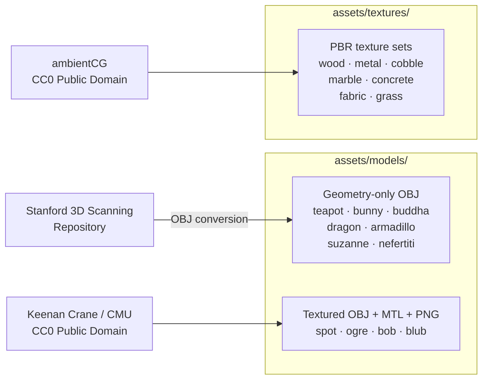
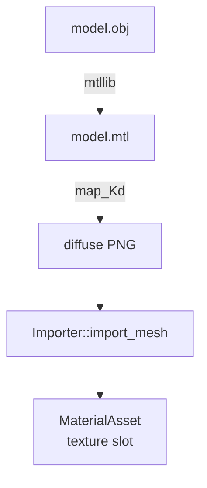
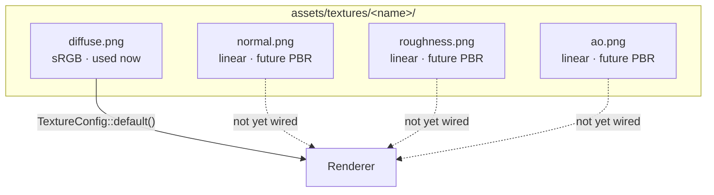
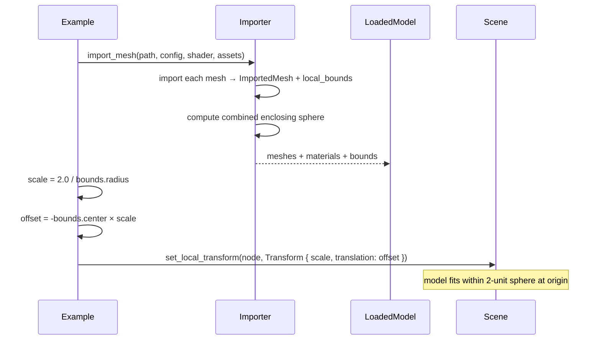

# Model and Texture Library

**Crates**: `rig-loader`, `rig-import`, `rig-assets`, `rig-render`  
**Purpose**: Track asset provenance, file layout, texture conventions, and model-viewer usage patterns.

---

## 0. Git LFS prerequisites

Binary asset payloads under `assets/` are tracked by Git LFS (see
[`.gitattributes`](../.gitattributes)). If LFS content has not been fetched,
the loader will report:

```text
assets/models/teapot.obj is a Git LFS pointer (not actual content) — run `git lfs pull` inside the Nix dev shell
```

The Nix dev shell (`nix develop --impure`) runs `git lfs install --local` and
`git lfs pull` automatically via `shellHook`. On a fresh clone, simply entering
the dev shell is enough. See the [README](../README.md#first-time-setup) for
details.

---

## 1. Asset provenance

The asset library combines geometry-only OBJ models, textured OBJ models, and
future-facing PBR texture sets. See [`assets/LICENSES.md`](../assets/LICENSES.md)
for per-file provenance and license notes.



---

## 2. Geometry-only models

| Model | File | Triangles | Source | License | Notes |
|-------|------|-----------|--------|---------|-------|
| Teapot | `assets/models/teapot.obj` | needs confirmation | `common-3d-test-models/data/teapot.obj` | Public-domain / common test model; verify upstream notes when updating | Default `model_gallery` model. |
| Bunny | `assets/models/bunny.obj` | needs confirmation | `common-3d-test-models/data/stanford-bunny.obj` | Stanford data: non-commercial research use | Small Stanford scan. |
| Buddha | `assets/models/buddha.obj` | needs confirmation | `common-3d-test-models/data/happy.obj` | Stanford data: non-commercial research use | High-detail scan. |
| Dragon | `assets/models/dragon.obj` | needs confirmation | `common-3d-test-models/data/xyzrgb_dragon.obj` | Stanford data: non-commercial research use | Very high-poly; load time can be noticeable. |
| Armadillo | `assets/models/armadillo.obj` | needs confirmation | `common-3d-test-models/data/armadillo.obj` | Stanford data: non-commercial research use | Geometry-only. |
| Suzanne | `assets/models/suzanne.obj` | needs confirmation | `common-3d-test-models/data/suzanne.obj` | Verify upstream notes when updating | Blender monkey test model. |
| Nefertiti | `assets/models/nefertiti.obj` | needs confirmation | `common-3d-test-models/data/nefertiti.obj` | Needs confirmation before redistribution beyond personal research | Very high-poly; may load slowly. |

---

## 3. Textured models

The Keenan Crane archives did not ship sibling MTL files for every OBJ variant, so
the checked-in layout includes small sibling `.mtl` files whose `map_Kd` references
point at the extracted diffuse texture. This matches the importer's sibling-path
resolution rule.

| Model | Directory | Triangles | Texture file | License |
|-------|-----------|-----------|--------------|---------|
| Spot | `assets/models/spot/` | needs confirmation | `spot_texture.png` | CC0 / public domain |
| Ogre | `assets/models/ogre/` | needs confirmation | `diffuse.png` | CC0 / public domain |
| Bob | `assets/models/bob/` | needs confirmation | `bob_diffuse.png` | CC0 / public domain |
| Blub | `assets/models/blub/` | needs confirmation | `blub_texture.png` | CC0 / public domain |



---

## 4. PBR texture map convention

ambientCG texture directories are scaffolded for future PBR work. The download
script normalizes each set to four predictable filenames when the upstream ZIPs are
available. At the time of this update, the checked-in directories contain placeholders
only; populate them with `scripts/download_assets.sh` or manually before using them.
If ambientCG's direct download URLs fail, download each `<ID>_2K-PNG.zip` manually
into `.asset-downloads/ambientcg/` and rerun the script; it will use the cached ZIPs.
Some ambientCG sets do not include an ambient-occlusion map. In that case the script
generates a 1×1 white `ao.png`, which represents “no occlusion” for future PBR use.



| Texture set | Directory | Status |
|-------------|-----------|--------|
| WoodFloor051 | `assets/textures/wood_oak/` | Downloaded; four-file convention. |
| Metal032 | `assets/textures/metal_rust/` | Downloaded; generated white AO fallback. |
| PavingStones131 | `assets/textures/stone_cobble/` | Downloaded; four-file convention. |
| Marble012 | `assets/textures/marble_white/` | Downloaded; four-file convention. |
| Concrete034 | `assets/textures/concrete_worn/` | Downloaded; four-file convention. |
| Fabric045 | `assets/textures/fabric_denim/` | Downloaded; four-file convention. |
| Ground037 | `assets/textures/terrain_grass/` | Downloaded; four-file convention. |

`Bricks076` was originally planned for `assets/textures/brick_red/`, but its direct
ambientCG archive URL was unavailable during this pass, so the brick set is not part
of the committed library.

---

## 5. Auto-scale via combined bounds

`LoadedModel.bounds` is the combined enclosing `BoundingSphere` across all meshes
adapted from one source model. `model_gallery` uses it to normalize every model into
a 2-unit radius sphere centered at the origin.



---

## 6. Usage snippets

Geometry-only models should create a fallback material before import and assign it to
every mesh without a material index.

```rust,no_run
use std::sync::Arc;

use rig_app::{
    rig_assets::{MaterialAsset, MaterialParams, ShaderAsset},
    rig_import::{AssetPath, FilesystemSource, Importer, MeshConfig},
    rig_render::PHONG_SHADER,
};

# fn example(ctx: &mut rig_app::StartupContext<'_>) -> anyhow::Result<()> {
let shader = ctx.assets.add_shader(ShaderAsset {
    source: Arc::from(PHONG_SHADER),
});
let fallback = ctx.assets.add_material(MaterialAsset {
    shader,
    parameters: MaterialParams {
        diffuse: [0.8, 0.8, 0.75, 1.0],
        ..Default::default()
    },
    textures: Vec::new(),
});

let mut importer = Importer::new(FilesystemSource::default());
let loaded = importer.import_mesh(
    &AssetPath::new("assets/models/bunny.obj"),
    &MeshConfig::default(),
    shader,
    ctx.assets,
)?;

for imported in loaded.meshes {
    let mesh = ctx.assets.add_mesh(imported.mesh);
    // Attach `mesh` to the scene with `fallback` material.
    let _ = (mesh, fallback);
}
# Ok(())
# }
```

Textured OBJ models can use the MTL-derived material when a mesh has a material
index, falling back only when source data is incomplete.

```rust,no_run
use std::sync::Arc;

use rig_app::{
    rig_assets::{MaterialAsset, MaterialParams, ShaderAsset},
    rig_import::{AssetPath, FilesystemSource, Importer, MeshConfig},
    rig_render::TEXTURED_SHADER,
};

# fn example(ctx: &mut rig_app::StartupContext<'_>) -> anyhow::Result<()> {
let shader = ctx.assets.add_shader(ShaderAsset {
    source: Arc::from(TEXTURED_SHADER),
});
let fallback = ctx.assets.add_material(MaterialAsset {
    shader,
    parameters: MaterialParams::default(),
    textures: Vec::new(),
});

let mut importer = Importer::new(FilesystemSource::default());
let loaded = importer.import_mesh(
    &AssetPath::new("assets/models/spot/spot.obj"),
    &MeshConfig::default(),
    shader,
    ctx.assets,
)?;
let materials = loaded
    .materials
    .into_iter()
    .map(|(material, _name)| ctx.assets.add_material(material))
    .collect::<Vec<_>>();

for imported in loaded.meshes {
    let material = imported
        .material_index
        .and_then(|index| materials.get(index).copied())
        .unwrap_or(fallback);
    let mesh = ctx.assets.add_mesh(imported.mesh);
    // Attach `mesh` to the scene with `material`.
    let _ = (mesh, material);
}
# Ok(())
# }
```
