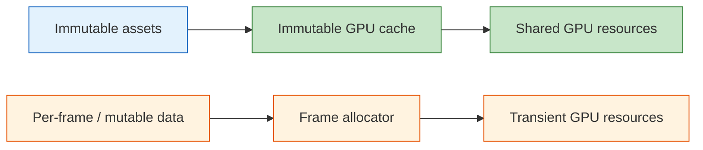
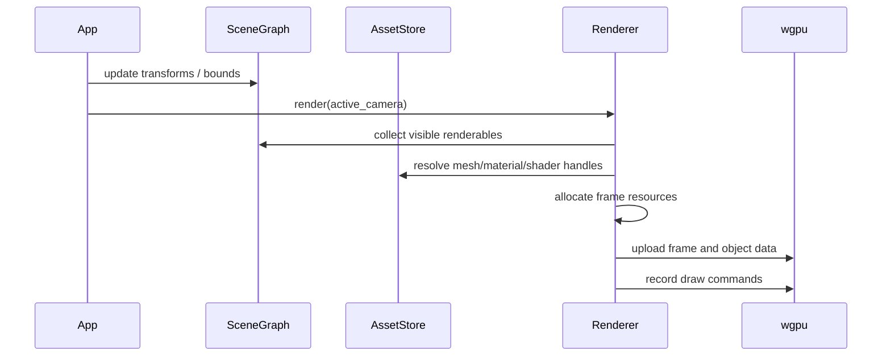

# Assets, GPU Resources, and Frame Resources

**Crates**: `rig-assets`, `rig-render`, `rig-math`
**Purpose**: Define how immutable assets become GPU resources and how per-frame data is managed safely

---

## Table of Contents

1. [Scope](#1-scope)
2. [The Core Split](#2-the-core-split)
3. [Immutable Assets](#3-immutable-assets)
4. [Immutable GPU Resource Cache](#4-immutable-gpu-resource-cache)
5. [What Must Not Be Content-Cached](#5-what-must-not-be-content-cached)
6. [Pipeline Specialization](#6-pipeline-specialization)
7. [Frame Resources](#7-frame-resources)
8. [Render Targets](#8-render-targets)
9. [Bind Groups and Data Layout](#9-bind-groups-and-data-layout)
10. [Scene Integration](#10-scene-integration)
11. [Worked Examples](#11-worked-examples)
12. [wgpu Mapping Summary](#12-wgpu-mapping-summary)

---

## 1. Scope

This document covers the resource model used by the renderer.

It deliberately separates two very different kinds of runtime data:

- immutable, shareable asset-backed resources
- transient or mutable frame-time allocations

That split is essential for correctness in Rust and for avoiding invalid caching rules.

---

## 2. The Core Split

### 2.1 Immutable resources

These are safe to deduplicate by content:

- shader modules from identical source
- immutable vertex buffers
- immutable index buffers
- sampled textures with identical content
- samplers with identical descriptors

### 2.2 Transient or mutable resources

These must be allocated and managed explicitly:

- per-frame uniform data
- per-object transforms uploaded every frame
- staging/upload buffers
- render targets
- depth attachments
- temporary post-processing buffers



### 2.3 Why this matters

A content cache answers the question: “have I already created this immutable thing?”

It does not answer the question: “where should this frame’s object-specific bytes live?”

Trying to use one mechanism for both produces aliasing bugs and confused ownership.

---

## 3. Immutable Assets

`rig-assets` defines shareable content that exists independently of any renderer instance.

### 3.1 Mesh assets

```rust
pub struct MeshAsset {
    pub vertex_layout: VertexLayout,
    pub vertex_data: Arc<[u8]>,
    pub index_data: Arc<[u8]>,
    pub local_bounds: BoundingSphere,
}
```

### 3.2 Material assets

```rust
pub struct MaterialAsset {
    pub shader: ShaderHandle,
    pub parameters: MaterialParams,
    pub textures: Vec<TextureHandle>,
}
```

### 3.3 Shader assets

```rust
pub struct ShaderAsset {
    pub source: Arc<str>,
}
```

### 3.4 Texture assets

```rust
pub struct TextureAsset {
    pub width: u32,
    pub height: u32,
    pub format: TextureFormat,
    pub data: Arc<[u8]>,
}
```

### 3.5 Design notes

- assets are immutable after creation
- assets are referenced by typed handles
- assets do not contain `wgpu` objects
- assets are not tied to any one render pass or surface format

---

## 4. Immutable GPU Resource Cache

`rig-render` turns immutable assets into reusable GPU resources.

### 4.1 Renderer-owned cache

```rust
pub struct ImmutableResourceCache {
    shaders: HashMap<u64, wgpu::ShaderModule>,
    vertex_buffers: HashMap<u64, wgpu::Buffer>,
    index_buffers: HashMap<u64, wgpu::Buffer>,
    textures: HashMap<u64, wgpu::Texture>,
    texture_views: HashMap<u64, wgpu::TextureView>,
    samplers: HashMap<u64, wgpu::Sampler>,
}
```

### 4.2 API shape

Prefer owned return values or opaque IDs.

```rust
impl ImmutableResourceCache {
    pub fn shader_module(
        &mut self,
        device: &wgpu::Device,
        shader: &ShaderAsset,
    ) -> wgpu::ShaderModule;

    pub fn mesh_buffers(
        &mut self,
        device: &wgpu::Device,
        mesh: &MeshAsset,
    ) -> CachedMeshBuffers;
}

pub struct CachedMeshBuffers {
    pub vertex: wgpu::Buffer,
    pub index: wgpu::Buffer,
}
```

Returning owned cloneable objects avoids borrow conflicts across nested cache lookups.

### 4.3 Hashing policy

The cache key should reflect immutable content.

Examples:

- shader source bytes
- mesh vertex/index bytes + layout
- texture pixels + format + dimensions
- sampler descriptor fields

The hash should never be used as a substitute for runtime identity of mutable allocations.

---

## 5. What Must Not Be Content-Cached

These resources should not be deduplicated by content hash alone.

### 5.1 Per-object uniform buffers

Bad idea:

```rust
struct UniformBufferDescriptor {
    size: usize,
    usage: BufferUsage,
}
```

If many objects share this descriptor, they will alias the same GPU buffer even though
they need different bytes each frame.

### 5.2 Render targets

A render target is not just “a texture with width and height”. It is an allocation owned
by a pass or renderer configuration. Two passes with the same dimensions do not imply the
same lifetime or aliasing rules.

### 5.3 Staging buffers

Uploads are operational runtime resources, not shared content.

### Rule

If the resource’s identity depends on when it is allocated, who writes it, or which pass
owns it, it should not be content-cached.

---

## 6. Pipeline Specialization

Pipelines belong to the renderer, not to scene nodes.

### 6.1 Why

`wgpu::RenderPipeline` depends on more than material intent. It also depends on pass and
target configuration such as:

- color target format
- depth/stencil format
- sample count
- primitive state
- bind group layout shape

That means a pipeline should be specialized from material/shader intent plus render-pass
configuration.

### 6.2 Recommended model

```rust
pub struct PipelineKey {
    pub shader: ShaderHandle,
    pub material_layout: MaterialLayoutKey,
    pub pass: PassKey,
    pub vertex_layout: VertexLayoutKey,
}
```

```rust
pub struct PipelineCache {
    render_pipelines: HashMap<PipelineKey, wgpu::RenderPipeline>,
}
```

Scene nodes should never directly own a `PipelineKey` or pipeline descriptor tied to a
surface format.

---

## 7. Frame Resources

Frame resources hold mutable data for one frame or a small ring of frames.

### 7.1 Typical contents

- camera matrices
- object transforms
- light lists
- material override data
- dynamic storage data

### 7.2 Example structure

```rust
pub struct FrameResources {
    object_buffer: DynamicBufferArena,
    view_buffer: DynamicBufferArena,
    light_buffer: DynamicBufferArena,
}
```

### 7.3 Dynamic buffer arena

```rust
pub struct DynamicBufferArena {
    buffer: wgpu::Buffer,
    size: u64,
    cursor: u64,
}

impl DynamicBufferArena {
    pub fn reset(&mut self);
    pub fn alloc(&mut self, size: u64, alignment: u64) -> BufferSliceAllocation;
}
```

This is a good fit for object transforms or per-frame camera data.

### 7.4 Typed upload model

Prefer typed Rust structs for CPU-side frame data.

```rust
#[repr(C)]
#[derive(Clone, Copy, bytemuck::Pod, bytemuck::Zeroable)]
pub struct FrameUniforms {
    pub view: [[f32; 4]; 4],
    pub proj: [[f32; 4]; 4],
}

#[repr(C)]
#[derive(Clone, Copy, bytemuck::Pod, bytemuck::Zeroable)]
pub struct ObjectUniforms {
    pub world: [[f32; 4]; 4],
}
```

This is better than string-named uniform byte blobs living in scene components.

---

## 8. Render Targets

Render targets are explicit renderer allocations.

### 8.1 Examples

- swapchain color target
- depth texture
- shadow map
- offscreen HDR color target
- post-processing ping-pong textures

### 8.2 Ownership

They should be owned by a renderer subsystem or pass manager because their lifetime is
tied to:

- window size
- pass graph
- sample count
- format requirements

### 8.3 Suggested shape

```rust
pub struct RenderTargets {
    depth: Option<TextureAllocation>,
    shadow_map: Option<TextureAllocation>,
    hdr_color: Option<TextureAllocation>,
}
```

These are allocations, not shared asset cache entries.

---

## 9. Bind Groups and Data Layout

Bind groups are renderer-generated from typed data sources.

### 9.1 Suggested grouping

- group 0: frame/view data
- group 1: material data and textures
- group 2: object data

The exact grouping can change, but the ownership boundary should stay consistent:

- scene provides world/model information
- assets provide shared immutable material/texture references
- renderer builds bind groups from frame data, object data, and material data

### 9.2 Avoid string-based uniform lookup

Avoid models like:

```rust
uniforms: Vec<UniformBinding> // searched by name like "pvw_matrix"
```

That is weakly typed and couples scene data to one shader layout strategy.

---

## 10. Scene Integration

The renderer consumes scene and asset handles.



This keeps responsibilities clean:

- scene never reaches into GPU resources
- assets never care about surface state
- renderer owns upload and draw policy

---

## 11. Worked Examples

### 11.1 Immutable triangle mesh

```rust
let triangle_mesh = assets.add_mesh(MeshAsset {
    vertex_layout,
    vertex_data: Arc::from(bytemuck::cast_slice(vertices)),
    index_data: Arc::from(bytemuck::cast_slice(indices)),
    local_bounds,
});
```

Renderer behavior:

1. hash mesh content
2. create or reuse vertex/index buffers
3. keep buffers in immutable cache

### 11.2 Per-object transform upload

```rust
let object_uniforms = ObjectUniforms {
    world: world.to_cols_array_2d(),
};
let alloc = frame_resources.object_buffer.alloc(
    std::mem::size_of::<ObjectUniforms>() as u64,
    256,
);
queue.write_buffer(&frame_resources.object_buffer.buffer, alloc.offset, bytemuck::bytes_of(&object_uniforms));
```

This is frame-local mutable data. It should not go through the immutable cache.

### 11.3 Render target resize

```rust
if size_changed {
    renderer.recreate_surface_targets(new_width, new_height)?;
}
```

Depth and offscreen targets are recreated explicitly because they are tied to the current
surface configuration.

---

## 12. wgpu Mapping Summary

| Concept | Lives in | Maps to |
|--------|----------|---------|
| `MeshAsset` | `rig-assets` | cached `wgpu::Buffer` pair |
| `ShaderAsset` | `rig-assets` | cached `wgpu::ShaderModule` |
| `TextureAsset` | `rig-assets` | cached `wgpu::Texture` + `TextureView` |
| `MaterialAsset` | `rig-assets` | renderer-generated bind groups + pipeline inputs |
| frame view data | `rig-render` | dynamic uniform/storage buffer allocation |
| object transform data | `rig-render` | dynamic uniform/storage buffer allocation |
| depth / shadow / offscreen targets | `rig-render` | explicit texture allocations |
| pass-specific pipeline | `rig-render` | cached `wgpu::RenderPipeline` specialized by pass |

### Final rule of thumb

If a resource can be shared across frames and across many scene instances without being
rewritten, it probably belongs in the immutable cache.

If a resource is written this frame, owned by a pass, or tied to current surface state,
it belongs in explicit runtime allocation.
