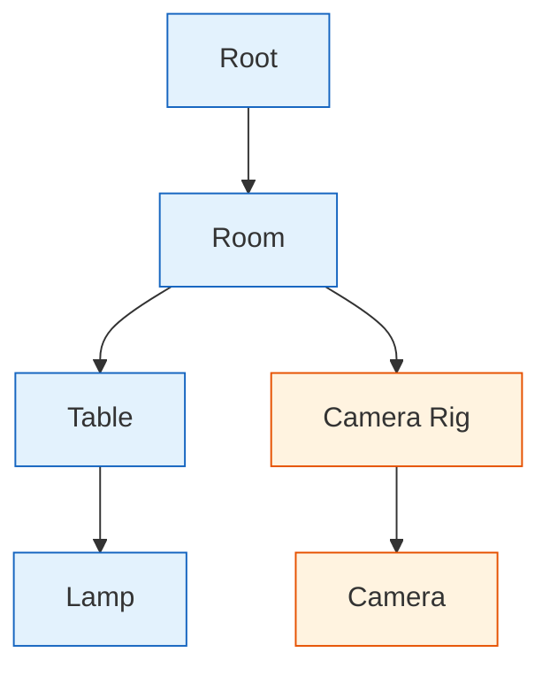
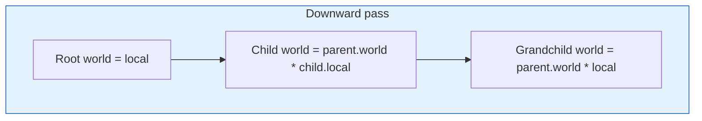
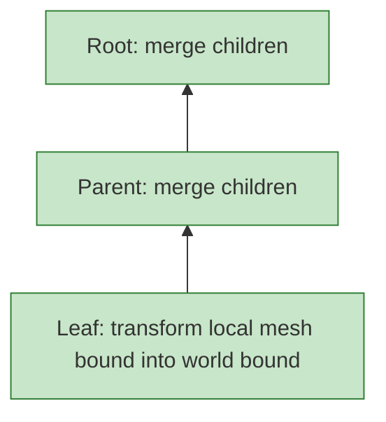
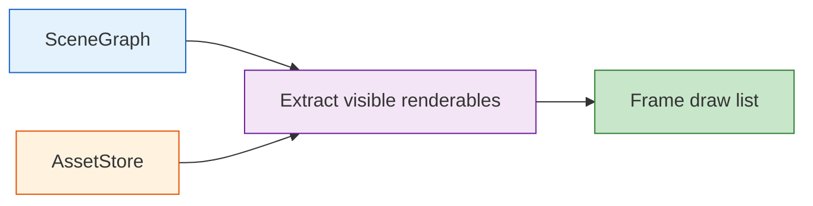

# Scene Graph

**Crates**: `rig-scene`, `rig-math`, `rig-assets`
**Purpose**: Model world structure, transforms, bounds, cameras, lights, and renderable instances

---

## Table of Contents

1. [Scope](#1-scope)
2. [Why a Scene Graph](#2-why-a-scene-graph)
3. [Handles and Arena Storage](#3-handles-and-arena-storage)
4. [Node Structure](#4-node-structure)
5. [Scene Components](#5-scene-components)
6. [Mutation APIs and Invariants](#6-mutation-apis-and-invariants)
7. [Transform Propagation](#7-transform-propagation)
8. [Bounds and Visibility](#8-bounds-and-visibility)
9. [Traversal APIs](#9-traversal-apis)
10. [Deletion and Handle Safety](#10-deletion-and-handle-safety)
11. [Renderer Extraction Boundary](#11-renderer-extraction-boundary)
12. [Worked Examples](#12-worked-examples)
13. [Extension Rules](#13-extension-rules)

---

## 1. Scope

`rig-scene` owns the world model.

It is responsible for:

- parent/child hierarchy
- local and world transforms
- world-space bounds
- camera and light placement in the scene
- references to renderable assets
- traversal and culling inputs

It is not responsible for:

- shader source compilation
- GPU buffer creation
- bind groups
- pipeline selection
- uniform packing and upload
- render-pass orchestration

That split is deliberate. The scene graph should remain reusable even if the renderer
changes substantially.

---

## 2. Why a Scene Graph

This project needs hierarchical transforms, local authoring, and world-space traversal.
An arena-backed scene graph is a good fit for that.

Examples that benefit directly:

- a camera attached under a moving rig
- a table with child legs and a lamp on top
- a spinning top parented under a stand
- future physics bodies that update node transforms

The graph is not intended to be a universal ECS replacement. It is the structure for
hierarchy-sensitive world data.



---

## 3. Handles and Arena Storage

### 3.1 Generational `NodeId`

Node identity must survive deletion safely. A plain arena index is not enough because a
destroyed slot may be reused later.

```rust
#[derive(Clone, Copy, PartialEq, Eq, Hash, Debug)]
pub struct NodeId {
    index: u32,
    generation: u32,
}
```

### 3.2 Arena layout

```rust
struct NodeSlot {
    generation: u32,
    node: Option<SceneNode>,
}

pub struct SceneGraph {
    nodes: Vec<NodeSlot>,
    free_list: Vec<u32>,

    renderables: HashMap<NodeId, Renderable>,
    cameras: HashMap<NodeId, CameraComponent>,
    lights: HashMap<NodeId, LightComponent>,
}
```

Validation is simple:

1. `index` must be in bounds
2. slot must contain a node
3. slot generation must match the handle generation

This catches stale handles deterministically.

### 3.3 Why an arena

- compact storage
- fast lookup by handle
- no parent/child reference cycles
- no `Rc<RefCell<_>>` graph gymnastics
- easy traversal with explicit iterators

---

## 4. Node Structure

Each node contains only hierarchy and world-model state.

```rust
pub struct SceneNode {
    name: String,
    parent: Option<NodeId>,
    first_child: Option<NodeId>,
    next_sibling: Option<NodeId>,

    local_transform: Transform,
    world_transform: Mat4,
    world_bound: BoundingSphere,

    visibility: VisibilityMode,
}
```

### Design notes

- `local_transform` is authoring state.
- `world_transform` is derived state.
- `world_bound` is derived state used by culling.
- visibility policy belongs here because it affects traversal and culling.

Renderer state is intentionally absent.

---

## 5. Scene Components

Components attached to nodes should describe world/domain concepts.

### 5.1 Renderable component

```rust
pub struct Renderable {
    pub mesh: MeshHandle,
    pub material: MaterialHandle,
}
```

This makes the node renderable without embedding GPU descriptors or shader source.

### 5.2 Camera component

```rust
pub struct CameraComponent {
    pub projection: Projection,
}
```

The node transform provides the camera pose. The component provides the projection model.

### 5.3 Light component

```rust
pub enum LightKind {
    Directional { color: Vec3, intensity: f32 },
    Point { color: Vec3, intensity: f32, range: f32 },
}

pub struct LightComponent {
    pub kind: LightKind,
}
```

### 5.4 Why not `EffectComponent`

The old design stored shader and pipeline details in scene components. That tightly
couples `rig-scene` to one renderer and to one binding model. The scene should say
what an object is, not how a specific render pass binds it.

---

## 6. Mutation APIs and Invariants

`SceneGraph` should keep storage private and expose targeted APIs.

Prefer APIs like:

```rust
impl SceneGraph {
    pub fn create_node(&mut self, name: impl Into<String>) -> NodeId;
    pub fn destroy_node(&mut self, id: NodeId) -> Result<()>;

    pub fn attach_child(&mut self, parent: NodeId, child: NodeId) -> Result<()>;
    pub fn detach_child(&mut self, child: NodeId) -> Result<()>;

    pub fn set_local_transform(&mut self, node: NodeId, transform: Transform) -> Result<()>;
    pub fn local_transform(&self, node: NodeId) -> Result<&Transform>;
    pub fn world_transform(&self, node: NodeId) -> Result<Mat4>;

    pub fn set_renderable(&mut self, node: NodeId, renderable: Renderable) -> Result<()>;
    pub fn renderable(&self, node: NodeId) -> Result<Option<&Renderable>>;
}
```

Avoid documenting direct internals such as `scene.nodes[id]`. That weakens invariants
and makes later refactors harder.

Important invariants:

- a node has at most one parent
- child lists are acyclic
- derived world state is recomputed through scene APIs
- invalid or stale handles return an error instead of indexing blindly

---

## 7. Transform Propagation

The transform update remains a strong fit for the scene graph.



```rust
impl SceneGraph {
    pub fn update_world_transforms(&mut self, root: NodeId) -> Result<()> {
        // Depth-first or breadth-first traversal.
        // Root world = root.local.to_mat4().
        // Child world = parent.world * child.local.to_mat4().
    }
}
```

### About `Transform`

`Transform` is a local authoring type: translation, rotation, and scale. World transforms
are stored as matrices because they are derived and easy for downstream math/rendering to use.

---

## 8. Bounds and Visibility

Bounds are scene-level data used for visibility decisions.

### 8.1 Local and world bounds

- mesh assets provide local/model-space bounds
- renderable nodes derive world bounds from mesh local bounds and world transform
- interior nodes merge child bounds

### 8.2 Visibility policy

```rust
pub enum VisibilityMode {
    Inherit,
    AlwaysVisible,
    Hidden,
}
```

### 8.3 Bound update



```rust
impl SceneGraph {
    pub fn update_world_bounds(&mut self, root: NodeId, assets: &AssetStore) -> Result<()> {
        // Post-order traversal.
        // Leaf nodes read mesh local bounds from assets.
        // Interior nodes merge child bounds.
    }
}
```

`rig-scene` can also expose helpers to collect nodes that are potentially visible for a
chosen camera frustum. The renderer then decides how to turn that into draw work.

---

## 9. Traversal APIs

Traversal should be explicit and safe.

Useful iterators:

- `children(node)`
- `descendants(node)`
- `ancestors(node)`
- `renderable_nodes()`
- `camera_nodes()`
- `light_nodes()`

Example:

```rust
for child in scene.children(parent)? {
    // work with validated handles only
}
```

These APIs prevent callers from depending on storage details like sibling pointers or
arena slot layout.

---

## 10. Deletion and Handle Safety

Deletion must invalidate the old handle permanently.

### 10.1 Destroying a node

When a node is destroyed:

1. it is detached from its parent
2. descendants are recursively destroyed or explicitly handled
3. scene components attached to that node are removed
4. the slot generation is incremented
5. the slot index goes to the free list

### 10.2 Why generation matters

Without a generation, code like this is unsafe at the logical level:

```rust
let cube = scene.create_node("cube");
scene.destroy_node(cube)?;
let light = scene.create_node("light");

// If light reused the same slot, cube would now refer to the wrong node.
```

With a generational handle, the old `cube` handle no longer validates.

---

## 11. Renderer Extraction Boundary

The renderer should read a narrow projection of the scene, not mutate scene internals.



The extracted data typically includes:

```rust
pub struct ExtractedRenderable {
    pub node: NodeId,
    pub mesh: MeshHandle,
    pub material: MaterialHandle,
    pub world_transform: Mat4,
    pub world_bound: BoundingSphere,
}
```

This is the hand-off point between `rig-scene` and `rig-render`.

---

## 12. Worked Examples

### 12.1 Triangle node

```rust
let triangle_mesh = assets.add_mesh(MeshAsset { /* vertex/index data */ });
let triangle_material = assets.add_material(MaterialAsset { /* shader + params */ });

let triangle = scene.create_node("triangle");
scene.set_renderable(
    triangle,
    Renderable {
        mesh: triangle_mesh,
        material: triangle_material,
    },
)?;
```

The scene node references assets by handle. The renderer resolves those handles later.

### 12.2 Camera in the scene

```rust
let camera = scene.create_node("main_camera");
scene.set_local_transform(
    camera,
    Transform {
        translation: Vec3::new(0.0, 1.0, 3.0),
        rotation: Quat::IDENTITY,
        scale: Vec3::ONE,
    },
)?;
scene.set_camera(
    camera,
    CameraComponent {
        projection: Projection::Perspective {
            fov_y_radians: 60.0_f32.to_radians(),
            near: 0.1,
            far: 100.0,
        },
    },
)?;
```

The app can choose this node as the active camera for rendering.

### 12.3 Parented object

```rust
let root = scene.create_node("root");
let rig = scene.create_node("rig");
let camera = scene.create_node("camera");

scene.attach_child(root, rig)?;
scene.attach_child(rig, camera)?;
```

Moving `rig` moves the camera automatically after world transforms are updated.

---

## 13. Extension Rules

When adding new scene components, prefer these rules.

### Good scene components

- cameras
- lights
- physics body handles
- animation state
- audio emitters
- gameplay metadata

### Bad scene components

- `wgpu::Buffer`
- shader source text for a specific render path
- pipeline descriptors tied to a surface format
- bind group layouts
- CPU-side uniform byte arrays for a renderer implementation

### Rule of thumb

If the data still makes sense when no renderer exists, it probably belongs in `rig-scene`.
If the data only exists to satisfy `wgpu` binding or pass setup, it belongs in `rig-render`.
