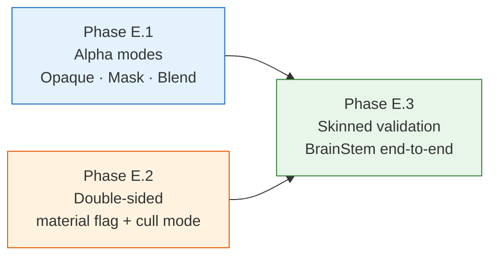
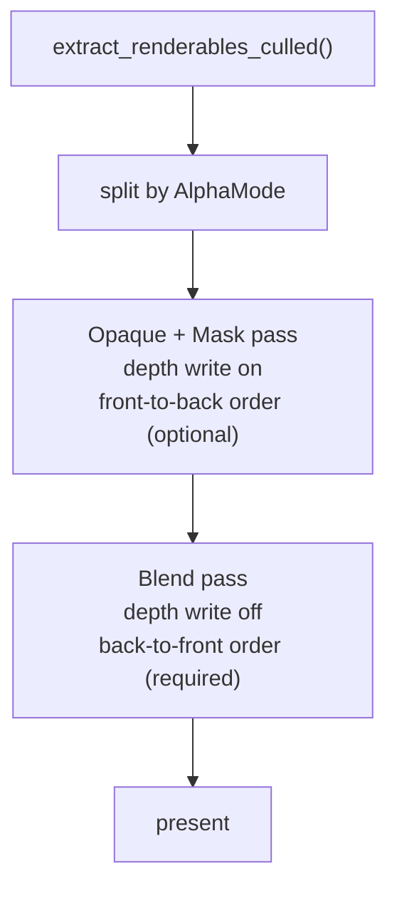
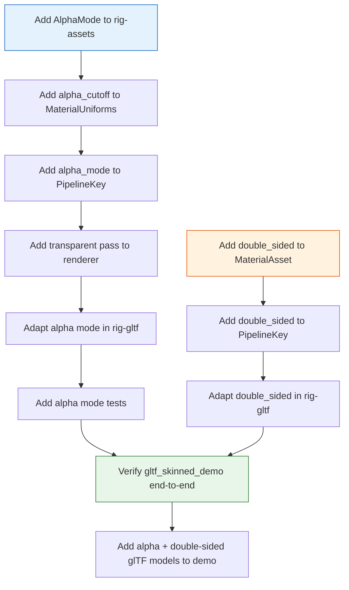

# Phase E: Production glTF Rendering

**Status**: Planned — not yet implemented  
**Depends on**: Phase A–D complete (material system, terrain, glTF loader, glTF enhancements)  
**Covers**: alpha modes, double-sided materials, skinned glTF runtime validation

---

## Overview

Phase E closes the gap between the current glTF loader and production-quality
rendering. The three pillars are:

1. **Alpha modes** — opaque (current), mask (alpha cutout), and blend
   (transparent) materials as specified by glTF 2.0.
2. **Double-sided rendering** — glTF `material.doubleSided` mapped to engine
   material state and renderer cull mode.
3. **Skinned glTF runtime validation** — `BrainStem.glb` and future skinned
   models exercising the full `rig-gltf` + `AnimationPlayer` + `SkinEvaluator`
   pipeline end to end.



---

## Phase E.1 — Alpha Modes

### Background

glTF 2.0 defines three alpha modes for materials:

| Mode | glTF value | Behaviour |
|------|-----------|-----------|
| Opaque | `"OPAQUE"` | Alpha channel ignored; fully opaque. Current engine default. |
| Mask | `"MASK"` | Fragment discarded if `alpha < alphaCutoff`. No blending. |
| Blend | `"BLEND"` | Standard alpha blending; requires sorted transparent pass. |

### MaterialAsset changes

Add an `AlphaMode` enum to `rig-assets`:

```rust
pub enum AlphaMode {
    Opaque,
    Mask { cutoff: f32 },
    Blend,
}

pub struct MaterialAsset {
    // ... existing fields ...
    pub alpha_mode: AlphaMode,  // default: AlphaMode::Opaque
}
```

### MaterialUniforms changes

Add `alpha_cutoff: f32` to the material uniform buffer. The shader reads this
value when the `HAS_ALPHA_MASK` flag is set:

```wgsl
const HAS_ALPHA_MASK: u32 = 32u;

// In fragment shader:
if (material.flags & HAS_ALPHA_MASK) != 0u {
    if base.a < material.alpha_cutoff {
        discard;
    }
}
```

For `AlphaMode::Opaque` and `AlphaMode::Blend`, the discard branch is not
taken (flag not set).

### Pipeline key changes

`AlphaMode` affects pipeline state and must be part of the `PipelineKey`:

| Alpha mode | Blend state | Depth write | Cull mode |
|-----------|-------------|-------------|-----------|
| Opaque | disabled | enabled | Back (default) |
| Mask | disabled | enabled | Back (default) |
| Blend | enabled (src_alpha / one_minus_src_alpha) | disabled | Back (default) |

`PipelineKey` gains an `alpha_mode: AlphaMode` field. The renderer creates
separate cached pipelines for each combination.

### Transparent pass ordering

`AlphaMode::Blend` materials require back-to-front sorting to avoid
transparency artefacts. The renderer needs a second draw pass:



Sorting is by camera-space Z of the renderable's bounding sphere centre.
`extract_renderables_culled` returns a flat list; the renderer splits it by
alpha mode before issuing draw calls.

### glTF adaptation

In `crates/gltf/src/materials.rs`, map `gltf::material::AlphaMode`:

```rust
match primitive.material().alpha_mode() {
    gltf::material::AlphaMode::Opaque => AlphaMode::Opaque,
    gltf::material::AlphaMode::Mask   => AlphaMode::Mask { cutoff: mat.alpha_cutoff().unwrap_or(0.5) },
    gltf::material::AlphaMode::Blend  => AlphaMode::Blend,
}
```

---

## Phase E.2 — Double-Sided Rendering

### Background

glTF `material.doubleSided` disables back-face culling for that material.
This is common for thin surfaces (leaves, cloth, paper) where both sides are
visible.

### MaterialAsset changes

Add a `double_sided: bool` field to `MaterialAsset` (default `false`):

```rust
pub struct MaterialAsset {
    // ... existing fields ...
    pub double_sided: bool,  // default: false
}
```

### Pipeline key changes

`double_sided` maps to `wgpu::Face` in the pipeline descriptor:

```rust
cull_mode: if material.double_sided { None } else { Some(wgpu::Face::Back) },
```

`PipelineKey` gains a `double_sided: bool` field. The renderer caches separate
pipelines for single-sided and double-sided materials.

### Shader implications

No shader changes are required. The GPU rasterizer handles culling before the
fragment stage. Double-sided materials may need correct normals on both faces —
glTF guarantees this by convention (normals point outward from the visible
surface), but the engine does not enforce it.

### glTF adaptation

In `crates/gltf/src/materials.rs`:

```rust
double_sided: primitive.material().double_sided(),
```

---

## Phase E.3 — Skinned glTF Runtime Validation

### Goal

Validate the full `rig-gltf` + `AnimationPlayer` + `SkinEvaluator` pipeline
with a production-quality skinned glTF asset. `BrainStem.glb` (Khronos sample)
is the primary validation target.

### Expected demo behaviour

- Load `assets/models/gltf/BrainStem.glb`.
- Create one `AnimationPlayer` for the first animation clip.
- Create one `SkinEvaluator` per `SkinnedPrimitive` descriptor.
- Each frame: advance animation → evaluate transforms → run skin evaluators →
  upload dynamic mesh data → render.
- Camera: `TrackBall` orbit + `CameraRig` WASD fly controls.
- Overlay: FPS counter, animation time, F3 toggle.

### Verification commands

```bash
# From inside the Nix development shell:
cargo run -p gltf_skinned_demo
# Expected: BrainStem model loads, animates, and deforms correctly.

# With nixGL on non-NixOS NVIDIA systems:
nixGL cargo run -p gltf_skinned_demo
```

### Validation checklist

- [ ] Asset loads without errors.
- [ ] All skinned primitives are identified via `LoadedGltf::skinned_primitives`.
- [ ] Animation advances and joint transforms update each frame.
- [ ] Skinned mesh deforms visibly and correctly (no T-pose freeze).
- [ ] Non-skinned primitives render statically.
- [ ] Camera controls respond correctly.
- [ ] Overlay FPS counter is visible and toggles with F3.
- [ ] No panics or GPU validation errors over a 60-second run.

---

## Open Questions

### Transparent sorting

| Question | Options | Notes |
|----------|---------|-------|
| Sort granularity | Per-renderable vs. per-triangle | Per-renderable is O(n log n) and sufficient for most scenes; per-triangle is needed for intersecting transparent geometry |
| Sort key | Bounding sphere centre Z vs. mesh centroid | Bounding sphere centre is already available from `BoundingSphere` |
| Sort frequency | Every frame vs. on camera move | Every frame is safest; camera-move-only risks stale order on object animation |

### Order-independent transparency (OIT)

OIT algorithms (weighted blended OIT, depth peeling, moment-based OIT) remove
the need for sorting entirely. They require additional render targets and
multi-pass rendering. Recommended only if sorted transparency proves
insufficient for a specific use case.

### Alpha-test pass placement

Mask materials do not require sorting and can share the opaque pass. The
question is whether to:

- **Merge mask into opaque pass** — simpler, one pass, correct for most cases.
- **Separate mask pass** — allows different pipeline state (e.g. no early-Z
  optimisation for alpha-tested geometry on some GPUs).

Recommendation: merge mask into the opaque pass initially. Separate only if
GPU profiling shows a measurable cost.

### Material extension slots

glTF KHR extensions (clearcoat, sheen, transmission, iridescence) add texture
slots beyond the current five. The question is whether to implement these
before or after alpha handling:

- **Before**: more complete PBR coverage, but increases pipeline complexity
  before the transparency pass is stable.
- **After**: alpha handling is simpler to reason about with a fixed slot count.

Recommendation: implement alpha modes and double-sided first. Extension slots
are Phase F scope.

---

## Implementation order



---

## References

- glTF 2.0 spec — alpha modes: [registry.khronos.org/glTF/specs/2.0/glTF-2.0.html#_material_alphamode](https://registry.khronos.org/glTF/specs/2.0/glTF-2.0.html#_material_alphamode)
- glTF 2.0 spec — double sided: [registry.khronos.org/glTF/specs/2.0/glTF-2.0.html#_material_doublesided](https://registry.khronos.org/glTF/specs/2.0/glTF-2.0.html#_material_doublesided)
- Khronos glTF sample models: [github.com/KhronosGroup/glTF-Sample-Models](https://github.com/KhronosGroup/glTF-Sample-Models)
- Weighted blended OIT: McGuire & Bavoil (2013)
- `docs/MATERIAL.md` — five-slot PBR layout and pipeline key design
- `docs/GLTF.md` — loader architecture and current limitations
